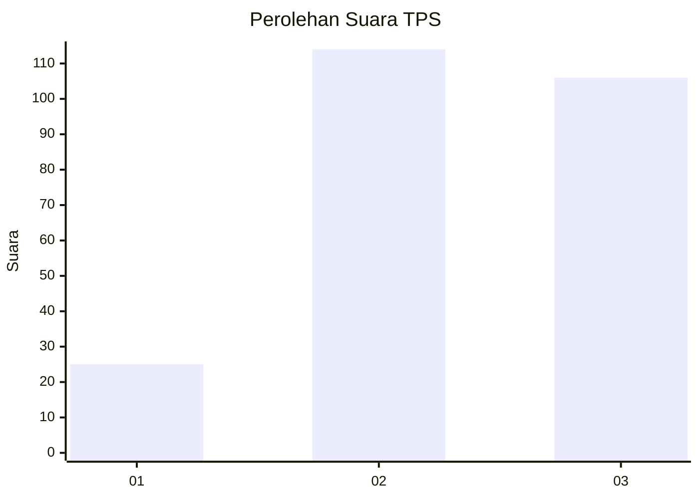
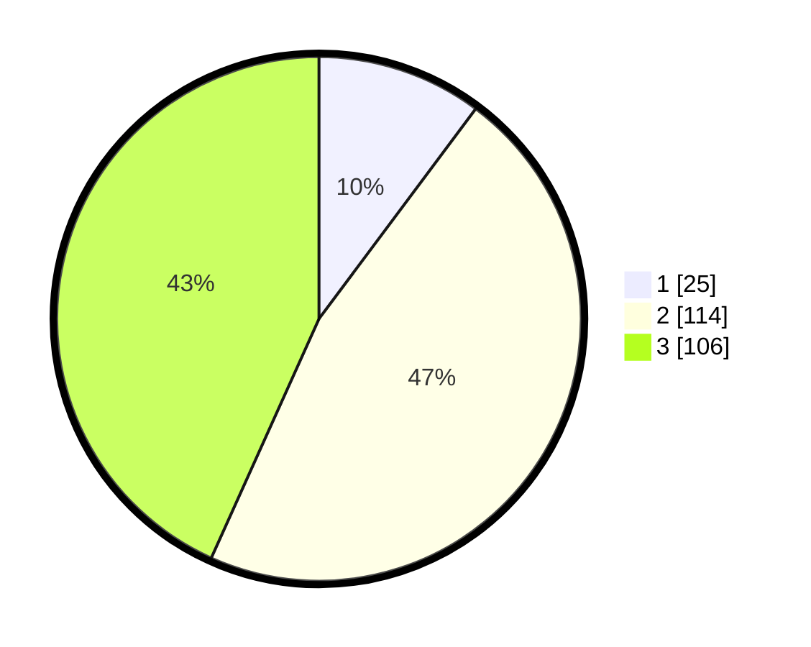

# Hasil

## Grafik

## Tabel

| No. | Nama Paslon    | Suara | Suara (raw) | Persentase |
|:--- |:-------------- | -----:| -----------:| ----------:|
| 1   | ANIES MUHAIMIN | 25    | [25][p-1]   | 10,20      |
| 2   | PRABOWO GIBRAN | 114   | [114][p-2]  | 46,53      |
| 3   | GANJAR MAHFUD  | 106   | [106][p-3]  | 43,27      |

[p-1]: https://github.com/gigit-pemilu/pemilu-2024/blob/main/pilpres/hitung-suara/sub/33-jawa-tengah/sub/09-boyolali/sub/07-teras/sub/2001-kopen/sub/009-tps/sub/paslon-1.txt
[p-2]: https://github.com/gigit-pemilu/pemilu-2024/blob/main/pilpres/hitung-suara/sub/33-jawa-tengah/sub/09-boyolali/sub/07-teras/sub/2001-kopen/sub/009-tps/sub/paslon-2.txt
[p-3]: https://github.com/gigit-pemilu/pemilu-2024/blob/main/pilpres/hitung-suara/sub/33-jawa-tengah/sub/09-boyolali/sub/07-teras/sub/2001-kopen/sub/009-tps/sub/paslon-3.txt

## Foto C Plano

https://sirekap-obj-formc.kpu.go.id/0ba8/pemilu/ppwp/33/09/07/20/01/3309072001009-20240214-224749--6f018903-09b2-43d4-b8ac-00af95ce7a53.jpg

https://sirekap-obj-formc.kpu.go.id/0ba8/pemilu/ppwp/33/09/07/20/01/3309072001009-20240214-205207--aff7830e-2dbf-4e55-bcfc-102eb9c2eeb3.jpg

https://sirekap-obj-formc.kpu.go.id/0ba8/pemilu/ppwp/33/09/07/20/01/3309072001009-20240214-205214--5e36f3c2-959b-45f2-9b2b-d2fed945caa7.jpg

## Metadata

| Key        | Value               |
| ---------- | ------------------- |
| Time Stamp | 2024-02-15 12:00:28 |

