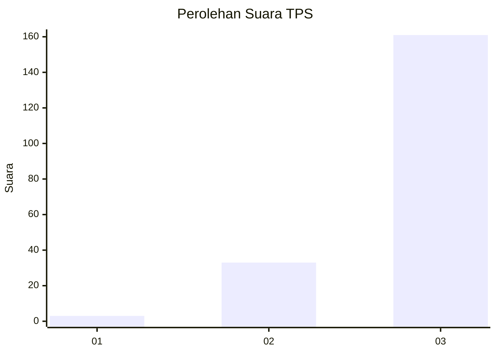
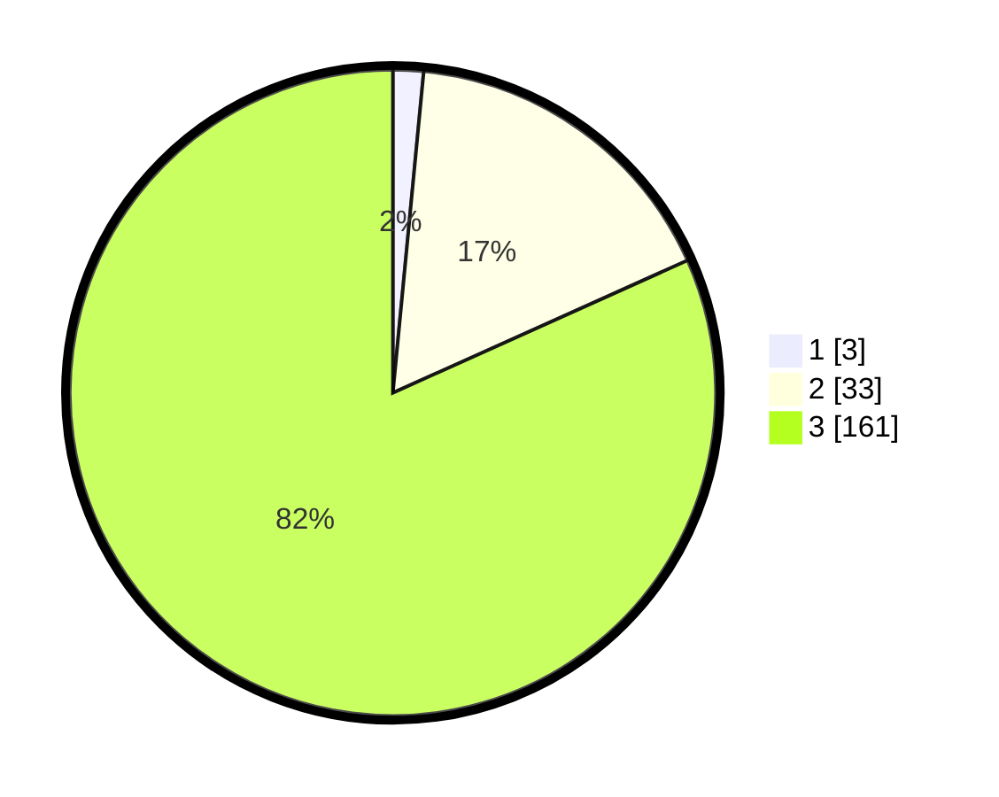

# Hasil

## Grafik

## Tabel

| No. | Nama Paslon    | Suara | Suara (raw) | Persentase |
|:--- |:-------------- | -----:| -----------:| ----------:|
| 1   | ANIES MUHAIMIN | 3     | [3][p-1]    | 1,52       |
| 2   | PRABOWO GIBRAN | 33    | [33][p-2]   | 16,75      |
| 3   | GANJAR MAHFUD  | 161   | [161][p-3]  | 81,73      |

[p-1]: https://github.com/gigit-pemilu/pemilu-2024/blob/main/pilpres/hitung-suara/sub/33-jawa-tengah/sub/09-boyolali/sub/07-teras/sub/2001-kopen/sub/012-tps/sub/paslon-1.txt
[p-2]: https://github.com/gigit-pemilu/pemilu-2024/blob/main/pilpres/hitung-suara/sub/33-jawa-tengah/sub/09-boyolali/sub/07-teras/sub/2001-kopen/sub/012-tps/sub/paslon-2.txt
[p-3]: https://github.com/gigit-pemilu/pemilu-2024/blob/main/pilpres/hitung-suara/sub/33-jawa-tengah/sub/09-boyolali/sub/07-teras/sub/2001-kopen/sub/012-tps/sub/paslon-3.txt

## Foto C Plano

https://sirekap-obj-formc.kpu.go.id/0c00/pemilu/ppwp/33/09/07/20/01/3309072001012-20240214-232111--186ef82d-6bf8-4e1f-91e9-e4de5c864c00.jpg

https://sirekap-obj-formc.kpu.go.id/0c00/pemilu/ppwp/33/09/07/20/01/3309072001012-20240214-230557--686ba985-d3d3-479b-9c26-9a3e5988407f.jpg

https://sirekap-obj-formc.kpu.go.id/0c00/pemilu/ppwp/33/09/07/20/01/3309072001012-20240214-230606--617a7983-ec43-49f2-a911-d70557240fdd.jpg

## Metadata

| Key        | Value               |
| ---------- | ------------------- |
| Time Stamp | 2024-02-15 21:30:27 |

