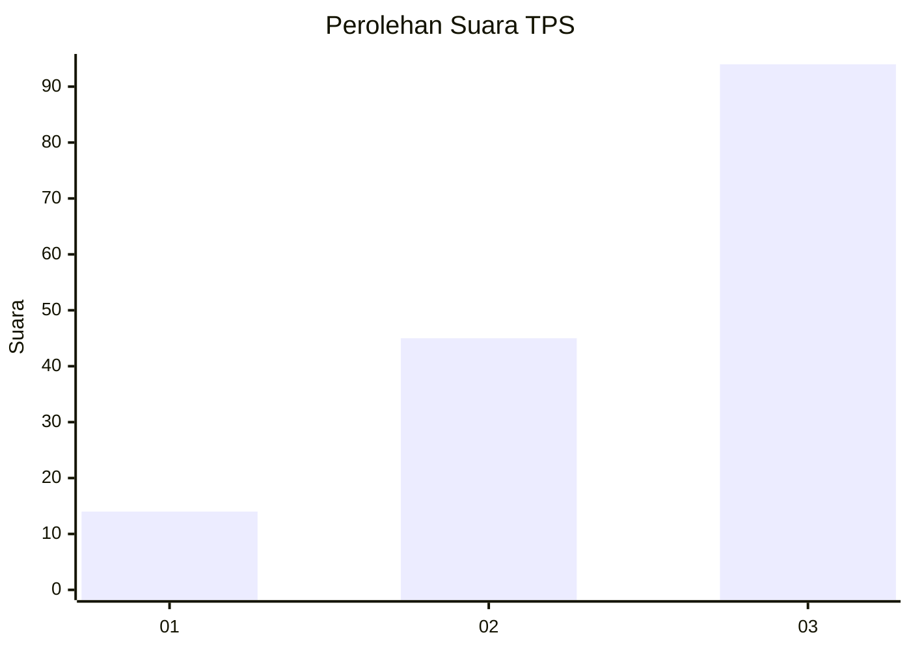
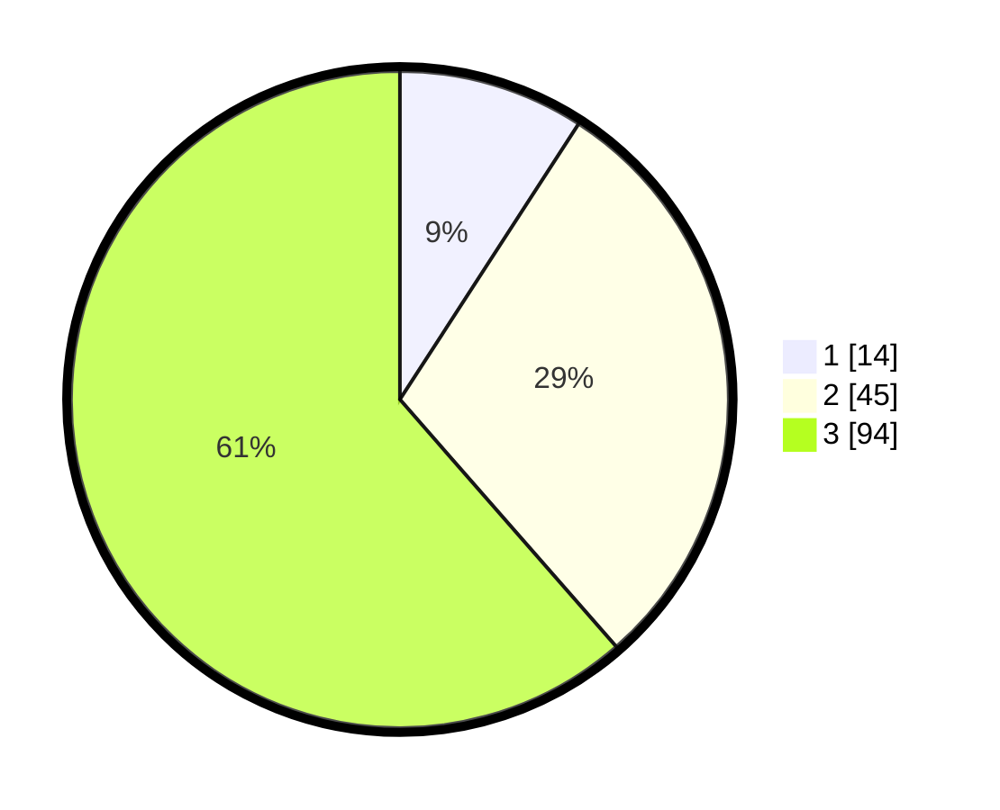

# Hasil

## Grafik

## Tabel

| No. | Nama Paslon    | Suara | Suara (raw) | Persentase |
|:--- |:-------------- | -----:| -----------:| ----------:|
| 1   | ANIES MUHAIMIN | 14    | [14][p-1]   | 9,15       |
| 2   | PRABOWO GIBRAN | 45    | [45][p-2]   | 29,41      |
| 3   | GANJAR MAHFUD  | 94    | [94][p-3]   | 61,44      |

[p-1]: https://github.com/gigit-pemilu/pemilu-2024-33-jawa-tengah/blob/main/pilpres/hitung-suara/sub/33-jawa-tengah/sub/09-boyolali/sub/07-teras/sub/2005-sudimoro/sub/002-tps/sub/paslon-1.txt
[p-2]: https://github.com/gigit-pemilu/pemilu-2024-33-jawa-tengah/blob/main/pilpres/hitung-suara/sub/33-jawa-tengah/sub/09-boyolali/sub/07-teras/sub/2005-sudimoro/sub/002-tps/sub/paslon-2.txt
[p-3]: https://github.com/gigit-pemilu/pemilu-2024-33-jawa-tengah/blob/main/pilpres/hitung-suara/sub/33-jawa-tengah/sub/09-boyolali/sub/07-teras/sub/2005-sudimoro/sub/002-tps/sub/paslon-3.txt

## Foto C Plano

https://sirekap-obj-formc.kpu.go.id/a299/pemilu/ppwp/33/09/07/20/05/3309072005002-20240215-004618--faff5db6-dc33-4df8-9163-72c99c0086a6.jpg

https://sirekap-obj-formc.kpu.go.id/a299/pemilu/ppwp/33/09/07/20/05/3309072005002-20240214-235241--1d202aee-d488-4335-93e8-48ef9e69180f.jpg

https://sirekap-obj-formc.kpu.go.id/a299/pemilu/ppwp/33/09/07/20/05/3309072005002-20240215-004659--d75e8489-3650-4093-8438-dc50fdf3e367.jpg

## Metadata

| Key        | Value               |
| ---------- | ------------------- |
| Time Stamp | 2024-02-15 21:30:27 |

