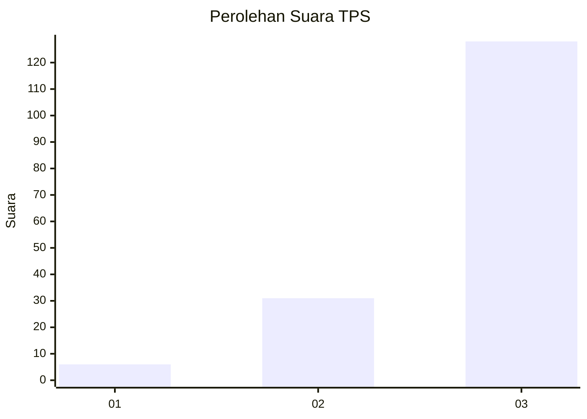
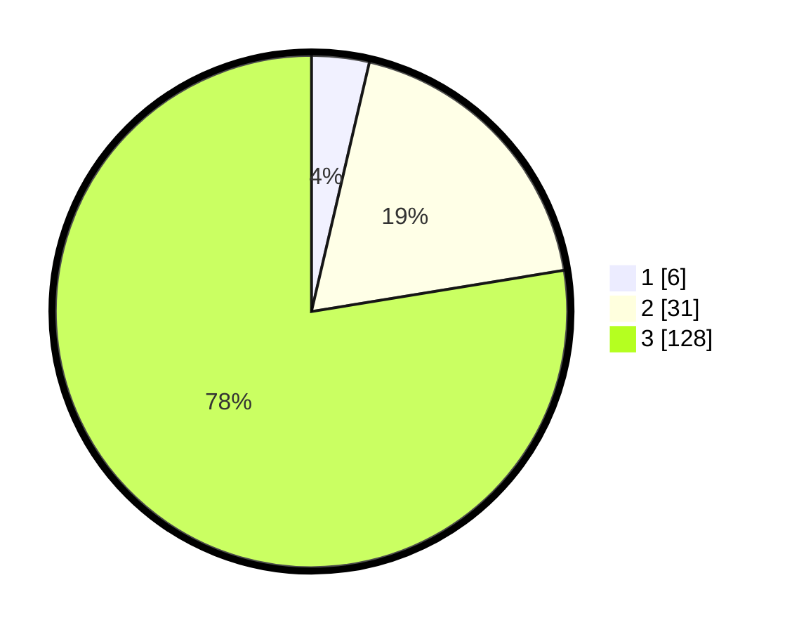

# Hasil

## Grafik

## Tabel

| No. | Nama Paslon    | Suara | Suara (raw) | Persentase |
|:--- |:-------------- | -----:| -----------:| ----------:|
| 1   | ANIES MUHAIMIN | 6     | [6][p-1]    | 3,64       |
| 2   | PRABOWO GIBRAN | 31    | [31][p-2]   | 18,79      |
| 3   | GANJAR MAHFUD  | 128   | [128][p-3]  | 77,58      |

[p-1]: https://github.com/gigit-pemilu/pemilu-2024/blob/main/pilpres/hitung-suara/sub/33-jawa-tengah/sub/09-boyolali/sub/07-teras/sub/2005-sudimoro/sub/011-tps/sub/paslon-1.txt
[p-2]: https://github.com/gigit-pemilu/pemilu-2024/blob/main/pilpres/hitung-suara/sub/33-jawa-tengah/sub/09-boyolali/sub/07-teras/sub/2005-sudimoro/sub/011-tps/sub/paslon-2.txt
[p-3]: https://github.com/gigit-pemilu/pemilu-2024/blob/main/pilpres/hitung-suara/sub/33-jawa-tengah/sub/09-boyolali/sub/07-teras/sub/2005-sudimoro/sub/011-tps/sub/paslon-3.txt

## Foto C Plano

https://sirekap-obj-formc.kpu.go.id/1e1e/pemilu/ppwp/33/09/07/20/05/3309072005011-20240214-211145--ae0568c3-e530-428d-82b5-8c1c7139326b.jpg

https://sirekap-obj-formc.kpu.go.id/1e1e/pemilu/ppwp/33/09/07/20/05/3309072005011-20240214-211209--fb5604e8-c74a-4870-95f5-67459a932554.jpg

https://sirekap-obj-formc.kpu.go.id/1e1e/pemilu/ppwp/33/09/07/20/05/3309072005011-20240214-211234--41edd665-dbb1-4dea-98bd-3d65064366ce.jpg

## Metadata

| Key        | Value               |
| ---------- | ------------------- |
| Time Stamp | 2024-02-15 22:00:27 |

