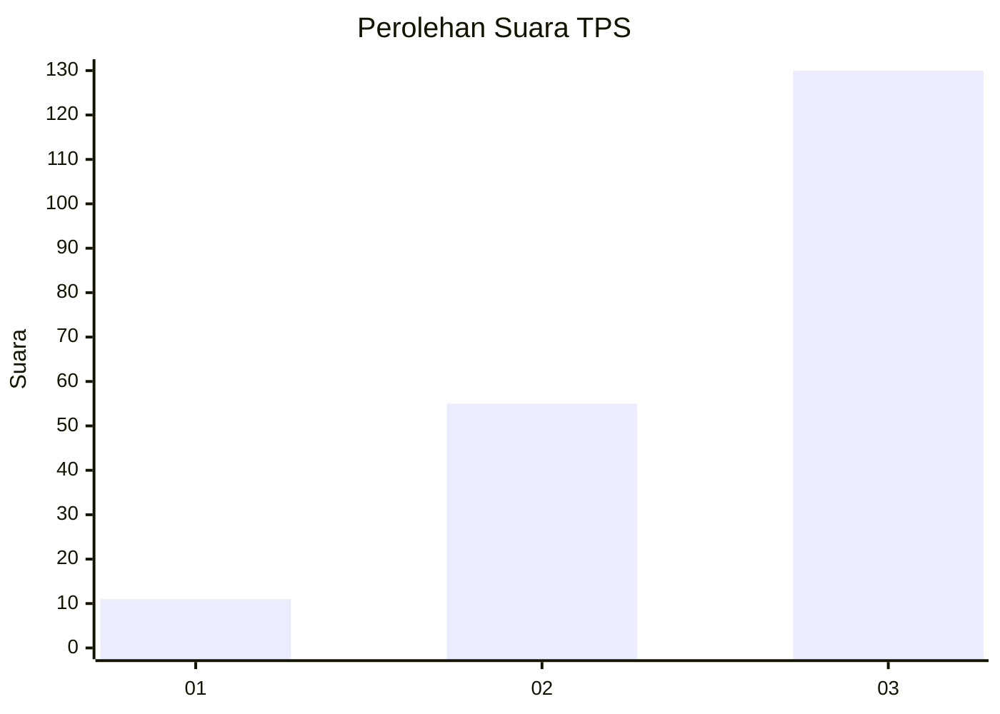
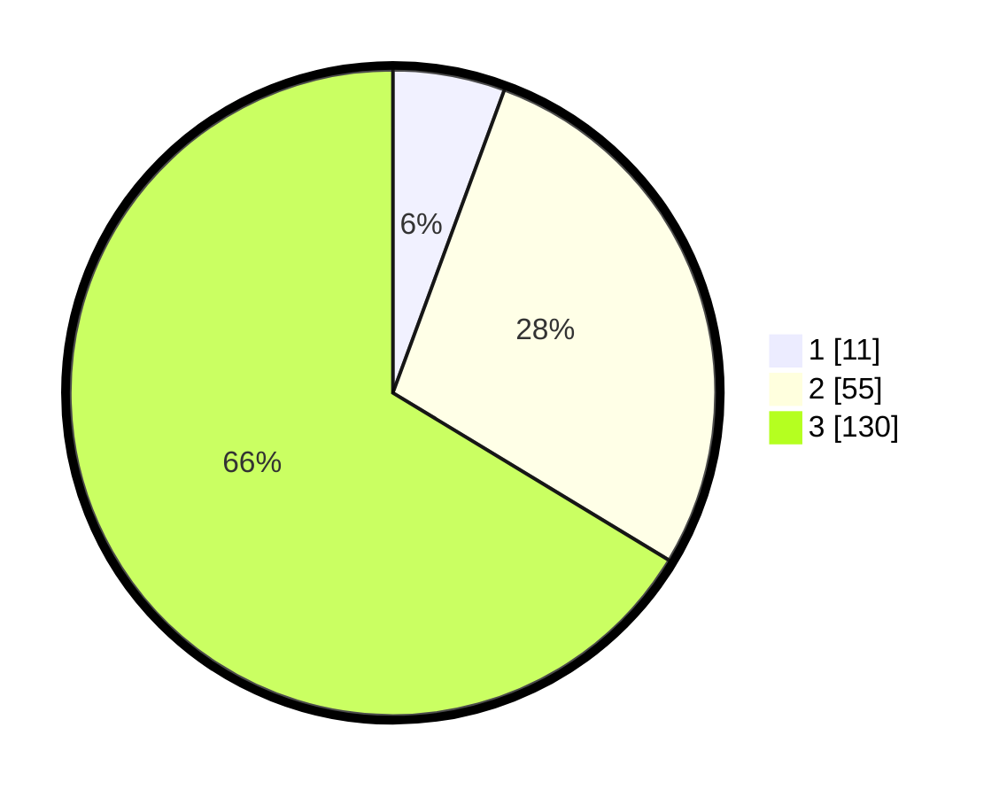

# Hasil

## Grafik

## Tabel

| No. | Nama Paslon    | Suara | Suara (raw) | Persentase |
|:--- |:-------------- | -----:| -----------:| ----------:|
| 1   | ANIES MUHAIMIN | 11    | [11][p-1]   | 5,61       |
| 2   | PRABOWO GIBRAN | 55    | [55][p-2]   | 28,06      |
| 3   | GANJAR MAHFUD  | 130   | [130][p-3]  | 66,33      |

[p-1]: https://github.com/gigit-pemilu/pemilu-2024-33-jawa-tengah/blob/main/pilpres/hitung-suara/sub/33-jawa-tengah/sub/09-boyolali/sub/07-teras/sub/2007-salakan/sub/007-tps/sub/paslon-1.txt
[p-2]: https://github.com/gigit-pemilu/pemilu-2024-33-jawa-tengah/blob/main/pilpres/hitung-suara/sub/33-jawa-tengah/sub/09-boyolali/sub/07-teras/sub/2007-salakan/sub/007-tps/sub/paslon-2.txt
[p-3]: https://github.com/gigit-pemilu/pemilu-2024-33-jawa-tengah/blob/main/pilpres/hitung-suara/sub/33-jawa-tengah/sub/09-boyolali/sub/07-teras/sub/2007-salakan/sub/007-tps/sub/paslon-3.txt

## Foto C Plano

https://sirekap-obj-formc.kpu.go.id/47c0/pemilu/ppwp/33/09/07/20/07/3309072007007-20240214-193028--d480075c-31bb-4976-bcee-28230b52b6af.jpg

https://sirekap-obj-formc.kpu.go.id/47c0/pemilu/ppwp/33/09/07/20/07/3309072007007-20240214-193548--6e08c2be-12e9-4761-a5ae-3a0578f5736f.jpg

https://sirekap-obj-formc.kpu.go.id/47c0/pemilu/ppwp/33/09/07/20/07/3309072007007-20240214-194247--a71a108c-f029-41c0-80d5-a4a69404f8a2.jpg

## Metadata

| Key        | Value               |
| ---------- | ------------------- |
| Time Stamp | 2024-02-25 20:00:00 |

