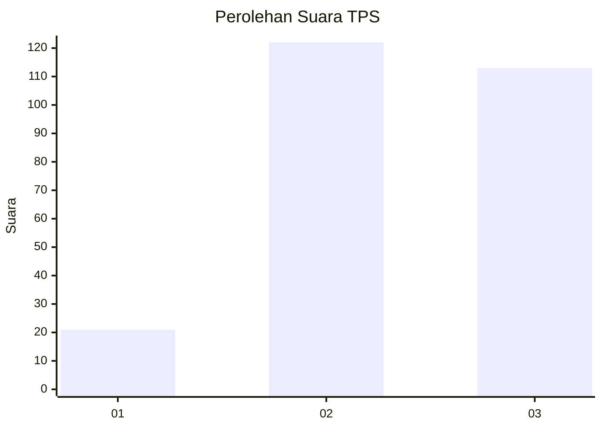
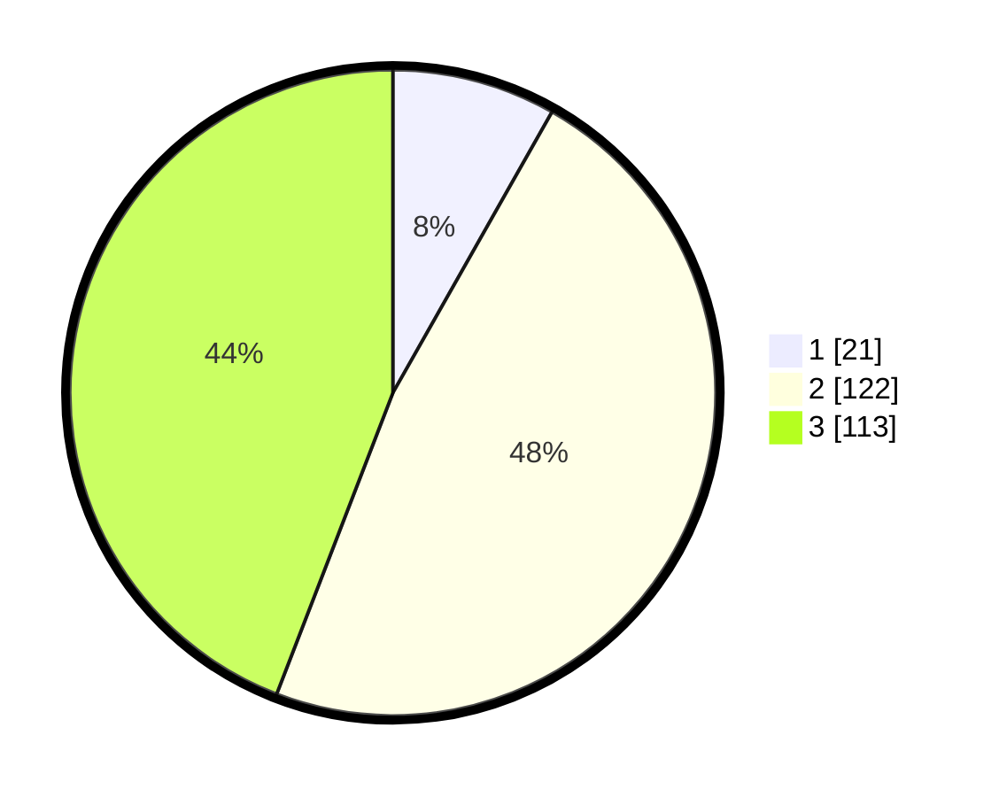

# Hasil

## Grafik

## Tabel

| No. | Nama Paslon    | Suara | Suara (raw) | Persentase |
|:--- |:-------------- | -----:| -----------:| ----------:|
| 1   | ANIES MUHAIMIN | 21    | [21][p-1]   | 8,20       |
| 2   | PRABOWO GIBRAN | 122   | [122][p-2]  | 47,66      |
| 3   | GANJAR MAHFUD  | 113   | [113][p-3]  | 44,14      |

[p-1]: https://github.com/gigit-pemilu/pemilu-2024-33-jawa-tengah/blob/main/pilpres/hitung-suara/sub/33-jawa-tengah/sub/09-boyolali/sub/07-teras/sub/2008-teras/sub/003-tps/sub/paslon-1.txt
[p-2]: https://github.com/gigit-pemilu/pemilu-2024-33-jawa-tengah/blob/main/pilpres/hitung-suara/sub/33-jawa-tengah/sub/09-boyolali/sub/07-teras/sub/2008-teras/sub/003-tps/sub/paslon-2.txt
[p-3]: https://github.com/gigit-pemilu/pemilu-2024-33-jawa-tengah/blob/main/pilpres/hitung-suara/sub/33-jawa-tengah/sub/09-boyolali/sub/07-teras/sub/2008-teras/sub/003-tps/sub/paslon-3.txt

## Foto C Plano

https://sirekap-obj-formc.kpu.go.id/8630/pemilu/ppwp/33/09/07/20/08/3309072008003-20240214-232905--cd14f35e-7e2e-4f21-b9a7-20b9b362041a.jpg

https://sirekap-obj-formc.kpu.go.id/8630/pemilu/ppwp/33/09/07/20/08/3309072008003-20240214-233055--bc2e6100-b6c2-4b3e-84af-5873b4165560.jpg

https://sirekap-obj-formc.kpu.go.id/8630/pemilu/ppwp/33/09/07/20/08/3309072008003-20240214-233201--da4d3348-27c8-48e7-a571-4f1d18071626.jpg

## Metadata

| Key        | Value               |
| ---------- | ------------------- |
| Time Stamp | 2024-02-15 22:00:27 |

