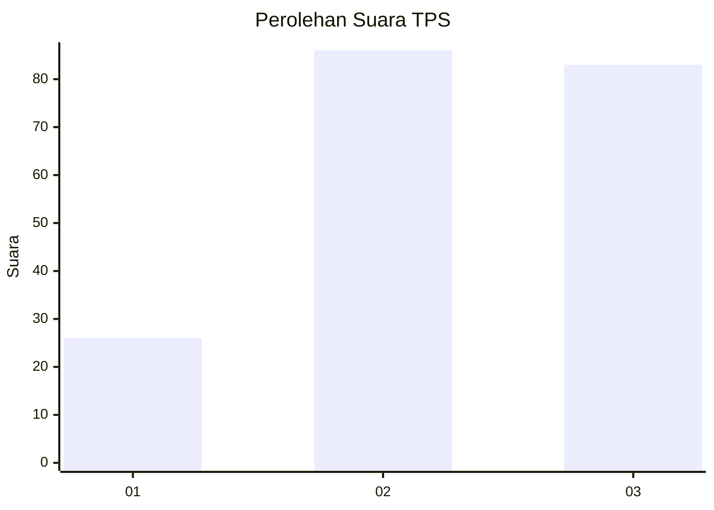
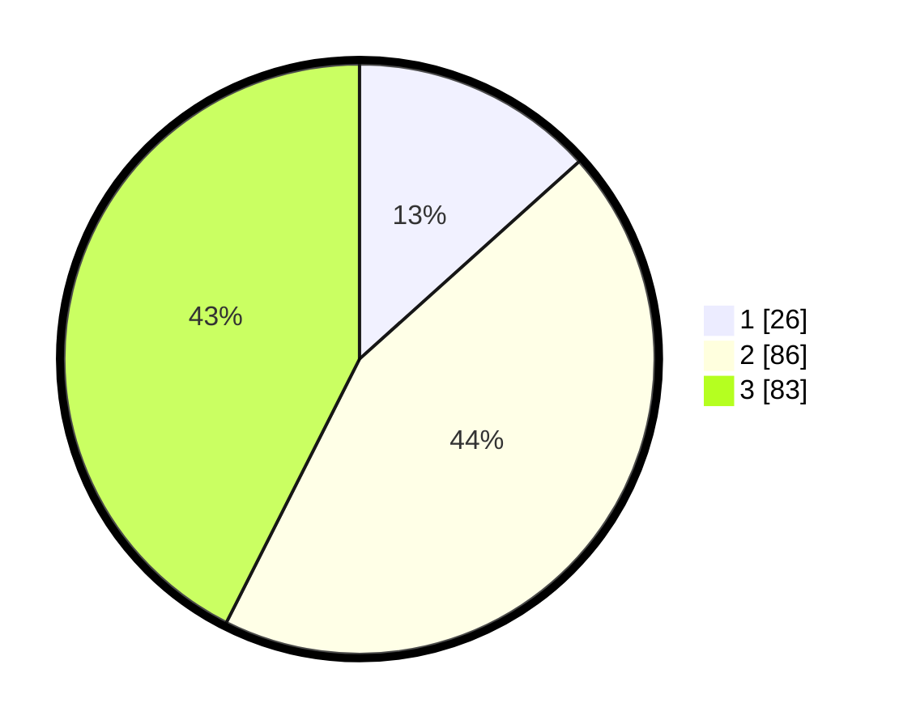

# Hasil

## Grafik

## Tabel

| No. | Nama Paslon    | Suara | Suara (raw) | Persentase |
|:--- |:-------------- | -----:| -----------:| ----------:|
| 1   | ANIES MUHAIMIN | 26    | [26][p-1]   | 13,33      |
| 2   | PRABOWO GIBRAN | 86    | [86][p-2]   | 44,10      |
| 3   | GANJAR MAHFUD  | 83    | [83][p-3]   | 42,56      |

[p-1]: https://github.com/gigit-pemilu/pemilu-2024-33-jawa-tengah/blob/main/pilpres/hitung-suara/sub/33-jawa-tengah/sub/09-boyolali/sub/07-teras/sub/2008-teras/sub/006-tps/sub/paslon-1.txt
[p-2]: https://github.com/gigit-pemilu/pemilu-2024-33-jawa-tengah/blob/main/pilpres/hitung-suara/sub/33-jawa-tengah/sub/09-boyolali/sub/07-teras/sub/2008-teras/sub/006-tps/sub/paslon-2.txt
[p-3]: https://github.com/gigit-pemilu/pemilu-2024-33-jawa-tengah/blob/main/pilpres/hitung-suara/sub/33-jawa-tengah/sub/09-boyolali/sub/07-teras/sub/2008-teras/sub/006-tps/sub/paslon-3.txt

## Foto C Plano

https://sirekap-obj-formc.kpu.go.id/c046/pemilu/ppwp/33/09/07/20/08/3309072008006-20240215-010842--06022cbe-09f6-4b2a-8c85-e3e1167d15ad.jpg

https://sirekap-obj-formc.kpu.go.id/c046/pemilu/ppwp/33/09/07/20/08/3309072008006-20240215-011005--e3efd6ca-6226-483a-ab33-45bd564e8b37.jpg

https://sirekap-obj-formc.kpu.go.id/c046/pemilu/ppwp/33/09/07/20/08/3309072008006-20240215-011119--d52781da-fc01-445a-b7a9-b9a8f70a5958.jpg

## Metadata

| Key        | Value               |
| ---------- | ------------------- |
| Time Stamp | 2024-02-15 22:00:27 |

