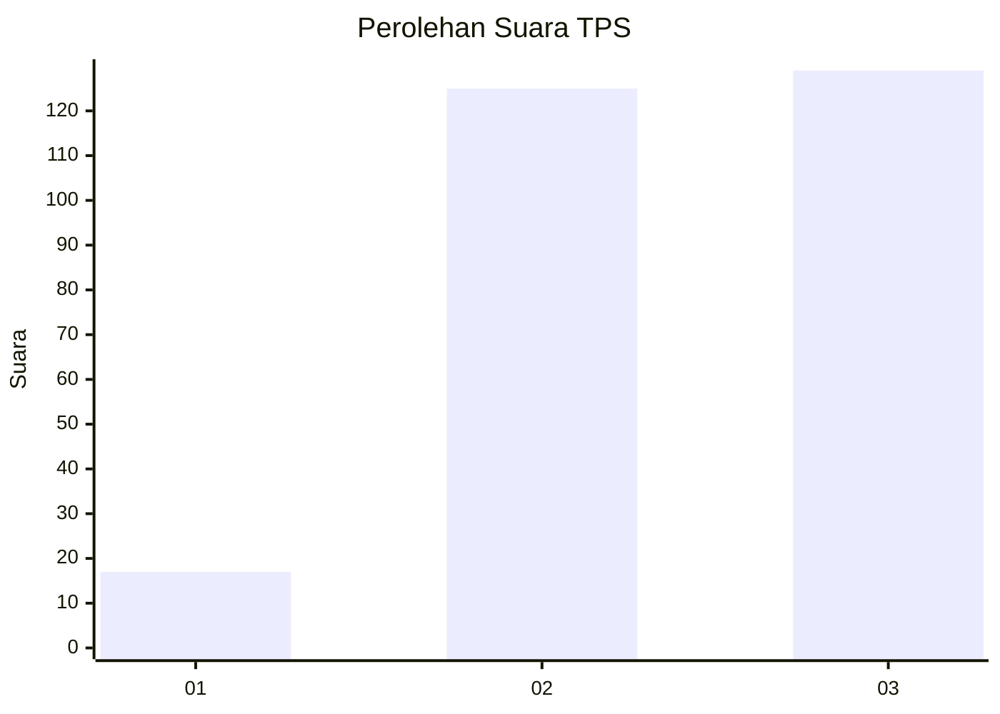
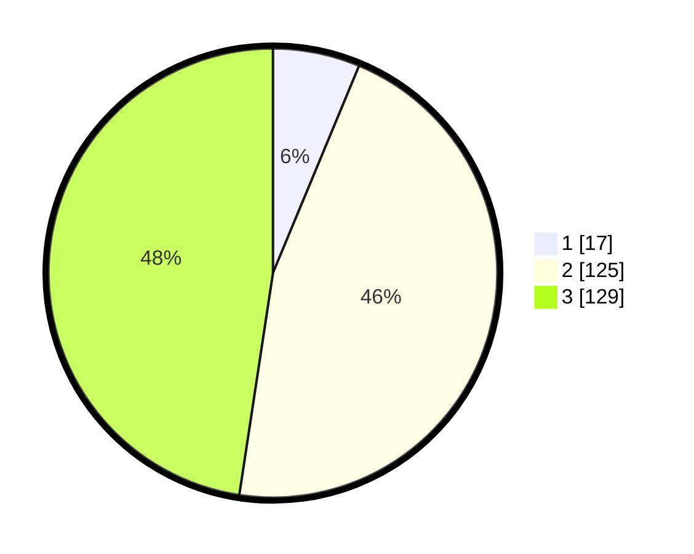

# Hasil

## Grafik

## Tabel

| No. | Nama Paslon    | Suara | Suara (raw) | Persentase |
|:--- |:-------------- | -----:| -----------:| ----------:|
| 1   | ANIES MUHAIMIN | 17    | [17][p-1]   | 6,27       |
| 2   | PRABOWO GIBRAN | 125   | [125][p-2]  | 46,13      |
| 3   | GANJAR MAHFUD  | 129   | [129][p-3]  | 47,60      |

[p-1]: https://github.com/gigit-pemilu/pemilu-2024-33-jawa-tengah/blob/main/pilpres/hitung-suara/sub/33-jawa-tengah/sub/09-boyolali/sub/07-teras/sub/2008-teras/sub/007-tps/sub/paslon-1.txt
[p-2]: https://github.com/gigit-pemilu/pemilu-2024-33-jawa-tengah/blob/main/pilpres/hitung-suara/sub/33-jawa-tengah/sub/09-boyolali/sub/07-teras/sub/2008-teras/sub/007-tps/sub/paslon-2.txt
[p-3]: https://github.com/gigit-pemilu/pemilu-2024-33-jawa-tengah/blob/main/pilpres/hitung-suara/sub/33-jawa-tengah/sub/09-boyolali/sub/07-teras/sub/2008-teras/sub/007-tps/sub/paslon-3.txt

## Foto C Plano

https://sirekap-obj-formc.kpu.go.id/1c90/pemilu/ppwp/33/09/07/20/08/3309072008007-20240215-012712--9ce7998d-44c1-4f69-aeeb-0f8d1cdbe1cc.jpg

https://sirekap-obj-formc.kpu.go.id/1c90/pemilu/ppwp/33/09/07/20/08/3309072008007-20240215-012814--98a68b3d-7e71-4597-9dbd-d89c4b2ffc80.jpg

https://sirekap-obj-formc.kpu.go.id/1c90/pemilu/ppwp/33/09/07/20/08/3309072008007-20240215-012907--428133fc-6bdd-4e69-afc3-c5fac68f96ab.jpg

## Metadata

| Key        | Value               |
| ---------- | ------------------- |
| Time Stamp | 2024-02-15 22:00:27 |

