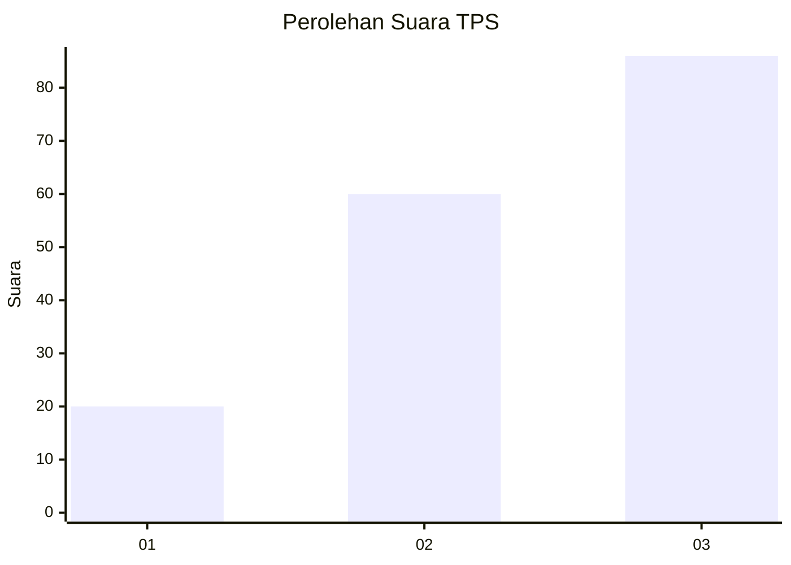
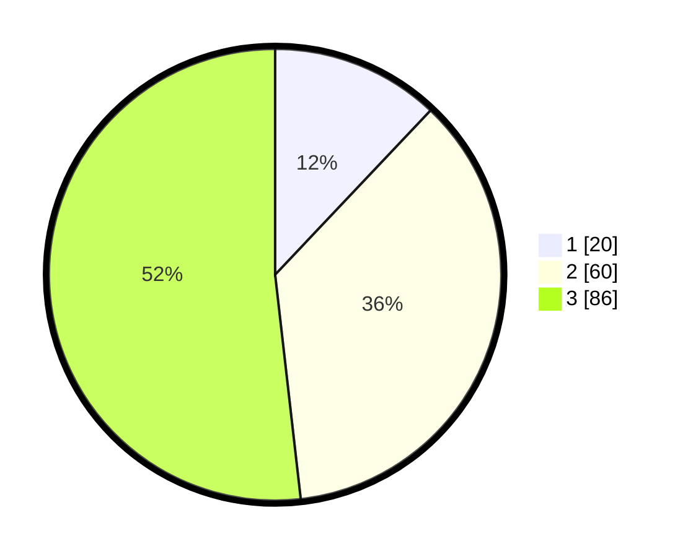

# Hasil

## Grafik

## Tabel

| No. | Nama Paslon    | Suara | Suara (raw) | Persentase |
|:--- |:-------------- | -----:| -----------:| ----------:|
| 1   | ANIES MUHAIMIN | 20    | [20][p-1]   | 12,05      |
| 2   | PRABOWO GIBRAN | 60    | [60][p-2]   | 36,14      |
| 3   | GANJAR MAHFUD  | 86    | [86][p-3]   | 51,81      |

[p-1]: https://github.com/gigit-pemilu/pemilu-2024/blob/main/pilpres/hitung-suara/sub/33-jawa-tengah/sub/09-boyolali/sub/07-teras/sub/2008-teras/sub/008-tps/sub/paslon-1.txt
[p-2]: https://github.com/gigit-pemilu/pemilu-2024/blob/main/pilpres/hitung-suara/sub/33-jawa-tengah/sub/09-boyolali/sub/07-teras/sub/2008-teras/sub/008-tps/sub/paslon-2.txt
[p-3]: https://github.com/gigit-pemilu/pemilu-2024/blob/main/pilpres/hitung-suara/sub/33-jawa-tengah/sub/09-boyolali/sub/07-teras/sub/2008-teras/sub/008-tps/sub/paslon-3.txt

## Foto C Plano

https://sirekap-obj-formc.kpu.go.id/b4a6/pemilu/ppwp/33/09/07/20/08/3309072008008-20240214-230929--173dfbc8-d239-4033-8eff-4543adda2345.jpg

https://sirekap-obj-formc.kpu.go.id/b4a6/pemilu/ppwp/33/09/07/20/08/3309072008008-20240214-231046--534f6859-41e9-4e07-a515-fcfc8c8043b7.jpg

https://sirekap-obj-formc.kpu.go.id/b4a6/pemilu/ppwp/33/09/07/20/08/3309072008008-20240214-231624--c9ec04e2-82ac-43f9-8a3b-d821dbfe63c6.jpg

## Metadata

| Key        | Value               |
| ---------- | ------------------- |
| Time Stamp | 2024-02-24 22:31:28 |

