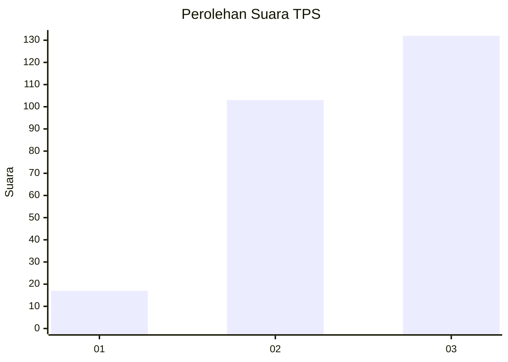
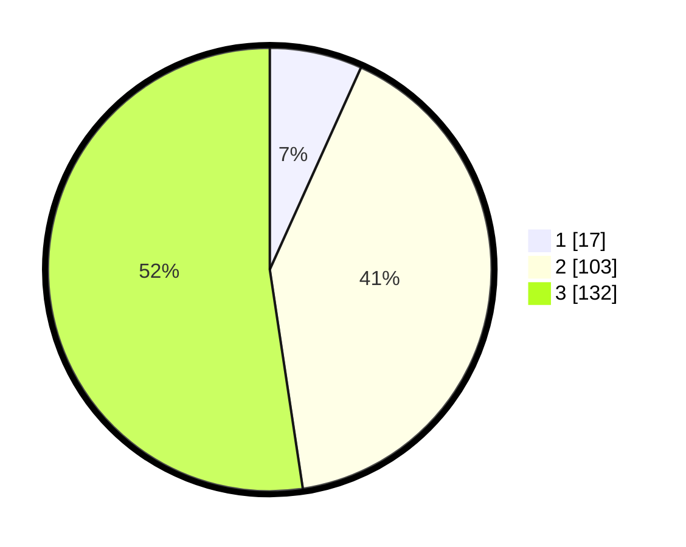

# Hasil

## Grafik

## Tabel

| No. | Nama Paslon    | Suara | Suara (raw) | Persentase |
|:--- |:-------------- | -----:| -----------:| ----------:|
| 1   | ANIES MUHAIMIN | 17    | [17][p-1]   | 6,75       |
| 2   | PRABOWO GIBRAN | 103   | [103][p-2]  | 40,87      |
| 3   | GANJAR MAHFUD  | 132   | [132][p-3]  | 52,38      |

[p-1]: https://github.com/gigit-pemilu/pemilu-2024/blob/main/pilpres/hitung-suara/sub/33-jawa-tengah/sub/09-boyolali/sub/07-teras/sub/2008-teras/sub/016-tps/sub/paslon-1.txt
[p-2]: https://github.com/gigit-pemilu/pemilu-2024/blob/main/pilpres/hitung-suara/sub/33-jawa-tengah/sub/09-boyolali/sub/07-teras/sub/2008-teras/sub/016-tps/sub/paslon-2.txt
[p-3]: https://github.com/gigit-pemilu/pemilu-2024/blob/main/pilpres/hitung-suara/sub/33-jawa-tengah/sub/09-boyolali/sub/07-teras/sub/2008-teras/sub/016-tps/sub/paslon-3.txt

## Foto C Plano

https://sirekap-obj-formc.kpu.go.id/cd59/pemilu/ppwp/33/09/07/20/08/3309072008016-20240214-233920--486c6db5-27ad-4703-ae9f-4b8ce0948939.jpg

https://sirekap-obj-formc.kpu.go.id/cd59/pemilu/ppwp/33/09/07/20/08/3309072008016-20240214-234102--69fc6164-e7b4-4e92-8288-dda53cda8c7d.jpg

https://sirekap-obj-formc.kpu.go.id/cd59/pemilu/ppwp/33/09/07/20/08/3309072008016-20240214-234200--2d1685ef-1f95-4810-ba1d-f0eb9dca13cf.jpg

## Metadata

| Key        | Value               |
| ---------- | ------------------- |
| Time Stamp | 2024-02-15 22:00:27 |

