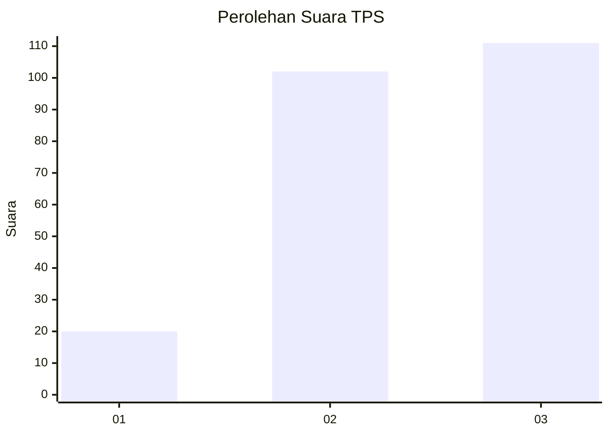
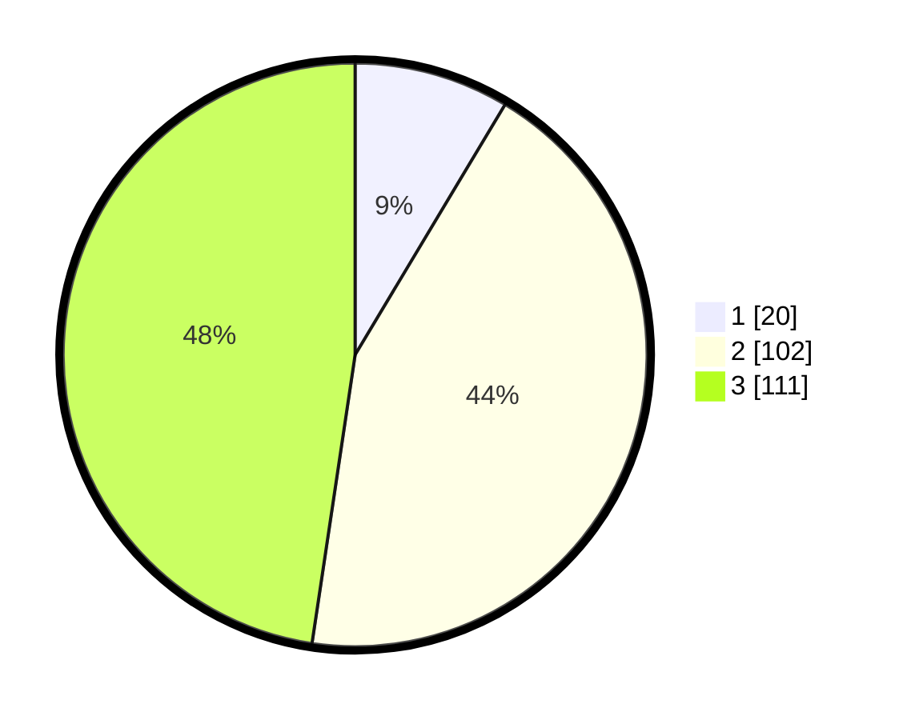

# Hasil

## Grafik

## Tabel

| No. | Nama Paslon    | Suara | Suara (raw) | Persentase |
|:--- |:-------------- | -----:| -----------:| ----------:|
| 1   | ANIES MUHAIMIN | 20    | [20][p-1]   | 8,58       |
| 2   | PRABOWO GIBRAN | 102   | [102][p-2]  | 43,78      |
| 3   | GANJAR MAHFUD  | 111   | [111][p-3]  | 47,64      |

[p-1]: https://github.com/gigit-pemilu/pemilu-2024/blob/main/pilpres/hitung-suara/sub/33-jawa-tengah/sub/09-boyolali/sub/07-teras/sub/2009-randusari/sub/002-tps/sub/paslon-1.txt
[p-2]: https://github.com/gigit-pemilu/pemilu-2024/blob/main/pilpres/hitung-suara/sub/33-jawa-tengah/sub/09-boyolali/sub/07-teras/sub/2009-randusari/sub/002-tps/sub/paslon-2.txt
[p-3]: https://github.com/gigit-pemilu/pemilu-2024/blob/main/pilpres/hitung-suara/sub/33-jawa-tengah/sub/09-boyolali/sub/07-teras/sub/2009-randusari/sub/002-tps/sub/paslon-3.txt

## Foto C Plano

https://sirekap-obj-formc.kpu.go.id/6bb6/pemilu/ppwp/33/09/07/20/09/3309072009002-20240214-235600--c214fd02-8480-4f26-8680-edb411d3e569.jpg

https://sirekap-obj-formc.kpu.go.id/6bb6/pemilu/ppwp/33/09/07/20/09/3309072009002-20240214-235735--efd675f5-7c2d-4188-bf06-85abf3f98b02.jpg

https://sirekap-obj-formc.kpu.go.id/6bb6/pemilu/ppwp/33/09/07/20/09/3309072009002-20240215-000001--531ca695-a938-45d7-81cb-33c4ce3325a4.jpg

## Metadata

| Key        | Value               |
| ---------- | ------------------- |
| Time Stamp | 2024-02-24 22:31:28 |

