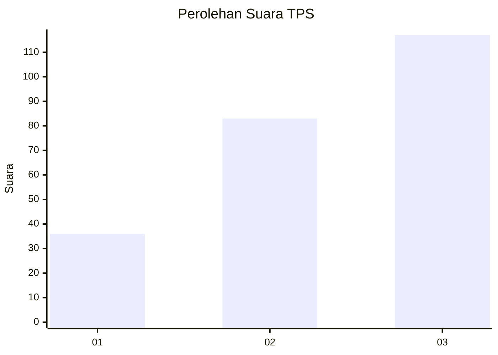
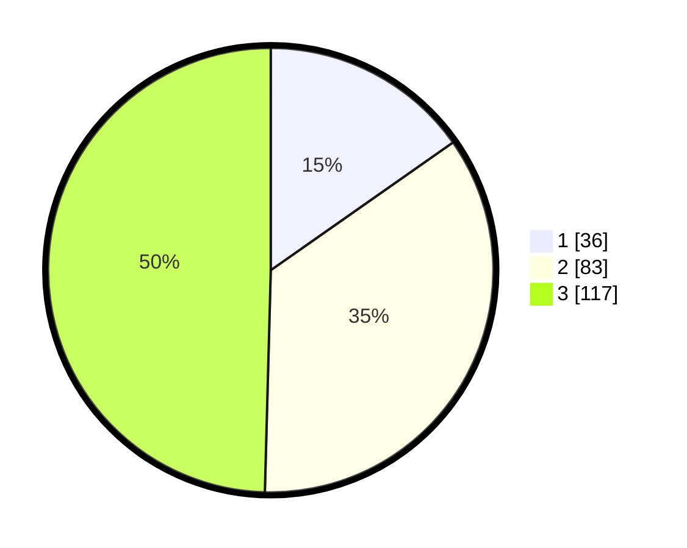

# Hasil

## Grafik

## Tabel

| No. | Nama Paslon    | Suara | Suara (raw) | Persentase |
|:--- |:-------------- | -----:| -----------:| ----------:|
| 1   | ANIES MUHAIMIN | 36    | [36][p-1]   | 15,25      |
| 2   | PRABOWO GIBRAN | 83    | [83][p-2]   | 35,17      |
| 3   | GANJAR MAHFUD  | 117   | [117][p-3]  | 49,58      |

[p-1]: https://github.com/gigit-pemilu/pemilu-2024-33-jawa-tengah/blob/main/pilpres/hitung-suara/sub/33-jawa-tengah/sub/09-boyolali/sub/07-teras/sub/2009-randusari/sub/008-tps/sub/paslon-1.txt
[p-2]: https://github.com/gigit-pemilu/pemilu-2024-33-jawa-tengah/blob/main/pilpres/hitung-suara/sub/33-jawa-tengah/sub/09-boyolali/sub/07-teras/sub/2009-randusari/sub/008-tps/sub/paslon-2.txt
[p-3]: https://github.com/gigit-pemilu/pemilu-2024-33-jawa-tengah/blob/main/pilpres/hitung-suara/sub/33-jawa-tengah/sub/09-boyolali/sub/07-teras/sub/2009-randusari/sub/008-tps/sub/paslon-3.txt

## Foto C Plano

https://sirekap-obj-formc.kpu.go.id/66ef/pemilu/ppwp/33/09/07/20/09/3309072009008-20240215-035006--8417f0dd-a3be-4586-8e4f-b45dedb189aa.jpg

https://sirekap-obj-formc.kpu.go.id/66ef/pemilu/ppwp/33/09/07/20/09/3309072009008-20240215-035023--2e25d8cb-929b-4bee-8840-2d82905794d2.jpg

https://sirekap-obj-formc.kpu.go.id/66ef/pemilu/ppwp/33/09/07/20/09/3309072009008-20240215-035039--40b671f0-db7c-4082-8260-f031c244fee0.jpg

## Metadata

| Key        | Value               |
| ---------- | ------------------- |
| Time Stamp | 2024-02-25 15:00:00 |

