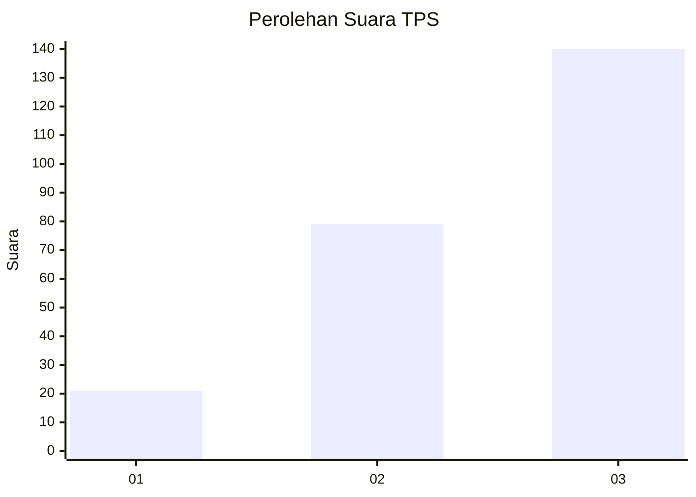
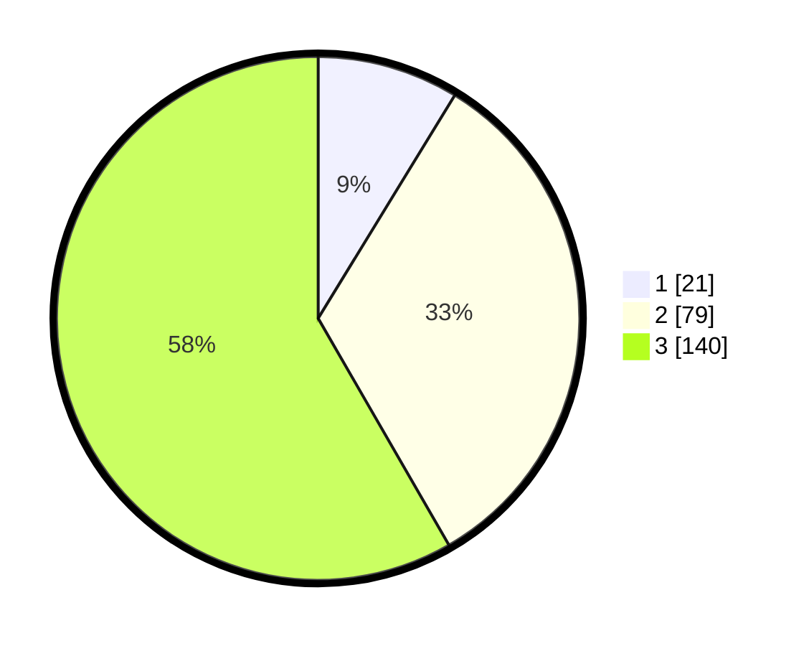

# Hasil

## Grafik

## Tabel

| No. | Nama Paslon    | Suara | Suara (raw) | Persentase |
|:--- |:-------------- | -----:| -----------:| ----------:|
| 1   | ANIES MUHAIMIN | 21    | [21][p-1]   | 8,75       |
| 2   | PRABOWO GIBRAN | 79    | [79][p-2]   | 32,92      |
| 3   | GANJAR MAHFUD  | 140   | [140][p-3]  | 58,33      |

[p-1]: https://github.com/gigit-pemilu/pemilu-2024/blob/main/pilpres/hitung-suara/sub/33-jawa-tengah/sub/09-boyolali/sub/07-teras/sub/2010-mojolegi/sub/003-tps/sub/paslon-1.txt
[p-2]: https://github.com/gigit-pemilu/pemilu-2024/blob/main/pilpres/hitung-suara/sub/33-jawa-tengah/sub/09-boyolali/sub/07-teras/sub/2010-mojolegi/sub/003-tps/sub/paslon-2.txt
[p-3]: https://github.com/gigit-pemilu/pemilu-2024/blob/main/pilpres/hitung-suara/sub/33-jawa-tengah/sub/09-boyolali/sub/07-teras/sub/2010-mojolegi/sub/003-tps/sub/paslon-3.txt

## Foto C Plano

https://sirekap-obj-formc.kpu.go.id/fb34/pemilu/ppwp/33/09/07/20/10/3309072010003-20240214-221836--1b0a785b-682a-4b18-b5ac-1db3d5b6fc08.jpg

https://sirekap-obj-formc.kpu.go.id/fb34/pemilu/ppwp/33/09/07/20/10/3309072010003-20240214-222154--2228ceb9-3b81-4c0f-9234-ea4e7c1a5068.jpg

https://sirekap-obj-formc.kpu.go.id/fb34/pemilu/ppwp/33/09/07/20/10/3309072010003-20240214-222446--57b7d72a-0bdd-468d-b98e-f7cc2b82e68b.jpg

## Metadata

| Key        | Value               |
| ---------- | ------------------- |
| Time Stamp | 2024-02-15 15:00:29 |

