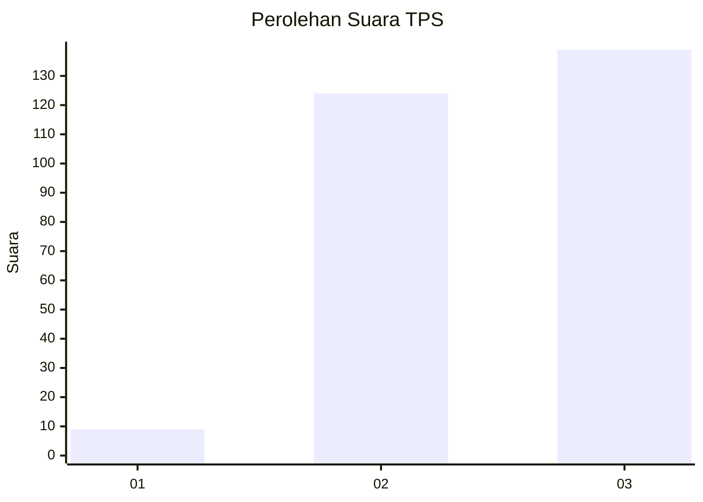
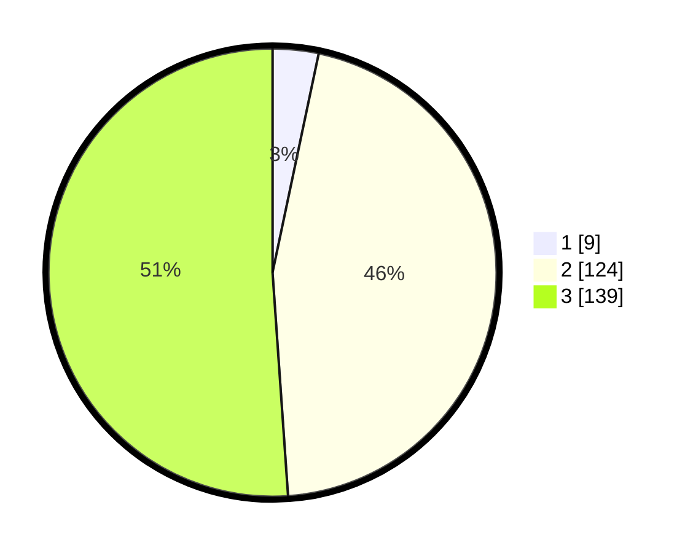

# Hasil

## Grafik

## Tabel

| No. | Nama Paslon    | Suara | Suara (raw) | Persentase |
|:--- |:-------------- | -----:| -----------:| ----------:|
| 1   | ANIES MUHAIMIN | 9     | [9][p-1]    | 3,31       |
| 2   | PRABOWO GIBRAN | 124   | [124][p-2]  | 45,59      |
| 3   | GANJAR MAHFUD  | 139   | [139][p-3]  | 51,10      |

[p-1]: https://github.com/gigit-pemilu/pemilu-2024-33-jawa-tengah/blob/main/pilpres/hitung-suara/sub/33-jawa-tengah/sub/09-boyolali/sub/07-teras/sub/2013-krasak/sub/006-tps/sub/paslon-1.txt
[p-2]: https://github.com/gigit-pemilu/pemilu-2024-33-jawa-tengah/blob/main/pilpres/hitung-suara/sub/33-jawa-tengah/sub/09-boyolali/sub/07-teras/sub/2013-krasak/sub/006-tps/sub/paslon-2.txt
[p-3]: https://github.com/gigit-pemilu/pemilu-2024-33-jawa-tengah/blob/main/pilpres/hitung-suara/sub/33-jawa-tengah/sub/09-boyolali/sub/07-teras/sub/2013-krasak/sub/006-tps/sub/paslon-3.txt

## Foto C Plano

https://sirekap-obj-formc.kpu.go.id/0c3d/pemilu/ppwp/33/09/07/20/13/3309072013006-20240216-091115--2f20c075-9b37-4f49-9039-b404d49f42cc.jpg

https://sirekap-obj-formc.kpu.go.id/0c3d/pemilu/ppwp/33/09/07/20/13/3309072013006-20240216-091213--8a1828b6-0d46-4753-b425-dbfb57b032d4.jpg

https://sirekap-obj-formc.kpu.go.id/0c3d/pemilu/ppwp/33/09/07/20/13/3309072013006-20240216-091338--c5c82d6a-4351-4bee-9e3c-5a61657619f4.jpg

## Metadata

| Key        | Value               |
| ---------- | ------------------- |
| Time Stamp | 2024-02-24 22:31:28 |

