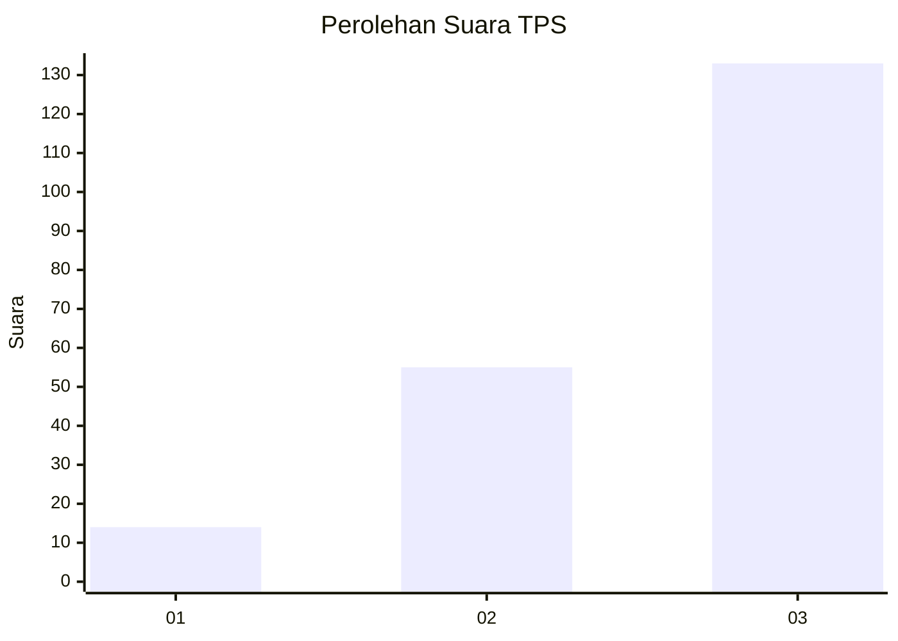
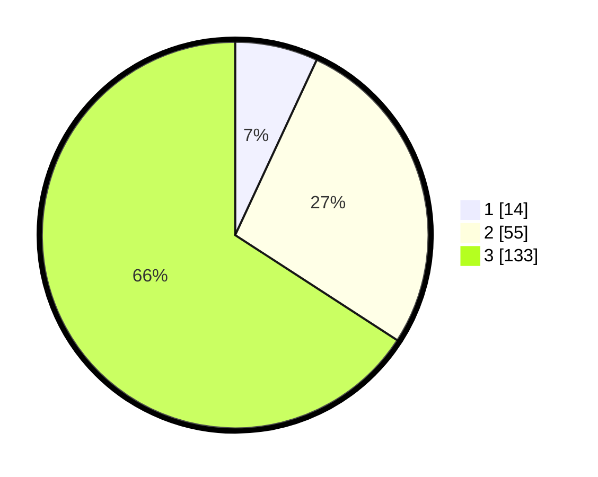

# Hasil

## Grafik

## Tabel

| No. | Nama Paslon    | Suara | Suara (raw) | Persentase |
|:--- |:-------------- | -----:| -----------:| ----------:|
| 1   | ANIES MUHAIMIN | 14    | [14][p-1]   | 6,93       |
| 2   | PRABOWO GIBRAN | 55    | [55][p-2]   | 27,23      |
| 3   | GANJAR MAHFUD  | 133   | [133][p-3]  | 65,84      |

[p-1]: https://github.com/gigit-pemilu/pemilu-2024/blob/main/pilpres/hitung-suara/sub/33-jawa-tengah/sub/09-boyolali/sub/08-sawit/sub/2002-manjung/sub/001-tps/sub/paslon-1.txt
[p-2]: https://github.com/gigit-pemilu/pemilu-2024/blob/main/pilpres/hitung-suara/sub/33-jawa-tengah/sub/09-boyolali/sub/08-sawit/sub/2002-manjung/sub/001-tps/sub/paslon-2.txt
[p-3]: https://github.com/gigit-pemilu/pemilu-2024/blob/main/pilpres/hitung-suara/sub/33-jawa-tengah/sub/09-boyolali/sub/08-sawit/sub/2002-manjung/sub/001-tps/sub/paslon-3.txt

## Foto C Plano

https://sirekap-obj-formc.kpu.go.id/1e45/pemilu/ppwp/33/09/08/20/02/3309082002001-20240214-203831--4a9b6b74-c043-4c68-8cb7-967cc7f7e21a.jpg

https://sirekap-obj-formc.kpu.go.id/1e45/pemilu/ppwp/33/09/08/20/02/3309082002001-20240214-204252--fc786544-1968-4ebe-b0dc-79ac2d2e530d.jpg

https://sirekap-obj-formc.kpu.go.id/1e45/pemilu/ppwp/33/09/08/20/02/3309082002001-20240214-204606--80fa30c2-85ce-45d2-8778-2a1336c61a70.jpg

## Metadata

| Key        | Value               |
| ---------- | ------------------- |
| Time Stamp | 2024-02-15 12:00:28 |

