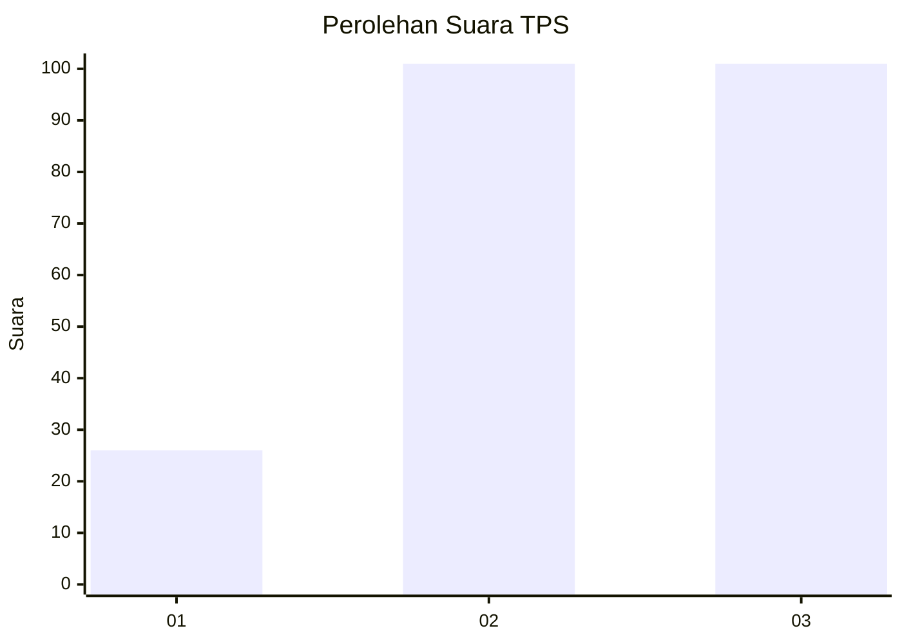
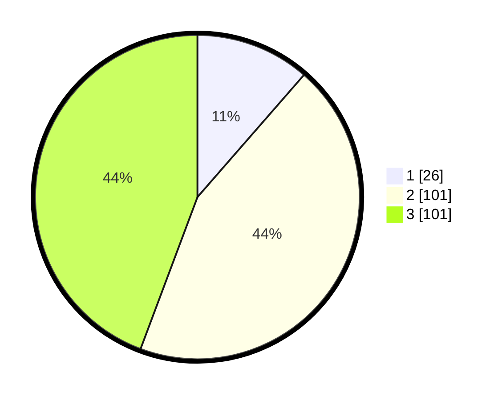

# Hasil

## Grafik

## Tabel

| No. | Nama Paslon    | Suara | Suara (raw) | Persentase |
|:--- |:-------------- | -----:| -----------:| ----------:|
| 1   | ANIES MUHAIMIN | 26    | [26][p-1]   | 11,40      |
| 2   | PRABOWO GIBRAN | 101   | [101][p-2]  | 44,30      |
| 3   | GANJAR MAHFUD  | 101   | [101][p-3]  | 44,30      |

[p-1]: https://github.com/gigit-pemilu/pemilu-2024/blob/main/pilpres/hitung-suara/sub/33-jawa-tengah/sub/09-boyolali/sub/08-sawit/sub/2003-gombang/sub/007-tps/sub/paslon-1.txt
[p-2]: https://github.com/gigit-pemilu/pemilu-2024/blob/main/pilpres/hitung-suara/sub/33-jawa-tengah/sub/09-boyolali/sub/08-sawit/sub/2003-gombang/sub/007-tps/sub/paslon-2.txt
[p-3]: https://github.com/gigit-pemilu/pemilu-2024/blob/main/pilpres/hitung-suara/sub/33-jawa-tengah/sub/09-boyolali/sub/08-sawit/sub/2003-gombang/sub/007-tps/sub/paslon-3.txt

## Foto C Plano

https://sirekap-obj-formc.kpu.go.id/f2a9/pemilu/ppwp/33/09/08/20/03/3309082003007-20240215-000305--807e112e-7bf7-4ca9-99f1-cbd0017483ca.jpg

https://sirekap-obj-formc.kpu.go.id/f2a9/pemilu/ppwp/33/09/08/20/03/3309082003007-20240215-000407--0a19e65c-d766-42a6-967b-855de61e5857.jpg

https://sirekap-obj-formc.kpu.go.id/f2a9/pemilu/ppwp/33/09/08/20/03/3309082003007-20240215-000519--d559eeeb-ce76-4c98-a56f-cf54fd324ecf.jpg

## Metadata

| Key        | Value               |
| ---------- | ------------------- |
| Time Stamp | 2024-02-24 22:31:28 |

