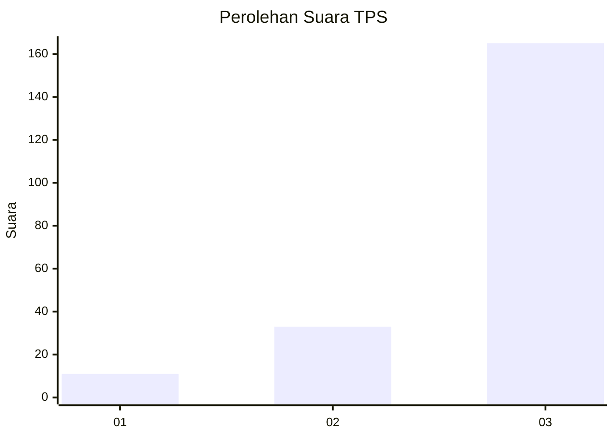
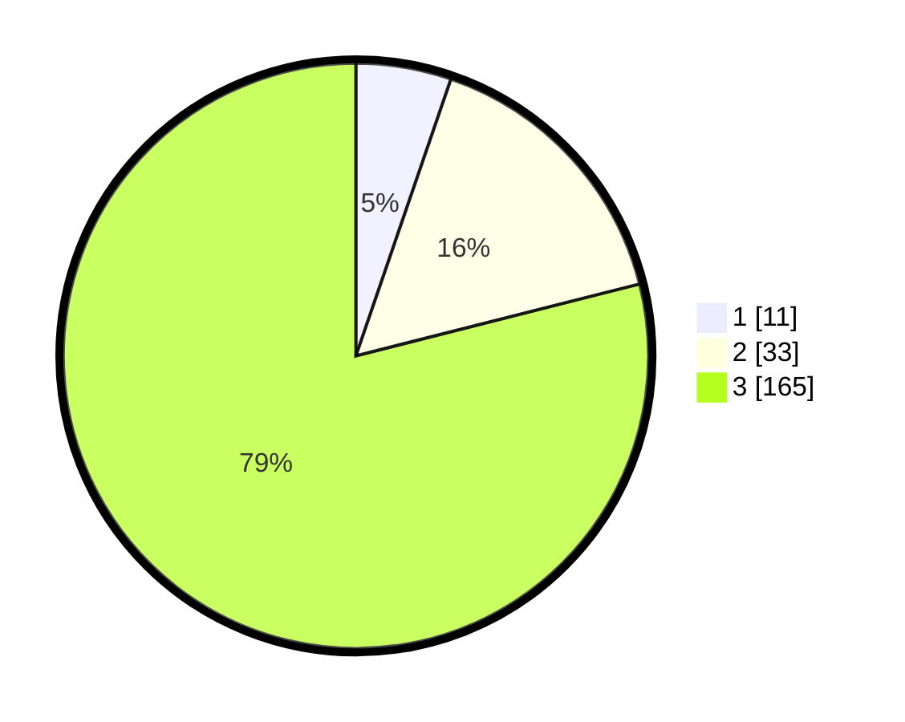

# Hasil

## Grafik

## Tabel

| No. | Nama Paslon    | Suara | Suara (raw) | Persentase |
|:--- |:-------------- | -----:| -----------:| ----------:|
| 1   | ANIES MUHAIMIN | 11    | [11][p-1]   | 5,26       |
| 2   | PRABOWO GIBRAN | 33    | [33][p-2]   | 15,79      |
| 3   | GANJAR MAHFUD  | 165   | [165][p-3]  | 78,95      |

[p-1]: https://github.com/gigit-pemilu/pemilu-2024-33-jawa-tengah/blob/main/pilpres/hitung-suara/sub/33-jawa-tengah/sub/09-boyolali/sub/08-sawit/sub/2004-tegalrejo/sub/001-tps/sub/paslon-1.txt
[p-2]: https://github.com/gigit-pemilu/pemilu-2024-33-jawa-tengah/blob/main/pilpres/hitung-suara/sub/33-jawa-tengah/sub/09-boyolali/sub/08-sawit/sub/2004-tegalrejo/sub/001-tps/sub/paslon-2.txt
[p-3]: https://github.com/gigit-pemilu/pemilu-2024-33-jawa-tengah/blob/main/pilpres/hitung-suara/sub/33-jawa-tengah/sub/09-boyolali/sub/08-sawit/sub/2004-tegalrejo/sub/001-tps/sub/paslon-3.txt

## Foto C Plano

https://sirekap-obj-formc.kpu.go.id/c670/pemilu/ppwp/33/09/08/20/04/3309082004001-20240214-213648--22d43cb0-d64d-4df1-9046-38dc573a0d08.jpg

https://sirekap-obj-formc.kpu.go.id/c670/pemilu/ppwp/33/09/08/20/04/3309082004001-20240214-214100--6518eff9-02a4-40e9-b7e8-d09af4fe3306.jpg

https://sirekap-obj-formc.kpu.go.id/c670/pemilu/ppwp/33/09/08/20/04/3309082004001-20240214-214341--62b673aa-8e6b-4158-9b9a-91b0a997b816.jpg

## Metadata

| Key        | Value               |
| ---------- | ------------------- |
| Time Stamp | 2024-02-15 15:00:29 |

