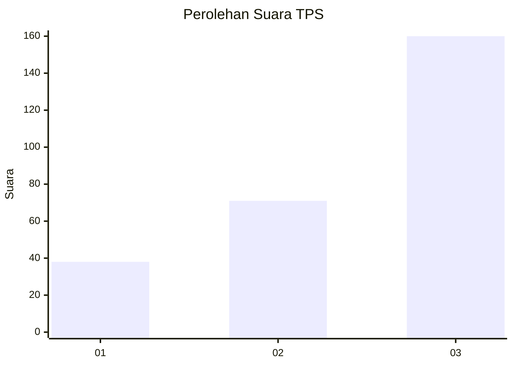
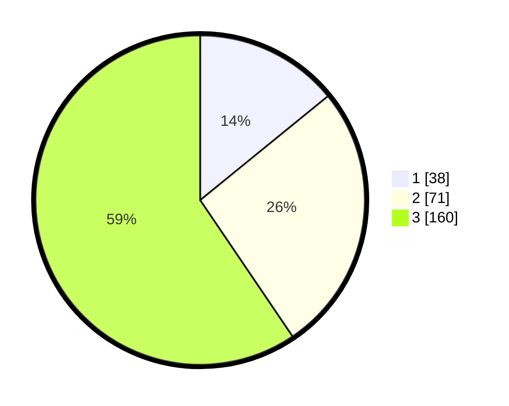

# Hasil

## Grafik

## Tabel

| No. | Nama Paslon    | Suara | Suara (raw) | Persentase |
|:--- |:-------------- | -----:| -----------:| ----------:|
| 1   | ANIES MUHAIMIN | 38    | [38][p-1]   | 14,13      |
| 2   | PRABOWO GIBRAN | 71    | [71][p-2]   | 26,39      |
| 3   | GANJAR MAHFUD  | 160   | [160][p-3]  | 59,48      |

[p-1]: https://github.com/gigit-pemilu/pemilu-2024/blob/main/pilpres/hitung-suara/sub/33-jawa-tengah/sub/09-boyolali/sub/08-sawit/sub/2004-tegalrejo/sub/008-tps/sub/paslon-1.txt
[p-2]: https://github.com/gigit-pemilu/pemilu-2024/blob/main/pilpres/hitung-suara/sub/33-jawa-tengah/sub/09-boyolali/sub/08-sawit/sub/2004-tegalrejo/sub/008-tps/sub/paslon-2.txt
[p-3]: https://github.com/gigit-pemilu/pemilu-2024/blob/main/pilpres/hitung-suara/sub/33-jawa-tengah/sub/09-boyolali/sub/08-sawit/sub/2004-tegalrejo/sub/008-tps/sub/paslon-3.txt

## Foto C Plano

https://sirekap-obj-formc.kpu.go.id/2596/pemilu/ppwp/33/09/08/20/04/3309082004008-20240214-214630--a934e96a-77cb-4673-8a60-4f8a14bc82dd.jpg

https://sirekap-obj-formc.kpu.go.id/2596/pemilu/ppwp/33/09/08/20/04/3309082004008-20240214-214919--90748b50-7c47-4ec3-a23a-073c76be9a75.jpg

https://sirekap-obj-formc.kpu.go.id/2596/pemilu/ppwp/33/09/08/20/04/3309082004008-20240214-215018--2e66742c-86cf-41a6-8a8c-6a10f2d99ad8.jpg

## Metadata

| Key        | Value               |
| ---------- | ------------------- |
| Time Stamp | 2024-02-15 15:00:29 |

