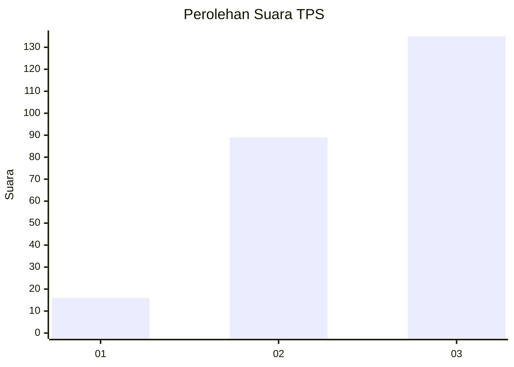
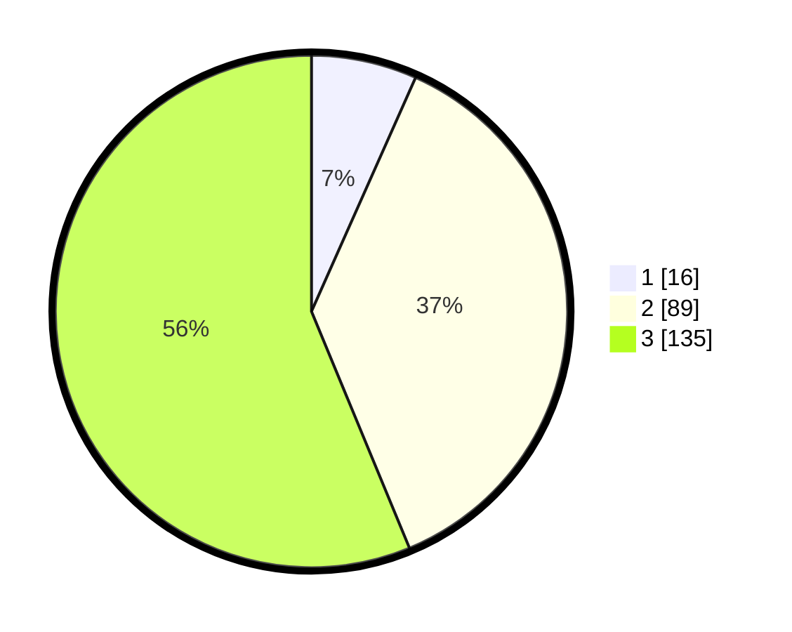

# Hasil

## Grafik

## Tabel

| No. | Nama Paslon    | Suara | Suara (raw) | Persentase |
|:--- |:-------------- | -----:| -----------:| ----------:|
| 1   | ANIES MUHAIMIN | 16    | [16][p-1]   | 6,67       |
| 2   | PRABOWO GIBRAN | 89    | [89][p-2]   | 37,08      |
| 3   | GANJAR MAHFUD  | 135   | [135][p-3]  | 56,25      |

[p-1]: https://github.com/gigit-pemilu/pemilu-2024-33-jawa-tengah/blob/main/pilpres/hitung-suara/sub/33-jawa-tengah/sub/09-boyolali/sub/08-sawit/sub/2006-jenengan/sub/002-tps/sub/paslon-1.txt
[p-2]: https://github.com/gigit-pemilu/pemilu-2024-33-jawa-tengah/blob/main/pilpres/hitung-suara/sub/33-jawa-tengah/sub/09-boyolali/sub/08-sawit/sub/2006-jenengan/sub/002-tps/sub/paslon-2.txt
[p-3]: https://github.com/gigit-pemilu/pemilu-2024-33-jawa-tengah/blob/main/pilpres/hitung-suara/sub/33-jawa-tengah/sub/09-boyolali/sub/08-sawit/sub/2006-jenengan/sub/002-tps/sub/paslon-3.txt

## Foto C Plano

https://sirekap-obj-formc.kpu.go.id/ca79/pemilu/ppwp/33/09/08/20/06/3309082006002-20240215-000644--ee6cbe02-8852-4f97-8470-183ca0b94847.jpg

https://sirekap-obj-formc.kpu.go.id/ca79/pemilu/ppwp/33/09/08/20/06/3309082006002-20240215-000718--e00ac92c-472b-4e98-8c8c-f2d466c43c9a.jpg

https://sirekap-obj-formc.kpu.go.id/ca79/pemilu/ppwp/33/09/08/20/06/3309082006002-20240215-000726--7ebbd05a-19e9-49fa-b6dd-496b4b08545f.jpg

## Metadata

| Key        | Value               |
| ---------- | ------------------- |
| Time Stamp | 2024-02-15 15:00:29 |

