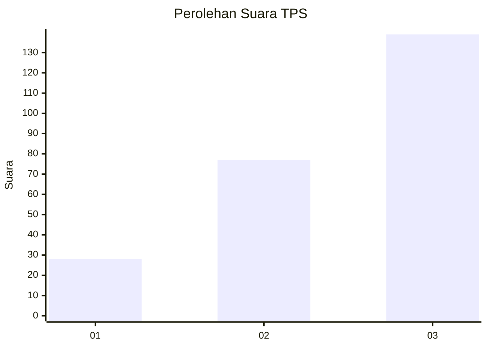
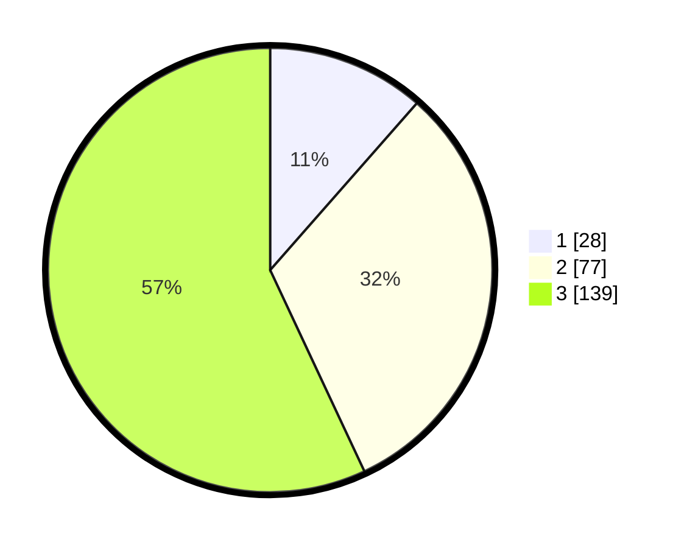

# Hasil

## Grafik

## Tabel

| No. | Nama Paslon    | Suara | Suara (raw) | Persentase |
|:--- |:-------------- | -----:| -----------:| ----------:|
| 1   | ANIES MUHAIMIN | 28    | [28][p-1]   | 11,48      |
| 2   | PRABOWO GIBRAN | 77    | [77][p-2]   | 31,56      |
| 3   | GANJAR MAHFUD  | 139   | [139][p-3]  | 56,97      |

[p-1]: https://github.com/gigit-pemilu/pemilu-2024-33-jawa-tengah/blob/main/pilpres/hitung-suara/sub/33-jawa-tengah/sub/09-boyolali/sub/08-sawit/sub/2009-jatirejo/sub/006-tps/sub/paslon-1.txt
[p-2]: https://github.com/gigit-pemilu/pemilu-2024-33-jawa-tengah/blob/main/pilpres/hitung-suara/sub/33-jawa-tengah/sub/09-boyolali/sub/08-sawit/sub/2009-jatirejo/sub/006-tps/sub/paslon-2.txt
[p-3]: https://github.com/gigit-pemilu/pemilu-2024-33-jawa-tengah/blob/main/pilpres/hitung-suara/sub/33-jawa-tengah/sub/09-boyolali/sub/08-sawit/sub/2009-jatirejo/sub/006-tps/sub/paslon-3.txt

## Foto C Plano

https://sirekap-obj-formc.kpu.go.id/2da9/pemilu/ppwp/33/09/08/20/09/3309082009006-20240214-234107--316f0421-a4ff-4885-b4cf-413aac330745.jpg

https://sirekap-obj-formc.kpu.go.id/2da9/pemilu/ppwp/33/09/08/20/09/3309082009006-20240214-234134--da367c17-8cdd-4472-8615-8f97fd1cbab0.jpg

https://sirekap-obj-formc.kpu.go.id/2da9/pemilu/ppwp/33/09/08/20/09/3309082009006-20240214-234151--901669a7-47d5-42a4-b9ce-be3bdfd2040e.jpg

## Metadata

| Key        | Value               |
| ---------- | ------------------- |
| Time Stamp | 2024-02-15 09:00:24 |

