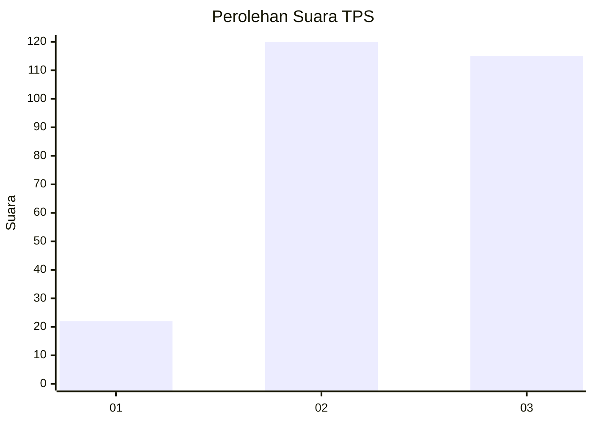
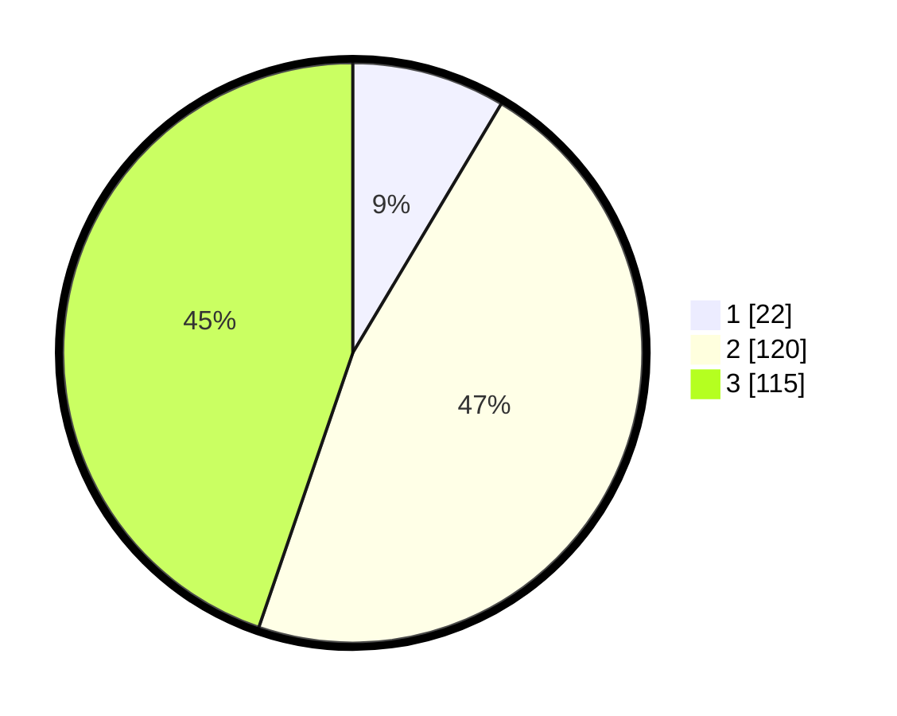

# Hasil

## Grafik

## Tabel

| No. | Nama Paslon    | Suara | Suara (raw) | Persentase |
|:--- |:-------------- | -----:| -----------:| ----------:|
| 1   | ANIES MUHAIMIN | 22    | [22][p-1]   | 8,56       |
| 2   | PRABOWO GIBRAN | 120   | [120][p-2]  | 46,69      |
| 3   | GANJAR MAHFUD  | 115   | [115][p-3]  | 44,75      |

[p-1]: https://github.com/gigit-pemilu/pemilu-2024-33-jawa-tengah/blob/main/pilpres/hitung-suara/sub/33-jawa-tengah/sub/09-boyolali/sub/08-sawit/sub/2010-bendosari/sub/005-tps/sub/paslon-1.txt
[p-2]: https://github.com/gigit-pemilu/pemilu-2024-33-jawa-tengah/blob/main/pilpres/hitung-suara/sub/33-jawa-tengah/sub/09-boyolali/sub/08-sawit/sub/2010-bendosari/sub/005-tps/sub/paslon-2.txt
[p-3]: https://github.com/gigit-pemilu/pemilu-2024-33-jawa-tengah/blob/main/pilpres/hitung-suara/sub/33-jawa-tengah/sub/09-boyolali/sub/08-sawit/sub/2010-bendosari/sub/005-tps/sub/paslon-3.txt

## Foto C Plano

https://sirekap-obj-formc.kpu.go.id/e0a8/pemilu/ppwp/33/09/08/20/10/3309082010005-20240215-023527--c41583ba-bab5-4624-8c39-6f86a3a08560.jpg

https://sirekap-obj-formc.kpu.go.id/e0a8/pemilu/ppwp/33/09/08/20/10/3309082010005-20240215-023857--f8ea0b36-dc49-4964-ae63-47d9cd2eea44.jpg

https://sirekap-obj-formc.kpu.go.id/e0a8/pemilu/ppwp/33/09/08/20/10/3309082010005-20240215-024034--28dddb47-e8b2-454d-b8e2-e1b6024f1a43.jpg

## Metadata

| Key        | Value               |
| ---------- | ------------------- |
| Time Stamp | 2024-02-15 22:00:27 |

