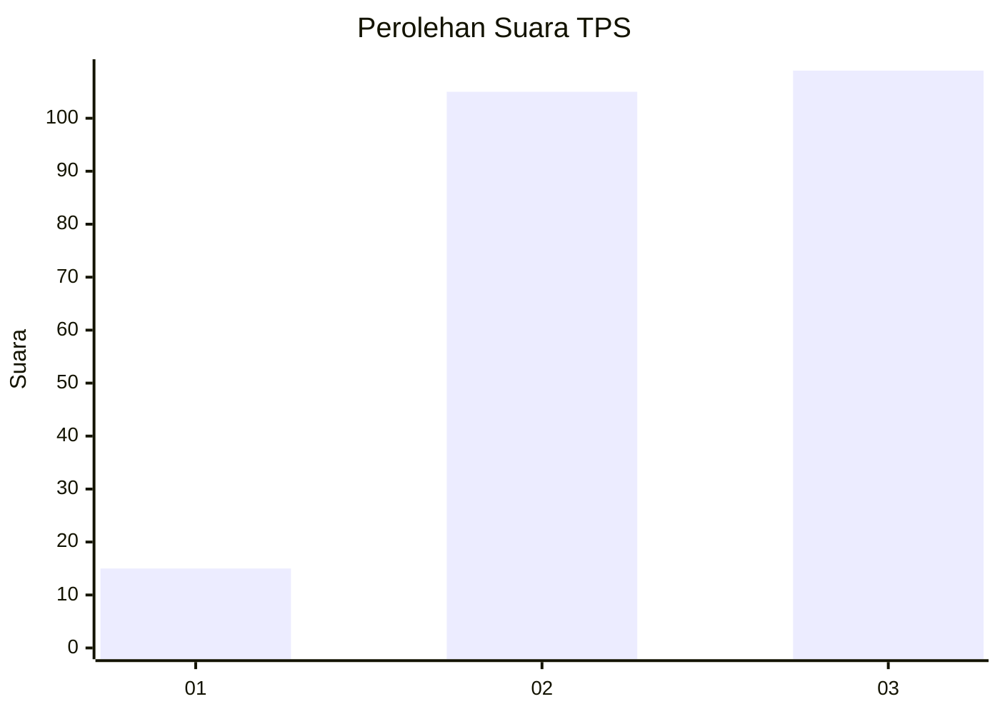
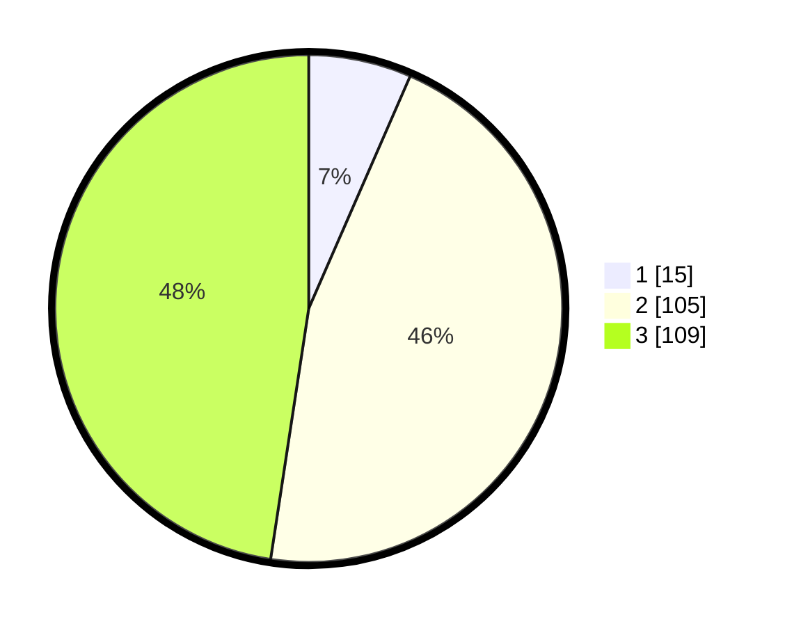

# Hasil

## Grafik

## Tabel

| No. | Nama Paslon    | Suara | Suara (raw) | Persentase |
|:--- |:-------------- | -----:| -----------:| ----------:|
| 1   | ANIES MUHAIMIN | 15    | [15][p-1]   | 6,55       |
| 2   | PRABOWO GIBRAN | 105   | [105][p-2]  | 45,85      |
| 3   | GANJAR MAHFUD  | 109   | [109][p-3]  | 47,60      |

[p-1]: https://github.com/gigit-pemilu/pemilu-2024-33-jawa-tengah/blob/main/pilpres/hitung-suara/sub/33-jawa-tengah/sub/09-boyolali/sub/09-banyudono/sub/2001-dukuh/sub/001-tps/sub/paslon-1.txt
[p-2]: https://github.com/gigit-pemilu/pemilu-2024-33-jawa-tengah/blob/main/pilpres/hitung-suara/sub/33-jawa-tengah/sub/09-boyolali/sub/09-banyudono/sub/2001-dukuh/sub/001-tps/sub/paslon-2.txt
[p-3]: https://github.com/gigit-pemilu/pemilu-2024-33-jawa-tengah/blob/main/pilpres/hitung-suara/sub/33-jawa-tengah/sub/09-boyolali/sub/09-banyudono/sub/2001-dukuh/sub/001-tps/sub/paslon-3.txt

## Foto C Plano

https://sirekap-obj-formc.kpu.go.id/12ba/pemilu/ppwp/33/09/09/20/01/3309092001001-20240215-012038--3c1093dd-916d-4ec3-893b-30ac8f1262d8.jpg

https://sirekap-obj-formc.kpu.go.id/12ba/pemilu/ppwp/33/09/09/20/01/3309092001001-20240215-011740--6b55d4c0-b231-4630-b74c-ecedebbd1fb8.jpg

https://sirekap-obj-formc.kpu.go.id/12ba/pemilu/ppwp/33/09/09/20/01/3309092001001-20240215-012220--7cff90c3-f18e-48de-94d7-1cd3aaaf11fa.jpg

## Metadata

| Key        | Value               |
| ---------- | ------------------- |
| Time Stamp | 2024-02-17 16:00:02 |

