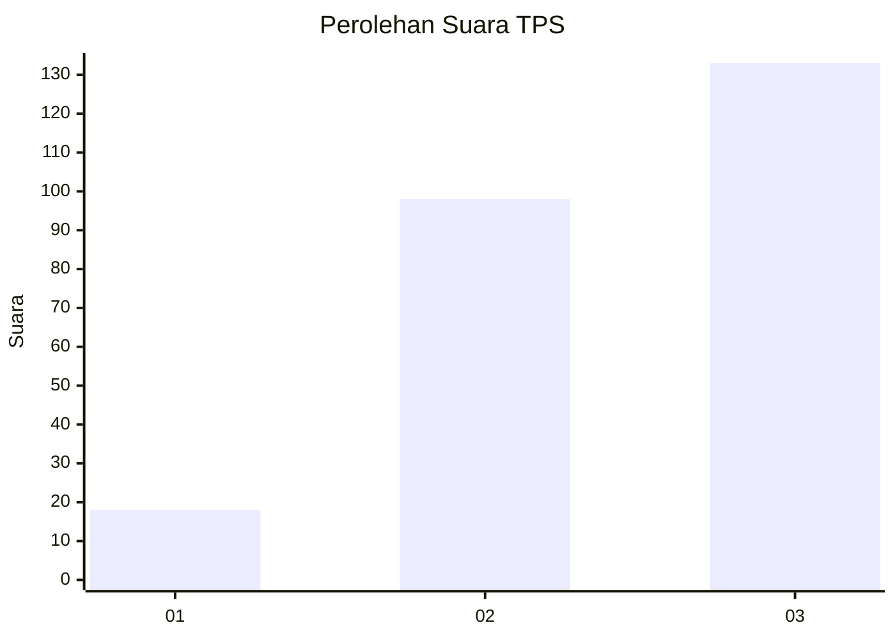
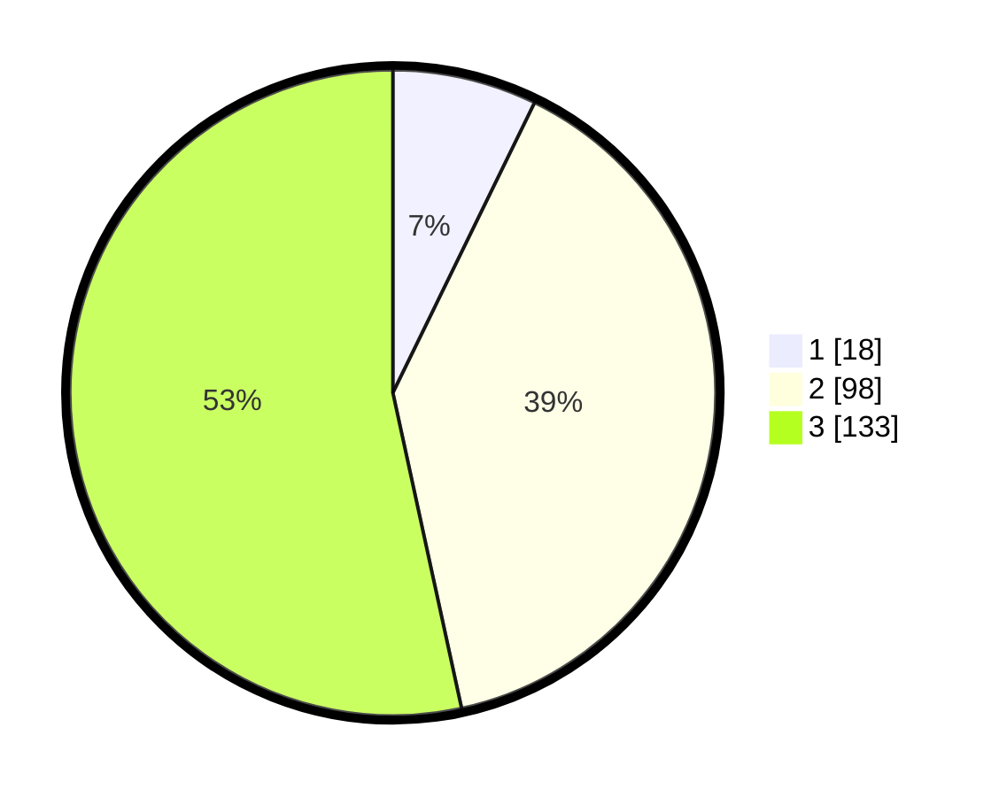

# Hasil

## Grafik

## Tabel

| No. | Nama Paslon    | Suara | Suara (raw) | Persentase |
|:--- |:-------------- | -----:| -----------:| ----------:|
| 1   | ANIES MUHAIMIN | 18    | [18][p-1]   | 7,23       |
| 2   | PRABOWO GIBRAN | 98    | [98][p-2]   | 39,36      |
| 3   | GANJAR MAHFUD  | 133   | [133][p-3]  | 53,41      |

[p-1]: https://github.com/gigit-pemilu/pemilu-2024-33-jawa-tengah/blob/main/pilpres/hitung-suara/sub/33-jawa-tengah/sub/09-boyolali/sub/09-banyudono/sub/2001-dukuh/sub/002-tps/sub/paslon-1.txt
[p-2]: https://github.com/gigit-pemilu/pemilu-2024-33-jawa-tengah/blob/main/pilpres/hitung-suara/sub/33-jawa-tengah/sub/09-boyolali/sub/09-banyudono/sub/2001-dukuh/sub/002-tps/sub/paslon-2.txt
[p-3]: https://github.com/gigit-pemilu/pemilu-2024-33-jawa-tengah/blob/main/pilpres/hitung-suara/sub/33-jawa-tengah/sub/09-boyolali/sub/09-banyudono/sub/2001-dukuh/sub/002-tps/sub/paslon-3.txt

## Foto C Plano

https://sirekap-obj-formc.kpu.go.id/d3a4/pemilu/ppwp/33/09/09/20/01/3309092001002-20240214-225344--7366a808-89b6-4e2c-a722-469667d7662e.jpg

https://sirekap-obj-formc.kpu.go.id/d3a4/pemilu/ppwp/33/09/09/20/01/3309092001002-20240214-230011--4c2d6c1d-0142-4a93-a2fa-bd95fec6c62d.jpg

https://sirekap-obj-formc.kpu.go.id/d3a4/pemilu/ppwp/33/09/09/20/01/3309092001002-20240214-230309--a57dcf4e-e6ec-488e-8da6-8dbbae739cbe.jpg

## Metadata

| Key        | Value               |
| ---------- | ------------------- |
| Time Stamp | 2024-02-16 12:51:22 |

