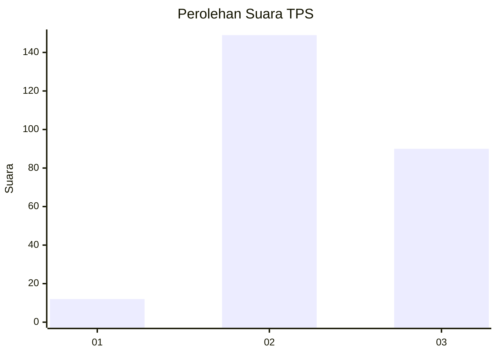
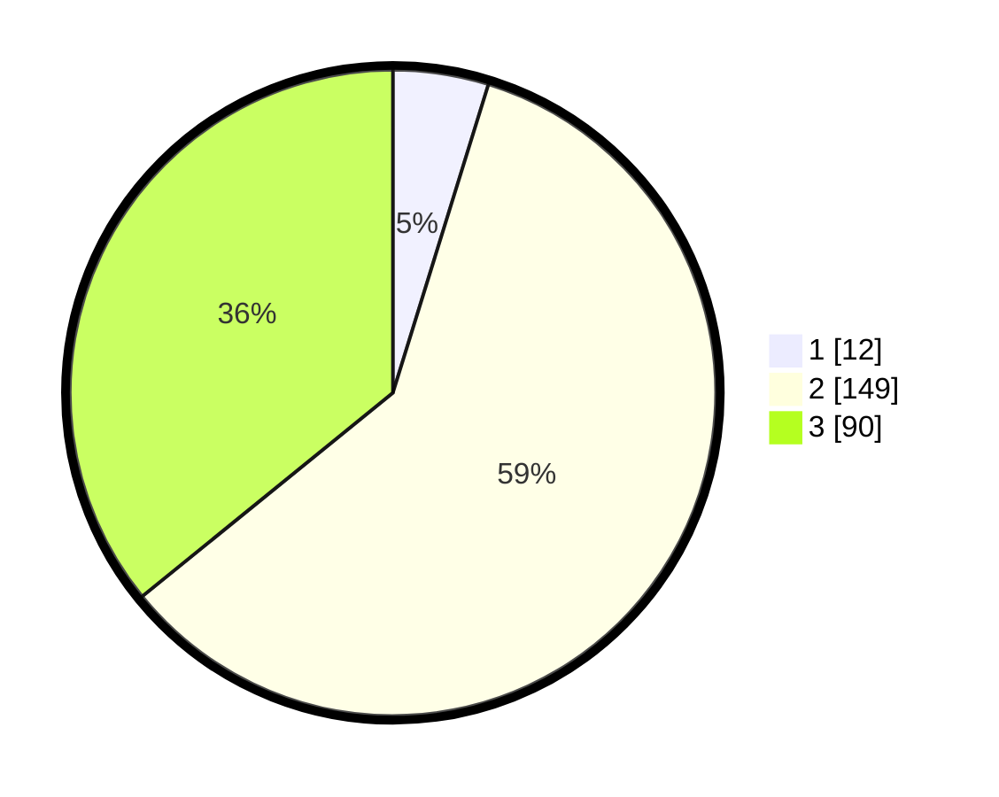

# Hasil

## Grafik

## Tabel

| No. | Nama Paslon    | Suara | Suara (raw) | Persentase |
|:--- |:-------------- | -----:| -----------:| ----------:|
| 1   | ANIES MUHAIMIN | 12    | [12][p-1]   | 4,78       |
| 2   | PRABOWO GIBRAN | 149   | [149][p-2]  | 59,36      |
| 3   | GANJAR MAHFUD  | 90    | [90][p-3]   | 35,86      |

[p-1]: https://github.com/gigit-pemilu/pemilu-2024-33-jawa-tengah/blob/main/pilpres/hitung-suara/sub/33-jawa-tengah/sub/09-boyolali/sub/09-banyudono/sub/2001-dukuh/sub/004-tps/sub/paslon-1.txt
[p-2]: https://github.com/gigit-pemilu/pemilu-2024-33-jawa-tengah/blob/main/pilpres/hitung-suara/sub/33-jawa-tengah/sub/09-boyolali/sub/09-banyudono/sub/2001-dukuh/sub/004-tps/sub/paslon-2.txt
[p-3]: https://github.com/gigit-pemilu/pemilu-2024-33-jawa-tengah/blob/main/pilpres/hitung-suara/sub/33-jawa-tengah/sub/09-boyolali/sub/09-banyudono/sub/2001-dukuh/sub/004-tps/sub/paslon-3.txt

## Foto C Plano

https://sirekap-obj-formc.kpu.go.id/787e/pemilu/ppwp/33/09/09/20/01/3309092001004-20240215-000543--05ca10fc-5f75-43e0-a269-9964fe2d06c0.jpg

https://sirekap-obj-formc.kpu.go.id/787e/pemilu/ppwp/33/09/09/20/01/3309092001004-20240215-001914--52e63749-afce-4995-b9ae-98c916edb89b.jpg

https://sirekap-obj-formc.kpu.go.id/787e/pemilu/ppwp/33/09/09/20/01/3309092001004-20240215-000908--c331028c-530f-4474-b286-d733c46fd3f7.jpg

## Metadata

| Key        | Value               |
| ---------- | ------------------- |
| Time Stamp | 2024-02-16 12:51:22 |

