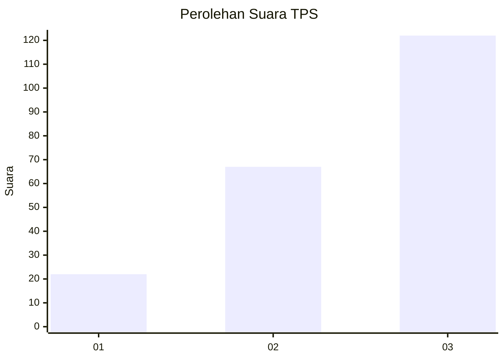
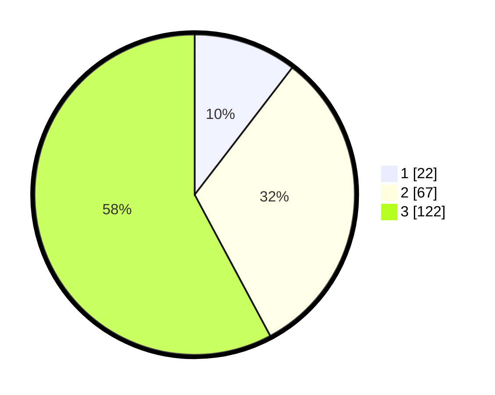

# Hasil

## Grafik

## Tabel

| No. | Nama Paslon    | Suara | Suara (raw) | Persentase |
|:--- |:-------------- | -----:| -----------:| ----------:|
| 1   | ANIES MUHAIMIN | 22    | [22][p-1]   | 10,43      |
| 2   | PRABOWO GIBRAN | 67    | [67][p-2]   | 31,75      |
| 3   | GANJAR MAHFUD  | 122   | [122][p-3]  | 57,82      |

[p-1]: https://github.com/gigit-pemilu/pemilu-2024/blob/main/pilpres/hitung-suara/sub/33-jawa-tengah/sub/09-boyolali/sub/09-banyudono/sub/2001-dukuh/sub/007-tps/sub/paslon-1.txt
[p-2]: https://github.com/gigit-pemilu/pemilu-2024/blob/main/pilpres/hitung-suara/sub/33-jawa-tengah/sub/09-boyolali/sub/09-banyudono/sub/2001-dukuh/sub/007-tps/sub/paslon-2.txt
[p-3]: https://github.com/gigit-pemilu/pemilu-2024/blob/main/pilpres/hitung-suara/sub/33-jawa-tengah/sub/09-boyolali/sub/09-banyudono/sub/2001-dukuh/sub/007-tps/sub/paslon-3.txt

## Foto C Plano

https://sirekap-obj-formc.kpu.go.id/8888/pemilu/ppwp/33/09/09/20/01/3309092001007-20240215-002254--89300d11-7c99-4b9f-8989-0a52f30f6549.jpg

https://sirekap-obj-formc.kpu.go.id/8888/pemilu/ppwp/33/09/09/20/01/3309092001007-20240215-002330--0ce63271-352f-45ed-97d3-f1bd130e9d03.jpg

https://sirekap-obj-formc.kpu.go.id/8888/pemilu/ppwp/33/09/09/20/01/3309092001007-20240215-002413--6ca8b6f8-8bd2-483d-82fd-4c3e8faf7d05.jpg

## Metadata

| Key        | Value               |
| ---------- | ------------------- |
| Time Stamp | 2024-02-16 12:51:22 |

