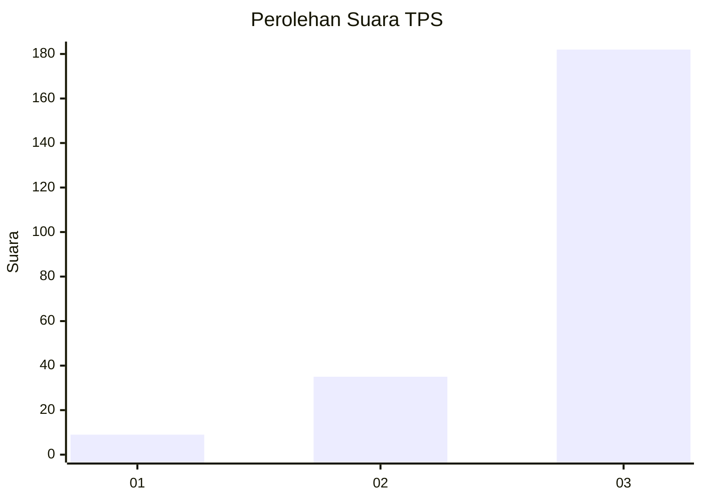
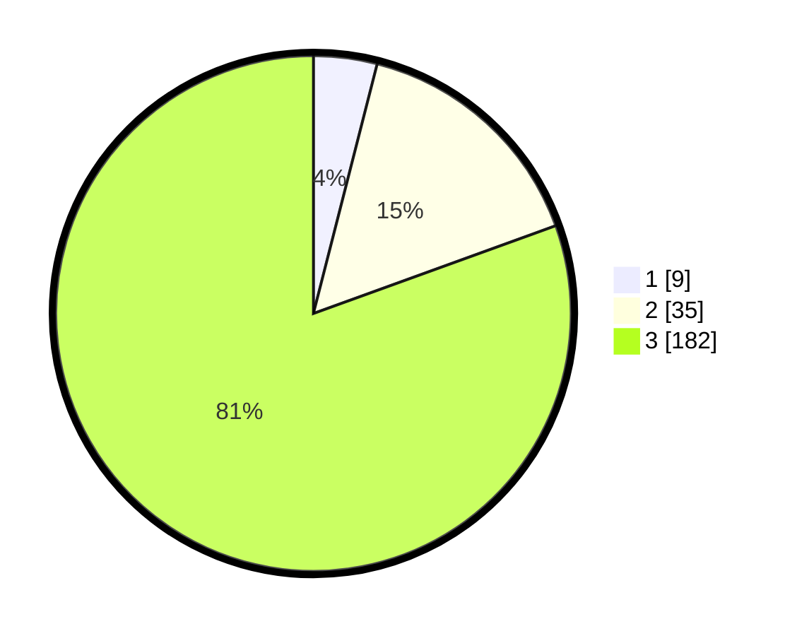

# Hasil

## Grafik

## Tabel

| No. | Nama Paslon    | Suara | Suara (raw) | Persentase |
|:--- |:-------------- | -----:| -----------:| ----------:|
| 1   | ANIES MUHAIMIN | 9     | [9][p-1]    | 3,98       |
| 2   | PRABOWO GIBRAN | 35    | [35][p-2]   | 15,49      |
| 3   | GANJAR MAHFUD  | 182   | [182][p-3]  | 80,53      |

[p-1]: https://github.com/gigit-pemilu/pemilu-2024/blob/main/pilpres/hitung-suara/sub/33-jawa-tengah/sub/09-boyolali/sub/09-banyudono/sub/2002-jipangan/sub/009-tps/sub/paslon-1.txt
[p-2]: https://github.com/gigit-pemilu/pemilu-2024/blob/main/pilpres/hitung-suara/sub/33-jawa-tengah/sub/09-boyolali/sub/09-banyudono/sub/2002-jipangan/sub/009-tps/sub/paslon-2.txt
[p-3]: https://github.com/gigit-pemilu/pemilu-2024/blob/main/pilpres/hitung-suara/sub/33-jawa-tengah/sub/09-boyolali/sub/09-banyudono/sub/2002-jipangan/sub/009-tps/sub/paslon-3.txt

## Foto C Plano

https://sirekap-obj-formc.kpu.go.id/2218/pemilu/ppwp/33/09/09/20/02/3309092002009-20240214-220015--ebacc109-f4a8-4b25-9e83-a1ced7b92689.jpg

https://sirekap-obj-formc.kpu.go.id/2218/pemilu/ppwp/33/09/09/20/02/3309092002009-20240214-220326--c8fc890e-6c11-400b-a429-9ec228252da7.jpg

https://sirekap-obj-formc.kpu.go.id/2218/pemilu/ppwp/33/09/09/20/02/3309092002009-20240214-221154--8c46401e-c869-466f-94af-9ceb6f386b54.jpg

## Metadata

| Key        | Value               |
| ---------- | ------------------- |
| Time Stamp | 2024-02-16 12:51:22 |

