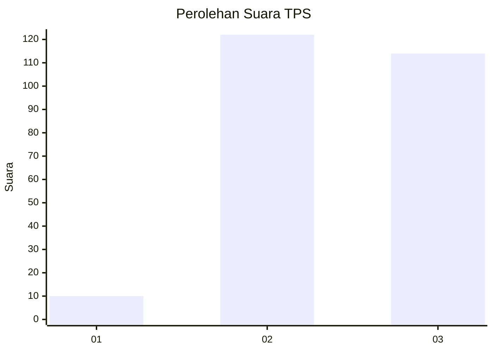
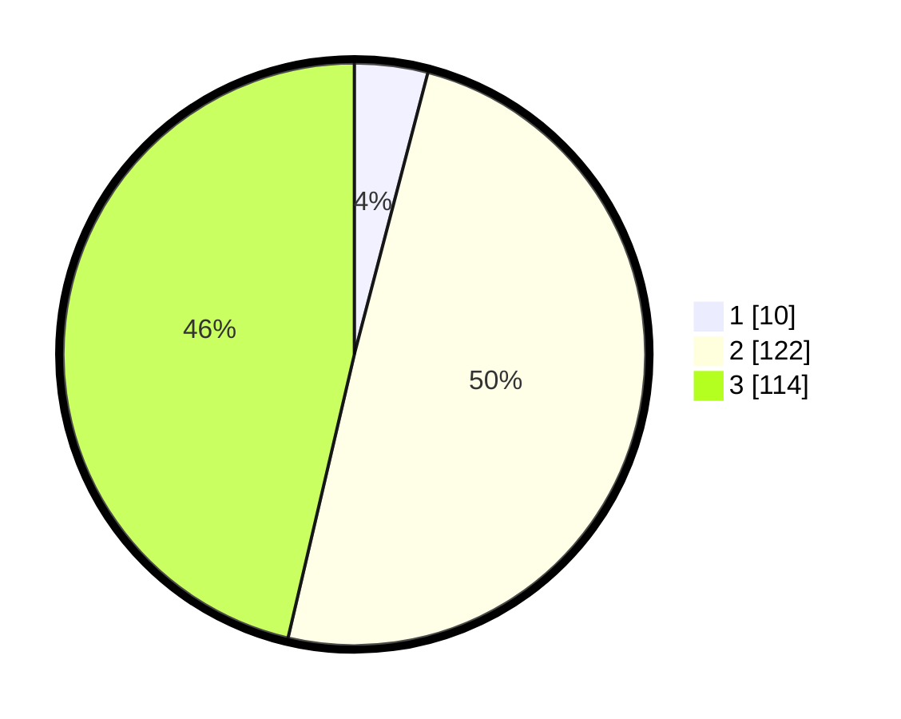

# Hasil

## Grafik

## Tabel

| No. | Nama Paslon    | Suara | Suara (raw) | Persentase |
|:--- |:-------------- | -----:| -----------:| ----------:|
| 1   | ANIES MUHAIMIN | 10    | [10][p-1]   | 4,07       |
| 2   | PRABOWO GIBRAN | 122   | [122][p-2]  | 49,59      |
| 3   | GANJAR MAHFUD  | 114   | [114][p-3]  | 46,34      |

[p-1]: https://github.com/gigit-pemilu/pemilu-2024/blob/main/pilpres/hitung-suara/sub/33-jawa-tengah/sub/09-boyolali/sub/09-banyudono/sub/2003-jembungan/sub/001-tps/sub/paslon-1.txt
[p-2]: https://github.com/gigit-pemilu/pemilu-2024/blob/main/pilpres/hitung-suara/sub/33-jawa-tengah/sub/09-boyolali/sub/09-banyudono/sub/2003-jembungan/sub/001-tps/sub/paslon-2.txt
[p-3]: https://github.com/gigit-pemilu/pemilu-2024/blob/main/pilpres/hitung-suara/sub/33-jawa-tengah/sub/09-boyolali/sub/09-banyudono/sub/2003-jembungan/sub/001-tps/sub/paslon-3.txt

## Foto C Plano

https://sirekap-obj-formc.kpu.go.id/5c0e/pemilu/ppwp/33/09/09/20/03/3309092003001-20240214-222311--e7c051d3-a17a-4a53-bfbe-8e10da9e8dfd.jpg

https://sirekap-obj-formc.kpu.go.id/5c0e/pemilu/ppwp/33/09/09/20/03/3309092003001-20240214-222417--b1504c39-da5a-4625-a597-1b79a7aa0b47.jpg

https://sirekap-obj-formc.kpu.go.id/5c0e/pemilu/ppwp/33/09/09/20/03/3309092003001-20240214-222542--f02b1e0e-636f-4f91-9eb2-726cd4dc1ae3.jpg

## Metadata

| Key        | Value               |
| ---------- | ------------------- |
| Time Stamp | 2024-02-27 11:00:00 |

