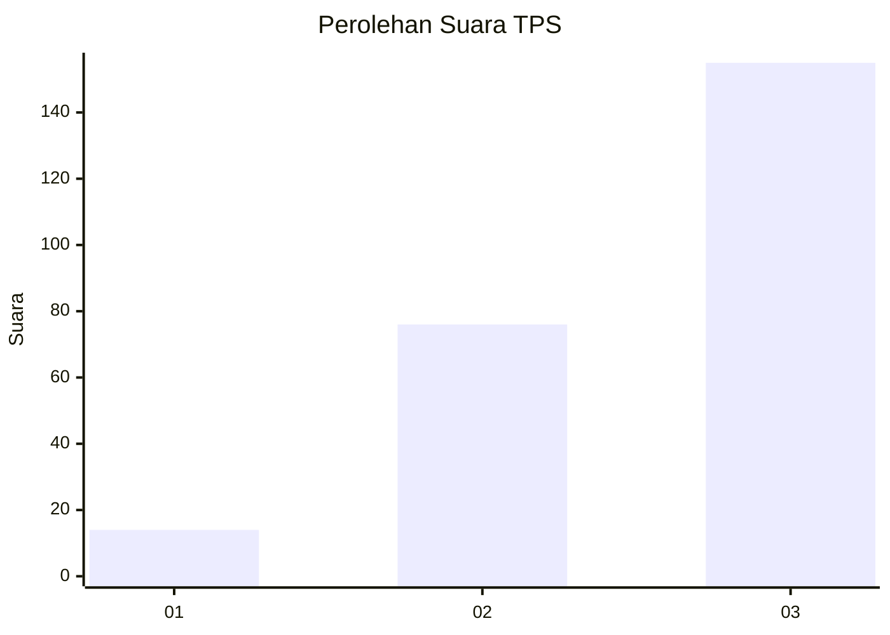
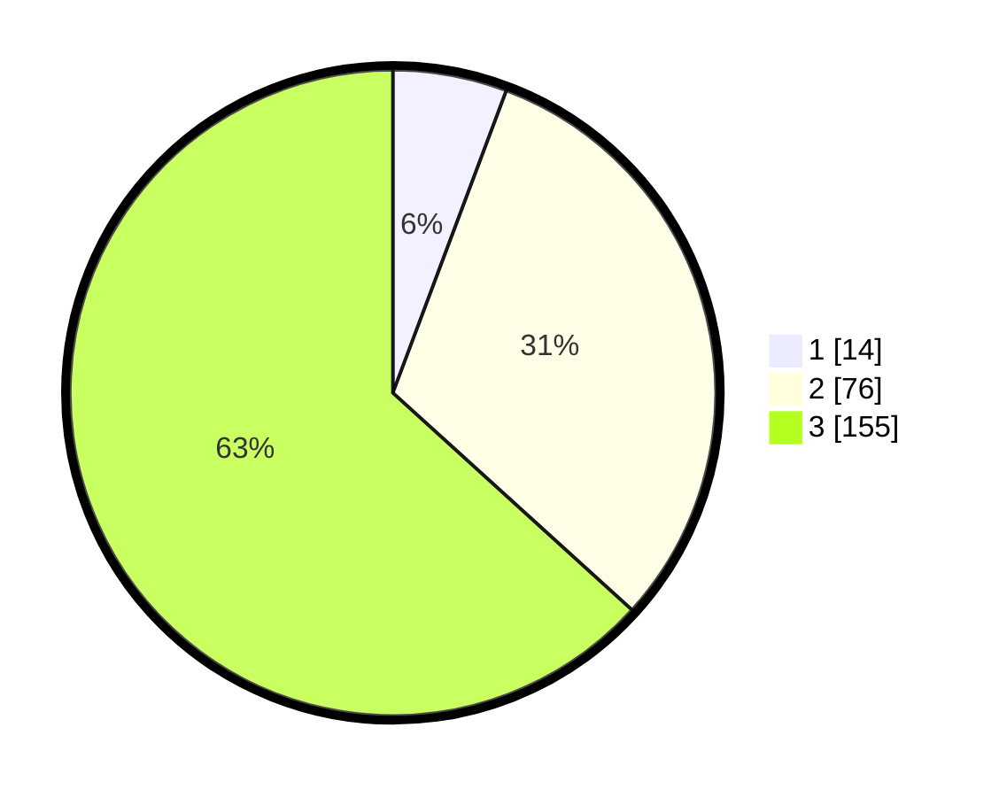

# Hasil

## Grafik

## Tabel

| No. | Nama Paslon    | Suara | Suara (raw) | Persentase |
|:--- |:-------------- | -----:| -----------:| ----------:|
| 1   | ANIES MUHAIMIN | 14    | [14][p-1]   | 5,71       |
| 2   | PRABOWO GIBRAN | 76    | [76][p-2]   | 31,02      |
| 3   | GANJAR MAHFUD  | 155   | [155][p-3]  | 63,27      |

[p-1]: https://github.com/gigit-pemilu/pemilu-2024/blob/main/pilpres/hitung-suara/sub/33-jawa-tengah/sub/09-boyolali/sub/09-banyudono/sub/2003-jembungan/sub/002-tps/sub/paslon-1.txt
[p-2]: https://github.com/gigit-pemilu/pemilu-2024/blob/main/pilpres/hitung-suara/sub/33-jawa-tengah/sub/09-boyolali/sub/09-banyudono/sub/2003-jembungan/sub/002-tps/sub/paslon-2.txt
[p-3]: https://github.com/gigit-pemilu/pemilu-2024/blob/main/pilpres/hitung-suara/sub/33-jawa-tengah/sub/09-boyolali/sub/09-banyudono/sub/2003-jembungan/sub/002-tps/sub/paslon-3.txt

## Foto C Plano

https://sirekap-obj-formc.kpu.go.id/896a/pemilu/ppwp/33/09/09/20/03/3309092003002-20240214-234210--84af46e5-8154-4721-afce-2e026a6df569.jpg

https://sirekap-obj-formc.kpu.go.id/896a/pemilu/ppwp/33/09/09/20/03/3309092003002-20240214-234459--d8dcae6d-aaa4-4e54-a0f6-09f849676718.jpg

https://sirekap-obj-formc.kpu.go.id/896a/pemilu/ppwp/33/09/09/20/03/3309092003002-20240214-234630--066855bc-b1c5-4ff3-98e7-f1c730afe7ea.jpg

## Metadata

| Key        | Value               |
| ---------- | ------------------- |
| Time Stamp | 2024-02-24 22:31:28 |

