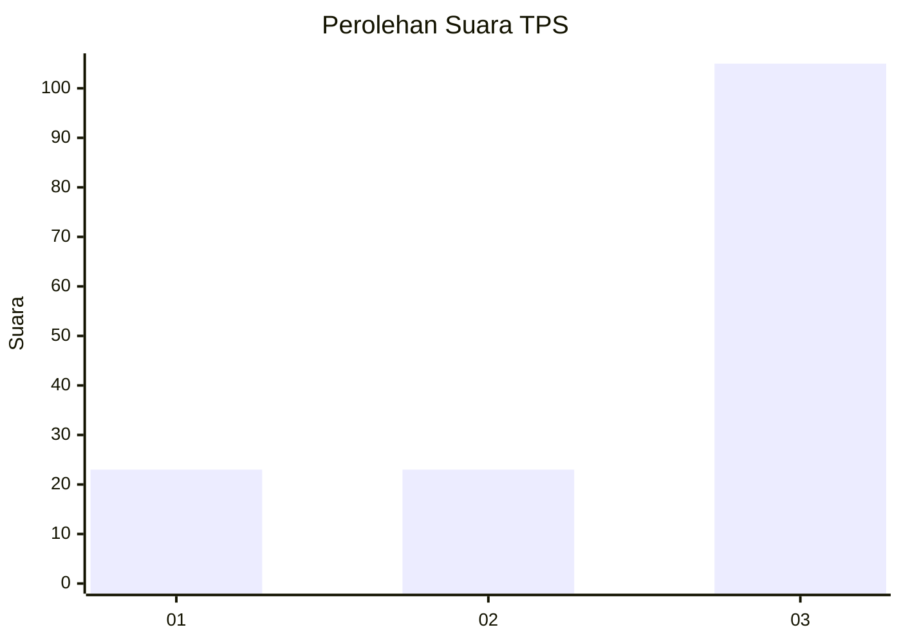
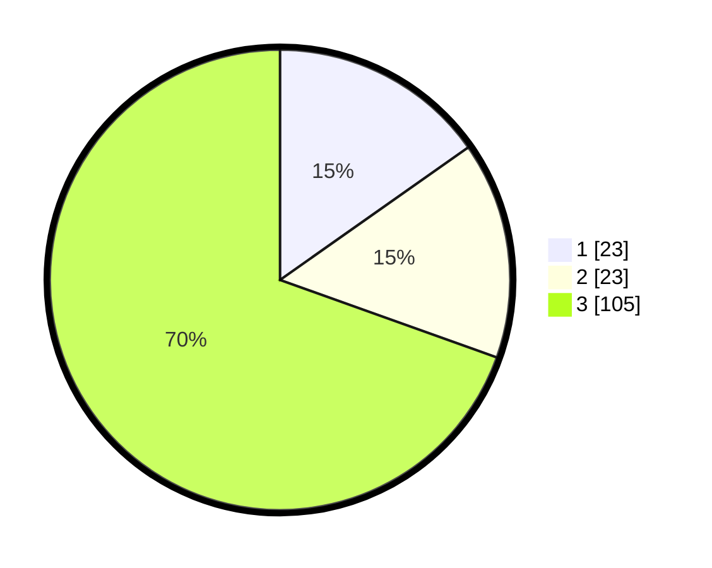

# Hasil

## Grafik

## Tabel

| No. | Nama Paslon    | Suara | Suara (raw) | Persentase |
|:--- |:-------------- | -----:| -----------:| ----------:|
| 1   | ANIES MUHAIMIN | 23    | [23][p-1]   | 15,23      |
| 2   | PRABOWO GIBRAN | 23    | [23][p-2]   | 15,23      |
| 3   | GANJAR MAHFUD  | 105   | [105][p-3]  | 69,54      |

[p-1]: https://github.com/gigit-pemilu/pemilu-2024-33-jawa-tengah/blob/main/pilpres/hitung-suara/sub/33-jawa-tengah/sub/09-boyolali/sub/09-banyudono/sub/2003-jembungan/sub/005-tps/sub/paslon-1.txt
[p-2]: https://github.com/gigit-pemilu/pemilu-2024-33-jawa-tengah/blob/main/pilpres/hitung-suara/sub/33-jawa-tengah/sub/09-boyolali/sub/09-banyudono/sub/2003-jembungan/sub/005-tps/sub/paslon-2.txt
[p-3]: https://github.com/gigit-pemilu/pemilu-2024-33-jawa-tengah/blob/main/pilpres/hitung-suara/sub/33-jawa-tengah/sub/09-boyolali/sub/09-banyudono/sub/2003-jembungan/sub/005-tps/sub/paslon-3.txt

## Foto C Plano

https://sirekap-obj-formc.kpu.go.id/363d/pemilu/ppwp/33/09/09/20/03/3309092003005-20240215-010209--76ce1148-99ac-49ea-b122-bf089c64a3a4.jpg

https://sirekap-obj-formc.kpu.go.id/363d/pemilu/ppwp/33/09/09/20/03/3309092003005-20240215-010329--ace88bc4-9dbf-494c-b788-cb61027b7012.jpg

https://sirekap-obj-formc.kpu.go.id/363d/pemilu/ppwp/33/09/09/20/03/3309092003005-20240215-010523--de941bb2-a699-4b13-bef6-85826288143e.jpg

## Metadata

| Key        | Value               |
| ---------- | ------------------- |
| Time Stamp | 2024-02-19 06:16:00 |

