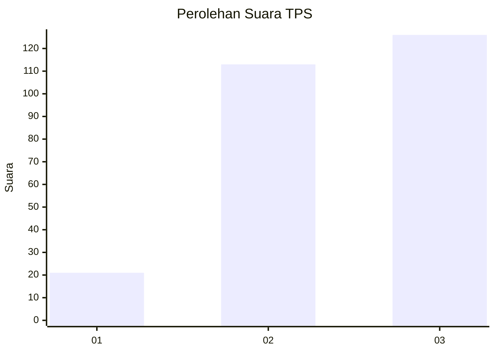
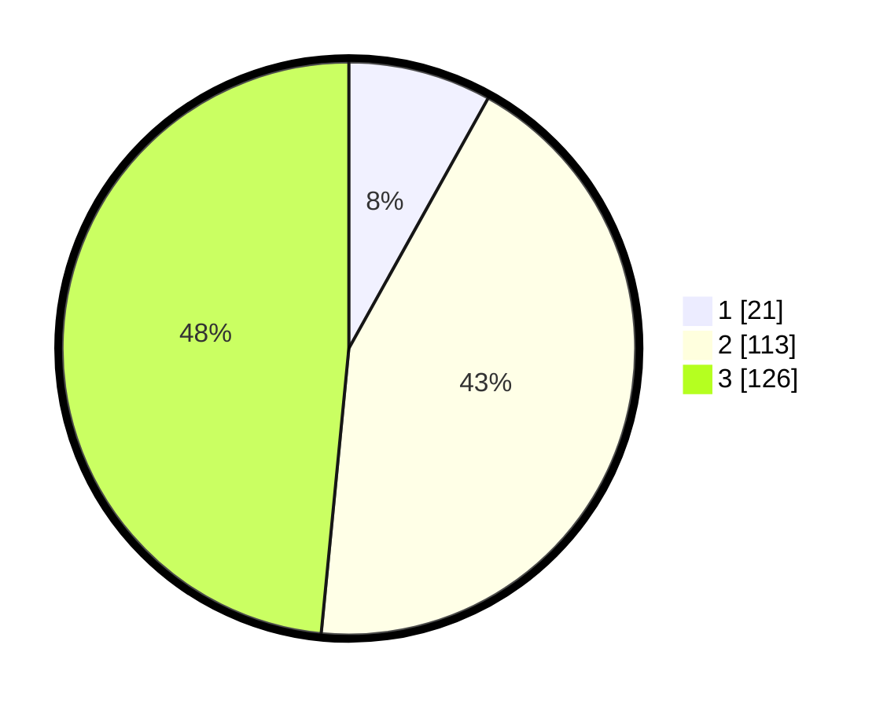

# Hasil

## Grafik

## Tabel

| No. | Nama Paslon    | Suara | Suara (raw) | Persentase |
|:--- |:-------------- | -----:| -----------:| ----------:|
| 1   | ANIES MUHAIMIN | 21    | [21][p-1]   | 8,08       |
| 2   | PRABOWO GIBRAN | 113   | [113][p-2]  | 43,46      |
| 3   | GANJAR MAHFUD  | 126   | [126][p-3]  | 48,46      |

[p-1]: https://github.com/gigit-pemilu/pemilu-2024-33-jawa-tengah/blob/main/pilpres/hitung-suara/sub/33-jawa-tengah/sub/09-boyolali/sub/09-banyudono/sub/2003-jembungan/sub/011-tps/sub/paslon-1.txt
[p-2]: https://github.com/gigit-pemilu/pemilu-2024-33-jawa-tengah/blob/main/pilpres/hitung-suara/sub/33-jawa-tengah/sub/09-boyolali/sub/09-banyudono/sub/2003-jembungan/sub/011-tps/sub/paslon-2.txt
[p-3]: https://github.com/gigit-pemilu/pemilu-2024-33-jawa-tengah/blob/main/pilpres/hitung-suara/sub/33-jawa-tengah/sub/09-boyolali/sub/09-banyudono/sub/2003-jembungan/sub/011-tps/sub/paslon-3.txt

## Foto C Plano

https://sirekap-obj-formc.kpu.go.id/05ef/pemilu/ppwp/33/09/09/20/03/3309092003011-20240214-221845--6eeaff22-84d4-48c2-a1d5-68f8b5f234ff.jpg

https://sirekap-obj-formc.kpu.go.id/05ef/pemilu/ppwp/33/09/09/20/03/3309092003011-20240214-222500--1bf99ff6-1f29-4c20-8ff4-bb28b9cce6d5.jpg

https://sirekap-obj-formc.kpu.go.id/05ef/pemilu/ppwp/33/09/09/20/03/3309092003011-20240214-230425--d38449a6-abda-489a-93b0-67e4b1b3a400.jpg

## Metadata

| Key        | Value               |
| ---------- | ------------------- |
| Time Stamp | 2024-02-16 13:30:32 |

