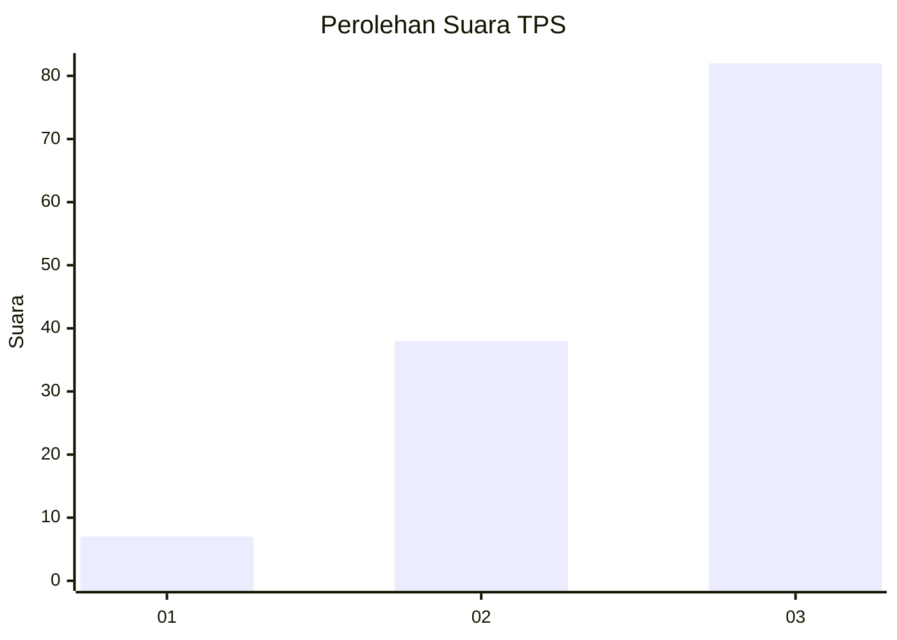
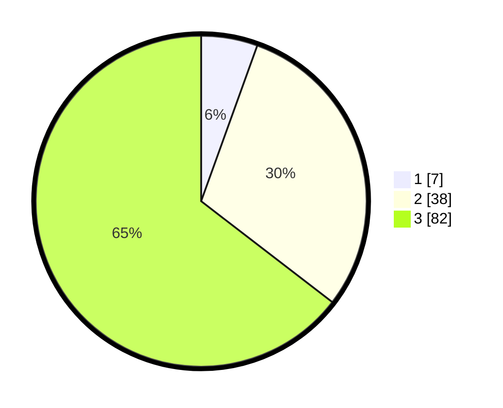

# Hasil

## Grafik

## Tabel

| No. | Nama Paslon    | Suara | Suara (raw) | Persentase |
|:--- |:-------------- | -----:| -----------:| ----------:|
| 1   | ANIES MUHAIMIN | 7     | [7][p-1]    | 5,51       |
| 2   | PRABOWO GIBRAN | 38    | [38][p-2]   | 29,92      |
| 3   | GANJAR MAHFUD  | 82    | [82][p-3]   | 64,57      |

[p-1]: https://github.com/gigit-pemilu/pemilu-2024/blob/main/pilpres/hitung-suara/sub/33-jawa-tengah/sub/09-boyolali/sub/09-banyudono/sub/2003-jembungan/sub/012-tps/sub/paslon-1.txt
[p-2]: https://github.com/gigit-pemilu/pemilu-2024/blob/main/pilpres/hitung-suara/sub/33-jawa-tengah/sub/09-boyolali/sub/09-banyudono/sub/2003-jembungan/sub/012-tps/sub/paslon-2.txt
[p-3]: https://github.com/gigit-pemilu/pemilu-2024/blob/main/pilpres/hitung-suara/sub/33-jawa-tengah/sub/09-boyolali/sub/09-banyudono/sub/2003-jembungan/sub/012-tps/sub/paslon-3.txt

## Foto C Plano

https://sirekap-obj-formc.kpu.go.id/9532/pemilu/ppwp/33/09/09/20/03/3309092003012-20240214-220258--fb99130c-18bf-4610-a61a-2ad80285f502.jpg

https://sirekap-obj-formc.kpu.go.id/9532/pemilu/ppwp/33/09/09/20/03/3309092003012-20240214-220906--be5dd89b-ff33-419a-b3ef-3079ae0b89b9.jpg

https://sirekap-obj-formc.kpu.go.id/9532/pemilu/ppwp/33/09/09/20/03/3309092003012-20240214-221008--b2b9f52a-3298-4317-af54-fbc5417ed06d.jpg

## Metadata

| Key        | Value               |
| ---------- | ------------------- |
| Time Stamp | 2024-02-15 16:30:25 |

