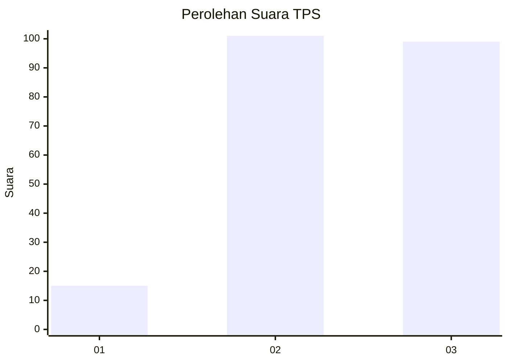
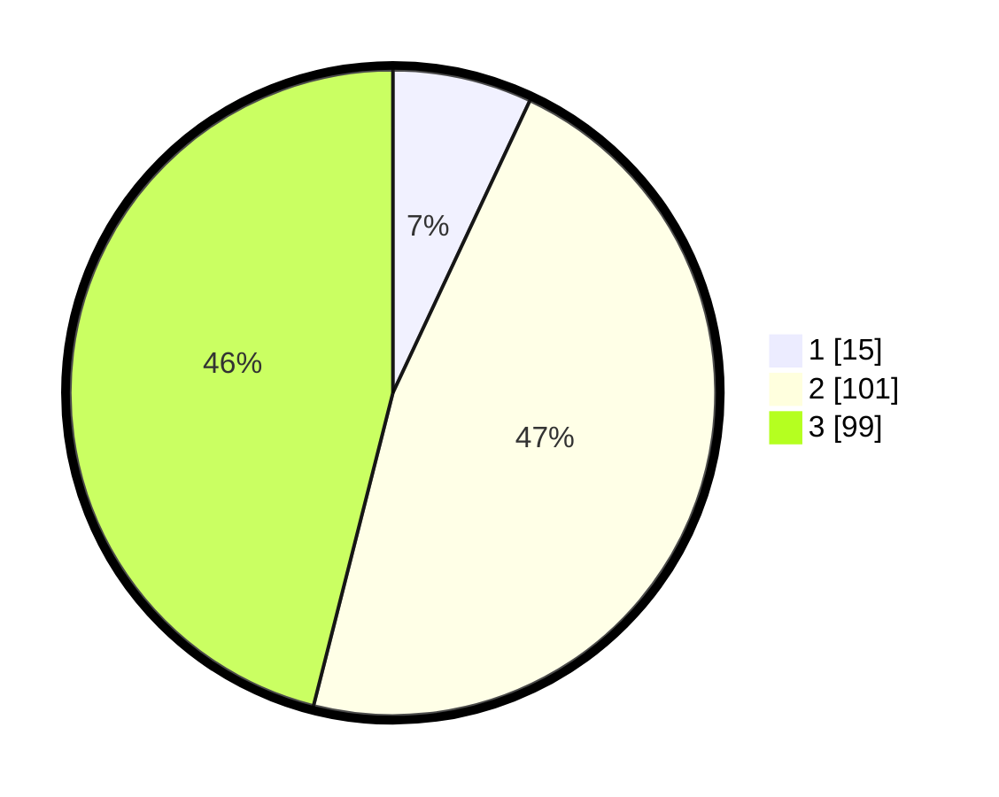

# Hasil

## Grafik

## Tabel

| No. | Nama Paslon    | Suara | Suara (raw) | Persentase |
|:--- |:-------------- | -----:| -----------:| ----------:|
| 1   | ANIES MUHAIMIN | 15    | [15][p-1]   | 6,98       |
| 2   | PRABOWO GIBRAN | 101   | [101][p-2]  | 46,98      |
| 3   | GANJAR MAHFUD  | 99    | [99][p-3]   | 46,05      |

[p-1]: https://github.com/gigit-pemilu/pemilu-2024/blob/main/pilpres/hitung-suara/sub/33-jawa-tengah/sub/09-boyolali/sub/09-banyudono/sub/2004-sambon/sub/006-tps/sub/paslon-1.txt
[p-2]: https://github.com/gigit-pemilu/pemilu-2024/blob/main/pilpres/hitung-suara/sub/33-jawa-tengah/sub/09-boyolali/sub/09-banyudono/sub/2004-sambon/sub/006-tps/sub/paslon-2.txt
[p-3]: https://github.com/gigit-pemilu/pemilu-2024/blob/main/pilpres/hitung-suara/sub/33-jawa-tengah/sub/09-boyolali/sub/09-banyudono/sub/2004-sambon/sub/006-tps/sub/paslon-3.txt

## Foto C Plano

https://sirekap-obj-formc.kpu.go.id/a734/pemilu/ppwp/33/09/09/20/04/3309092004006-20240214-223013--8aa4f673-5a52-452e-91b2-f01981d9890a.jpg

https://sirekap-obj-formc.kpu.go.id/a734/pemilu/ppwp/33/09/09/20/04/3309092004006-20240214-223100--83ecebaf-66ce-433a-a782-aa931f5cf7cb.jpg

https://sirekap-obj-formc.kpu.go.id/a734/pemilu/ppwp/33/09/09/20/04/3309092004006-20240214-223157--51f914ad-1e14-4035-b3fb-2e050dff3559.jpg

## Metadata

| Key        | Value               |
| ---------- | ------------------- |
| Time Stamp | 2024-02-25 21:00:00 |

