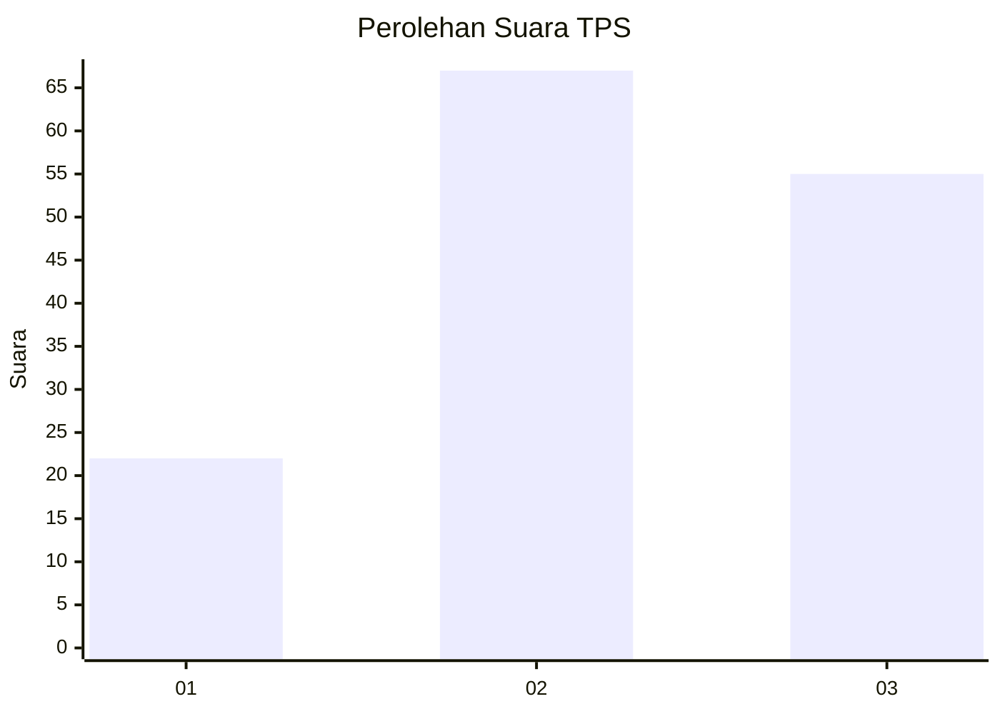
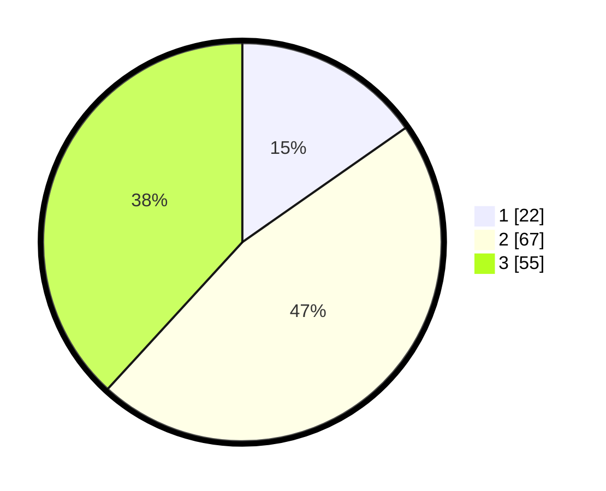

# Hasil

## Grafik

## Tabel

| No. | Nama Paslon    | Suara | Suara (raw) | Persentase |
|:--- |:-------------- | -----:| -----------:| ----------:|
| 1   | ANIES MUHAIMIN | 22    | [22][p-1]   | 15,28      |
| 2   | PRABOWO GIBRAN | 67    | [67][p-2]   | 46,53      |
| 3   | GANJAR MAHFUD  | 55    | [55][p-3]   | 38,19      |

[p-1]: https://github.com/gigit-pemilu/pemilu-2024-33-jawa-tengah/blob/main/pilpres/hitung-suara/sub/33-jawa-tengah/sub/09-boyolali/sub/09-banyudono/sub/2004-sambon/sub/008-tps/sub/paslon-1.txt
[p-2]: https://github.com/gigit-pemilu/pemilu-2024-33-jawa-tengah/blob/main/pilpres/hitung-suara/sub/33-jawa-tengah/sub/09-boyolali/sub/09-banyudono/sub/2004-sambon/sub/008-tps/sub/paslon-2.txt
[p-3]: https://github.com/gigit-pemilu/pemilu-2024-33-jawa-tengah/blob/main/pilpres/hitung-suara/sub/33-jawa-tengah/sub/09-boyolali/sub/09-banyudono/sub/2004-sambon/sub/008-tps/sub/paslon-3.txt

## Foto C Plano

https://sirekap-obj-formc.kpu.go.id/9eb2/pemilu/ppwp/33/09/09/20/04/3309092004008-20240214-141509--78540f82-2a6a-4898-aee7-a2b7131326e6.jpg

https://sirekap-obj-formc.kpu.go.id/9eb2/pemilu/ppwp/33/09/09/20/04/3309092004008-20240214-141642--dc3ee64c-2314-4223-ac84-03b40a7c3335.jpg

https://sirekap-obj-formc.kpu.go.id/9eb2/pemilu/ppwp/33/09/09/20/04/3309092004008-20240214-141826--070cd6c1-143b-4ed2-8581-3ec53243fe85.jpg

## Metadata

| Key        | Value               |
| ---------- | ------------------- |
| Time Stamp | 2024-02-26 00:00:00 |

