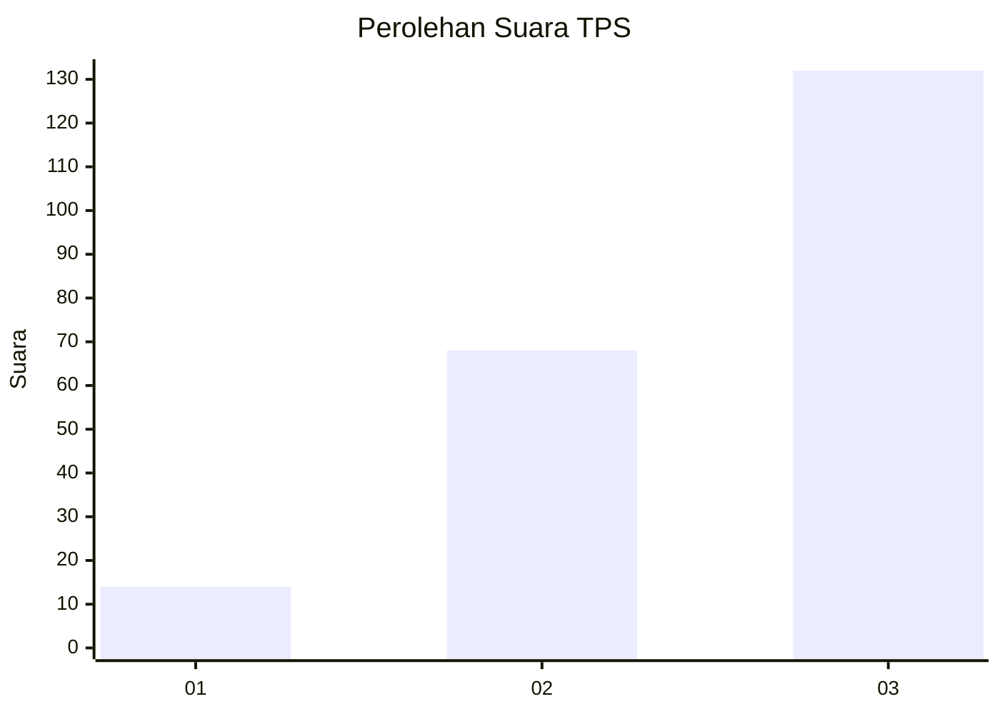
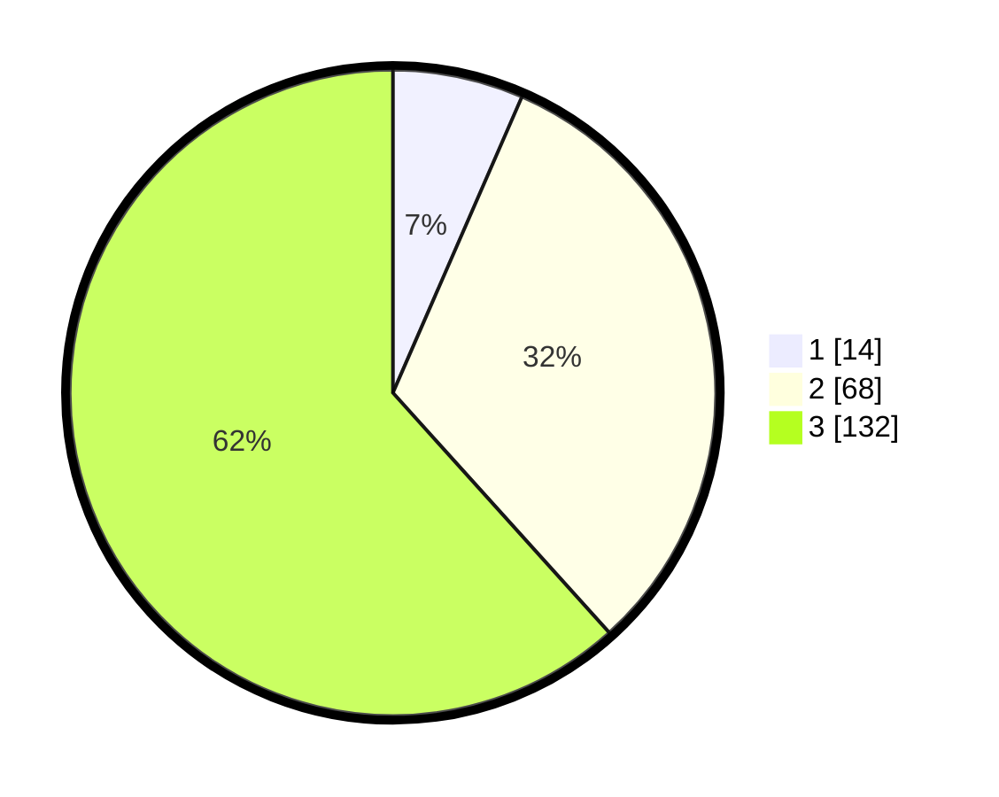

# Hasil

## Grafik

## Tabel

| No. | Nama Paslon    | Suara | Suara (raw) | Persentase |
|:--- |:-------------- | -----:| -----------:| ----------:|
| 1   | ANIES MUHAIMIN | 14    | [14][p-1]   | 6,54       |
| 2   | PRABOWO GIBRAN | 68    | [68][p-2]   | 31,78      |
| 3   | GANJAR MAHFUD  | 132   | [132][p-3]  | 61,68      |

[p-1]: https://github.com/gigit-pemilu/pemilu-2024-33-jawa-tengah/blob/main/pilpres/hitung-suara/sub/33-jawa-tengah/sub/09-boyolali/sub/09-banyudono/sub/2005-kuwiran/sub/001-tps/sub/paslon-1.txt
[p-2]: https://github.com/gigit-pemilu/pemilu-2024-33-jawa-tengah/blob/main/pilpres/hitung-suara/sub/33-jawa-tengah/sub/09-boyolali/sub/09-banyudono/sub/2005-kuwiran/sub/001-tps/sub/paslon-2.txt
[p-3]: https://github.com/gigit-pemilu/pemilu-2024-33-jawa-tengah/blob/main/pilpres/hitung-suara/sub/33-jawa-tengah/sub/09-boyolali/sub/09-banyudono/sub/2005-kuwiran/sub/001-tps/sub/paslon-3.txt

## Foto C Plano

https://sirekap-obj-formc.kpu.go.id/a289/pemilu/ppwp/33/09/09/20/05/3309092005001-20240214-212755--8ca57ee9-b9d8-4672-88ab-d0bb329bcfb3.jpg

https://sirekap-obj-formc.kpu.go.id/a289/pemilu/ppwp/33/09/09/20/05/3309092005001-20240214-214659--525c1ae6-11ab-4c01-b555-98b92040db75.jpg

https://sirekap-obj-formc.kpu.go.id/a289/pemilu/ppwp/33/09/09/20/05/3309092005001-20240214-214746--a9f2c65c-73bd-4e32-a3a0-db973bb18f15.jpg

## Metadata

| Key        | Value               |
| ---------- | ------------------- |
| Time Stamp | 2024-02-19 06:16:00 |

