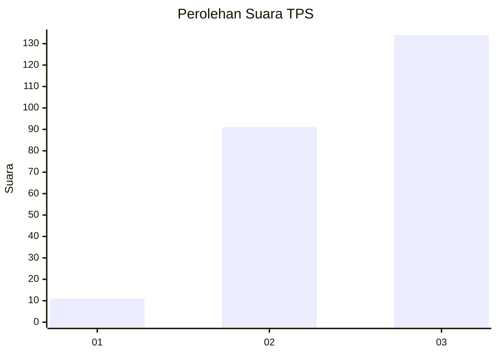
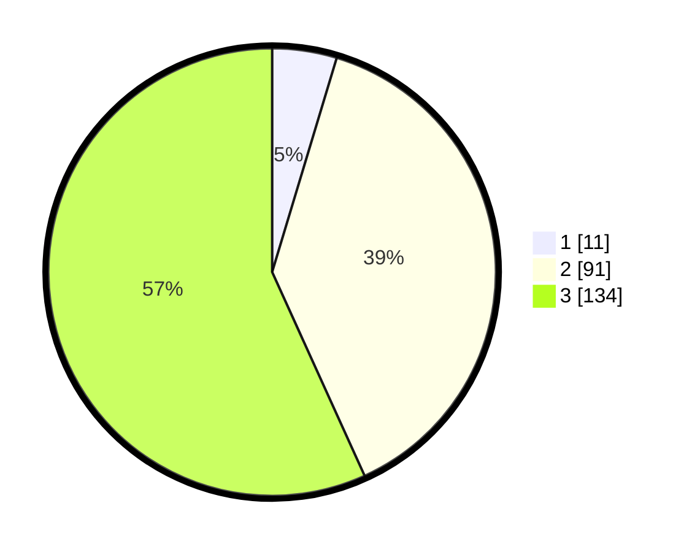

# Hasil

## Grafik

## Tabel

| No. | Nama Paslon    | Suara | Suara (raw) | Persentase |
|:--- |:-------------- | -----:| -----------:| ----------:|
| 1   | ANIES MUHAIMIN | 11    | [11][p-1]   | 4,66       |
| 2   | PRABOWO GIBRAN | 91    | [91][p-2]   | 38,56      |
| 3   | GANJAR MAHFUD  | 134   | [134][p-3]  | 56,78      |

[p-1]: https://github.com/gigit-pemilu/pemilu-2024-33-jawa-tengah/blob/main/pilpres/hitung-suara/sub/33-jawa-tengah/sub/09-boyolali/sub/09-banyudono/sub/2006-cangkringan/sub/004-tps/sub/paslon-1.txt
[p-2]: https://github.com/gigit-pemilu/pemilu-2024-33-jawa-tengah/blob/main/pilpres/hitung-suara/sub/33-jawa-tengah/sub/09-boyolali/sub/09-banyudono/sub/2006-cangkringan/sub/004-tps/sub/paslon-2.txt
[p-3]: https://github.com/gigit-pemilu/pemilu-2024-33-jawa-tengah/blob/main/pilpres/hitung-suara/sub/33-jawa-tengah/sub/09-boyolali/sub/09-banyudono/sub/2006-cangkringan/sub/004-tps/sub/paslon-3.txt

## Foto C Plano

https://sirekap-obj-formc.kpu.go.id/3174/pemilu/ppwp/33/09/09/20/06/3309092006004-20240214-234353--5afd1f04-7f63-4743-8b59-591dbd979cd0.jpg

https://sirekap-obj-formc.kpu.go.id/3174/pemilu/ppwp/33/09/09/20/06/3309092006004-20240214-203732--b4beda81-5d9e-4caa-b70f-02be987b24c1.jpg

https://sirekap-obj-formc.kpu.go.id/3174/pemilu/ppwp/33/09/09/20/06/3309092006004-20240214-220825--ff669a22-49b4-47fc-9b1f-3327a0cd3baf.jpg

## Metadata

| Key        | Value               |
| ---------- | ------------------- |
| Time Stamp | 2024-02-19 06:16:00 |

