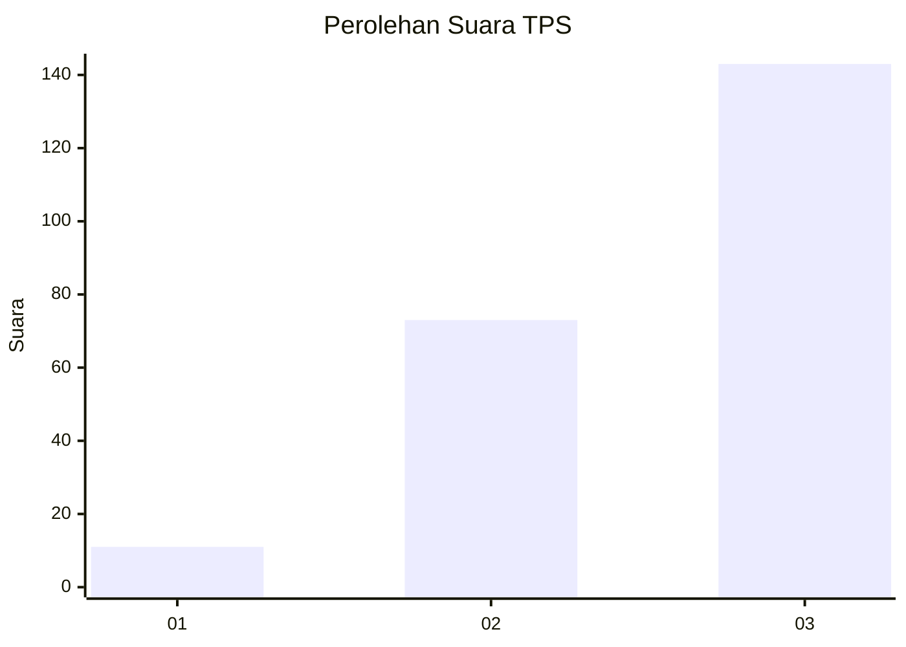
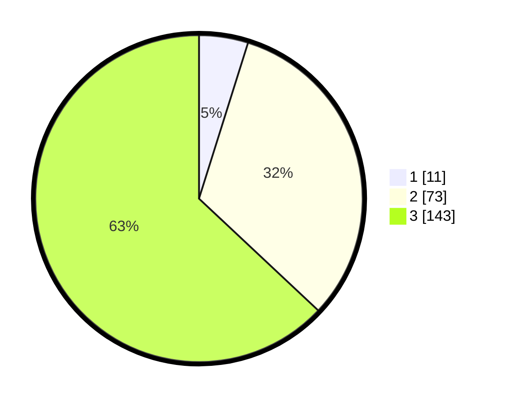

# Hasil

## Grafik

## Tabel

| No. | Nama Paslon    | Suara | Suara (raw) | Persentase |
|:--- |:-------------- | -----:| -----------:| ----------:|
| 1   | ANIES MUHAIMIN | 11    | [11][p-1]   | 4,85       |
| 2   | PRABOWO GIBRAN | 73    | [73][p-2]   | 32,16      |
| 3   | GANJAR MAHFUD  | 143   | [143][p-3]  | 63,00      |

[p-1]: https://github.com/gigit-pemilu/pemilu-2024-33-jawa-tengah/blob/main/pilpres/hitung-suara/sub/33-jawa-tengah/sub/09-boyolali/sub/09-banyudono/sub/2007-ngaru-aru/sub/003-tps/sub/paslon-1.txt
[p-2]: https://github.com/gigit-pemilu/pemilu-2024-33-jawa-tengah/blob/main/pilpres/hitung-suara/sub/33-jawa-tengah/sub/09-boyolali/sub/09-banyudono/sub/2007-ngaru-aru/sub/003-tps/sub/paslon-2.txt
[p-3]: https://github.com/gigit-pemilu/pemilu-2024-33-jawa-tengah/blob/main/pilpres/hitung-suara/sub/33-jawa-tengah/sub/09-boyolali/sub/09-banyudono/sub/2007-ngaru-aru/sub/003-tps/sub/paslon-3.txt

## Foto C Plano

https://sirekap-obj-formc.kpu.go.id/57bc/pemilu/ppwp/33/09/09/20/07/3309092007003-20240214-232351--9ec26b78-e207-4429-afc2-ed8a7b157b75.jpg

https://sirekap-obj-formc.kpu.go.id/57bc/pemilu/ppwp/33/09/09/20/07/3309092007003-20240214-232413--67fddddb-7a42-4a2b-977d-5b454135cbf8.jpg

https://sirekap-obj-formc.kpu.go.id/57bc/pemilu/ppwp/33/09/09/20/07/3309092007003-20240214-232431--0416e3e4-cbc5-4737-8c21-d0cb0848670f.jpg

## Metadata

| Key        | Value               |
| ---------- | ------------------- |
| Time Stamp | 2024-02-15 15:30:25 |

