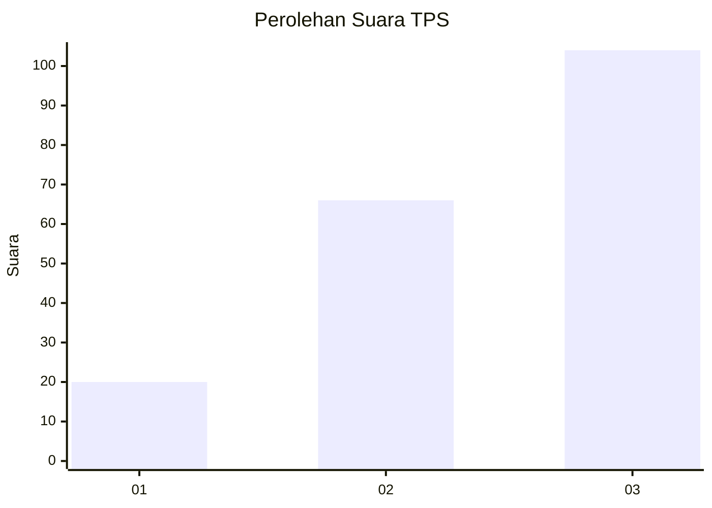
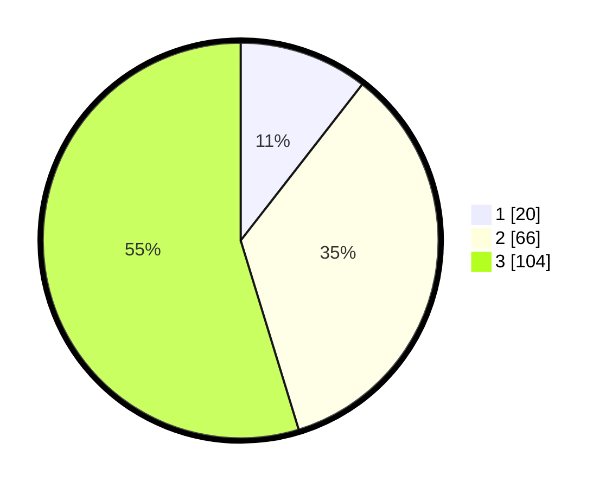

# Hasil

## Grafik

## Tabel

| No. | Nama Paslon    | Suara | Suara (raw) | Persentase |
|:--- |:-------------- | -----:| -----------:| ----------:|
| 1   | ANIES MUHAIMIN | 20    | [20][p-1]   | 10,53      |
| 2   | PRABOWO GIBRAN | 66    | [66][p-2]   | 34,74      |
| 3   | GANJAR MAHFUD  | 104   | [104][p-3]  | 54,74      |

[p-1]: https://github.com/gigit-pemilu/pemilu-2024/blob/main/pilpres/hitung-suara/sub/33-jawa-tengah/sub/09-boyolali/sub/09-banyudono/sub/2007-ngaru-aru/sub/005-tps/sub/paslon-1.txt
[p-2]: https://github.com/gigit-pemilu/pemilu-2024/blob/main/pilpres/hitung-suara/sub/33-jawa-tengah/sub/09-boyolali/sub/09-banyudono/sub/2007-ngaru-aru/sub/005-tps/sub/paslon-2.txt
[p-3]: https://github.com/gigit-pemilu/pemilu-2024/blob/main/pilpres/hitung-suara/sub/33-jawa-tengah/sub/09-boyolali/sub/09-banyudono/sub/2007-ngaru-aru/sub/005-tps/sub/paslon-3.txt

## Foto C Plano

https://sirekap-obj-formc.kpu.go.id/c959/pemilu/ppwp/33/09/09/20/07/3309092007005-20240215-014330--ae5dc8a9-af2d-4367-9ed7-737ecaabb914.jpg

https://sirekap-obj-formc.kpu.go.id/c959/pemilu/ppwp/33/09/09/20/07/3309092007005-20240215-014407--0637a0ed-96f8-478e-ad30-66e6bc0cbefa.jpg

https://sirekap-obj-formc.kpu.go.id/c959/pemilu/ppwp/33/09/09/20/07/3309092007005-20240215-014543--06aab03b-ffd3-4c43-933f-57236260742f.jpg

## Metadata

| Key        | Value               |
| ---------- | ------------------- |
| Time Stamp | 2024-02-16 12:51:22 |

