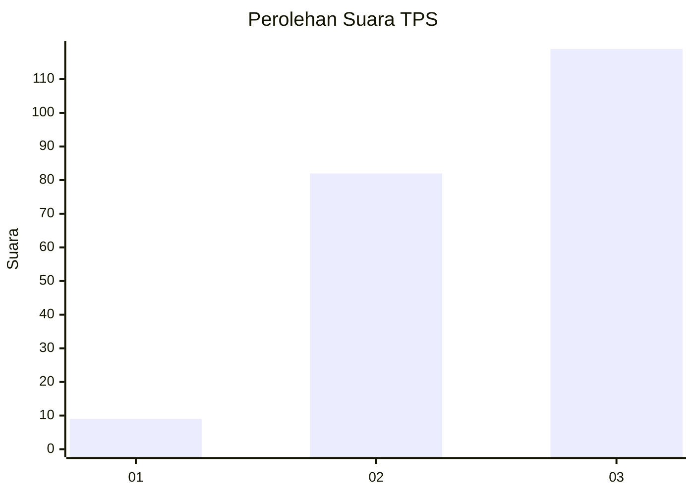
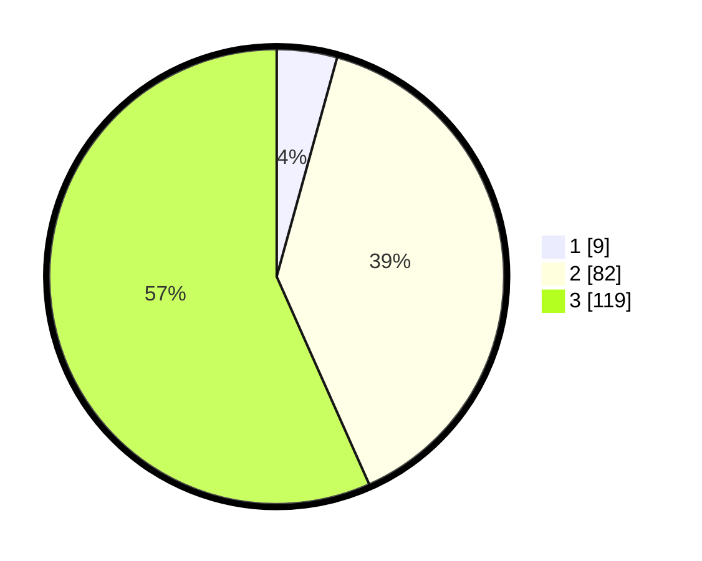

# Hasil

## Grafik

## Tabel

| No. | Nama Paslon    | Suara | Suara (raw) | Persentase |
|:--- |:-------------- | -----:| -----------:| ----------:|
| 1   | ANIES MUHAIMIN | 9     | [9][p-1]    | 4,29       |
| 2   | PRABOWO GIBRAN | 82    | [82][p-2]   | 39,05      |
| 3   | GANJAR MAHFUD  | 119   | [119][p-3]  | 56,67      |

[p-1]: https://github.com/gigit-pemilu/pemilu-2024/blob/main/pilpres/hitung-suara/sub/33-jawa-tengah/sub/09-boyolali/sub/09-banyudono/sub/2008-bendan/sub/005-tps/sub/paslon-1.txt
[p-2]: https://github.com/gigit-pemilu/pemilu-2024/blob/main/pilpres/hitung-suara/sub/33-jawa-tengah/sub/09-boyolali/sub/09-banyudono/sub/2008-bendan/sub/005-tps/sub/paslon-2.txt
[p-3]: https://github.com/gigit-pemilu/pemilu-2024/blob/main/pilpres/hitung-suara/sub/33-jawa-tengah/sub/09-boyolali/sub/09-banyudono/sub/2008-bendan/sub/005-tps/sub/paslon-3.txt

## Foto C Plano

https://sirekap-obj-formc.kpu.go.id/dd88/pemilu/ppwp/33/09/09/20/08/3309092008005-20240214-230640--48dbd9f7-9918-4106-9635-ced51e50ac51.jpg

https://sirekap-obj-formc.kpu.go.id/dd88/pemilu/ppwp/33/09/09/20/08/3309092008005-20240214-230743--4d8f4293-b9bc-4942-9ad4-74659bbeb309.jpg

https://sirekap-obj-formc.kpu.go.id/dd88/pemilu/ppwp/33/09/09/20/08/3309092008005-20240214-221008--e69e6a4c-4e53-4f80-b42b-40a42e4642e0.jpg

## Metadata

| Key        | Value               |
| ---------- | ------------------- |
| Time Stamp | 2024-02-16 12:51:22 |

