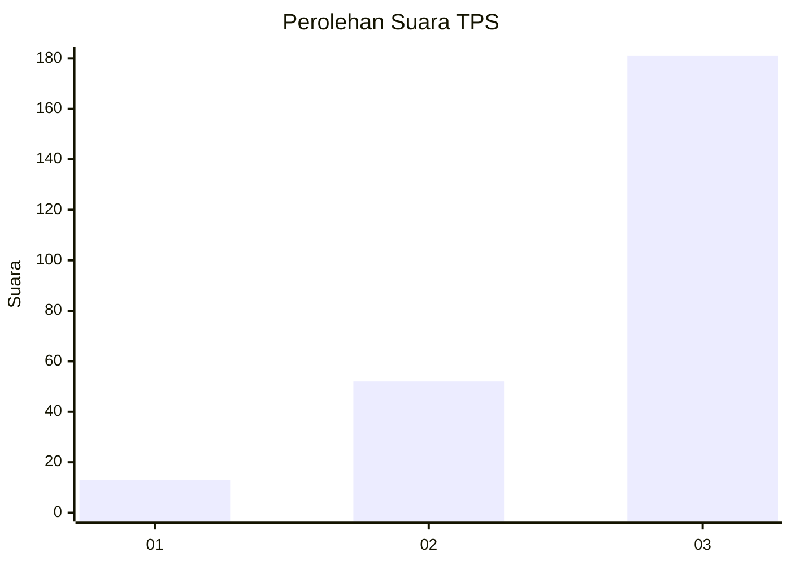
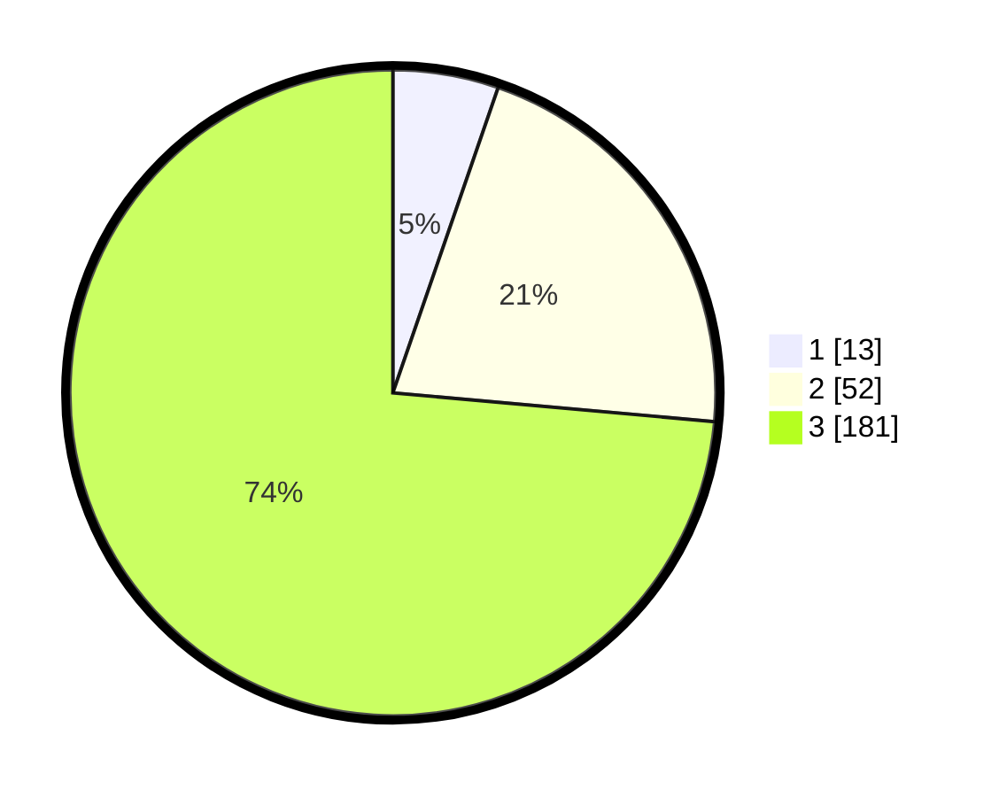

# Hasil

## Grafik

## Tabel

| No. | Nama Paslon    | Suara | Suara (raw) | Persentase |
|:--- |:-------------- | -----:| -----------:| ----------:|
| 1   | ANIES MUHAIMIN | 13    | [13][p-1]   | 5,28       |
| 2   | PRABOWO GIBRAN | 52    | [52][p-2]   | 21,14      |
| 3   | GANJAR MAHFUD  | 181   | [181][p-3]  | 73,58      |

[p-1]: https://github.com/gigit-pemilu/pemilu-2024-33-jawa-tengah/blob/main/pilpres/hitung-suara/sub/33-jawa-tengah/sub/09-boyolali/sub/09-banyudono/sub/2008-bendan/sub/007-tps/sub/paslon-1.txt
[p-2]: https://github.com/gigit-pemilu/pemilu-2024-33-jawa-tengah/blob/main/pilpres/hitung-suara/sub/33-jawa-tengah/sub/09-boyolali/sub/09-banyudono/sub/2008-bendan/sub/007-tps/sub/paslon-2.txt
[p-3]: https://github.com/gigit-pemilu/pemilu-2024-33-jawa-tengah/blob/main/pilpres/hitung-suara/sub/33-jawa-tengah/sub/09-boyolali/sub/09-banyudono/sub/2008-bendan/sub/007-tps/sub/paslon-3.txt

## Foto C Plano

https://sirekap-obj-formc.kpu.go.id/2a9c/pemilu/ppwp/33/09/09/20/08/3309092008007-20240215-001946--5817a205-1219-460e-b4c3-8a0b11ea8ff9.jpg

https://sirekap-obj-formc.kpu.go.id/2a9c/pemilu/ppwp/33/09/09/20/08/3309092008007-20240215-002101--8122580c-44fc-4c16-810e-d3c2e904e010.jpg

https://sirekap-obj-formc.kpu.go.id/2a9c/pemilu/ppwp/33/09/09/20/08/3309092008007-20240215-002143--9ca01165-991a-4eba-83ad-ae0bcce10a69.jpg

## Metadata

| Key        | Value               |
| ---------- | ------------------- |
| Time Stamp | 2024-02-16 12:51:22 |

