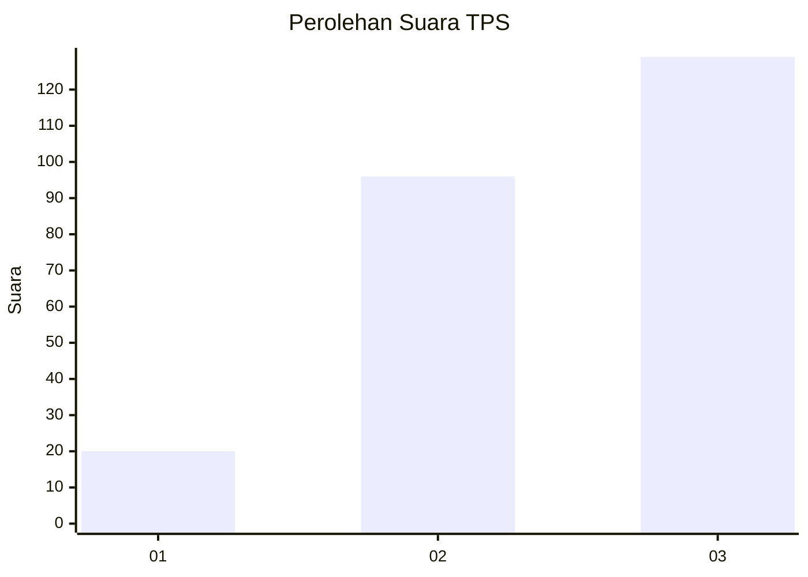
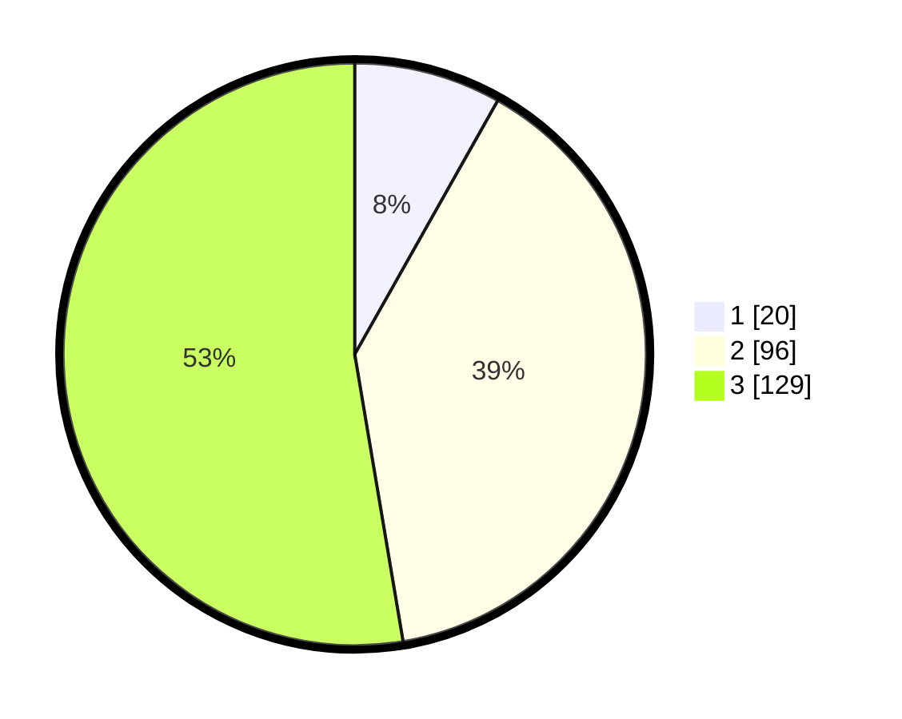

# Hasil

## Grafik

## Tabel

| No. | Nama Paslon    | Suara | Suara (raw) | Persentase |
|:--- |:-------------- | -----:| -----------:| ----------:|
| 1   | ANIES MUHAIMIN | 20    | [20][p-1]   | 8,16       |
| 2   | PRABOWO GIBRAN | 96    | [96][p-2]   | 39,18      |
| 3   | GANJAR MAHFUD  | 129   | [129][p-3]  | 52,65      |

[p-1]: https://github.com/gigit-pemilu/pemilu-2024/blob/main/pilpres/hitung-suara/sub/33-jawa-tengah/sub/09-boyolali/sub/09-banyudono/sub/2008-bendan/sub/008-tps/sub/paslon-1.txt
[p-2]: https://github.com/gigit-pemilu/pemilu-2024/blob/main/pilpres/hitung-suara/sub/33-jawa-tengah/sub/09-boyolali/sub/09-banyudono/sub/2008-bendan/sub/008-tps/sub/paslon-2.txt
[p-3]: https://github.com/gigit-pemilu/pemilu-2024/blob/main/pilpres/hitung-suara/sub/33-jawa-tengah/sub/09-boyolali/sub/09-banyudono/sub/2008-bendan/sub/008-tps/sub/paslon-3.txt

## Foto C Plano

https://sirekap-obj-formc.kpu.go.id/394e/pemilu/ppwp/33/09/09/20/08/3309092008008-20240214-231443--4d0516fa-7096-4446-a120-654476d3fdbf.jpg

https://sirekap-obj-formc.kpu.go.id/394e/pemilu/ppwp/33/09/09/20/08/3309092008008-20240214-231617--609a7d2a-5a34-40a0-a309-08f9d57bc680.jpg

https://sirekap-obj-formc.kpu.go.id/394e/pemilu/ppwp/33/09/09/20/08/3309092008008-20240214-231805--dcee68a4-1742-4c71-b7b1-e6d09ceb6ec8.jpg

## Metadata

| Key        | Value               |
| ---------- | ------------------- |
| Time Stamp | 2024-02-19 06:16:00 |

