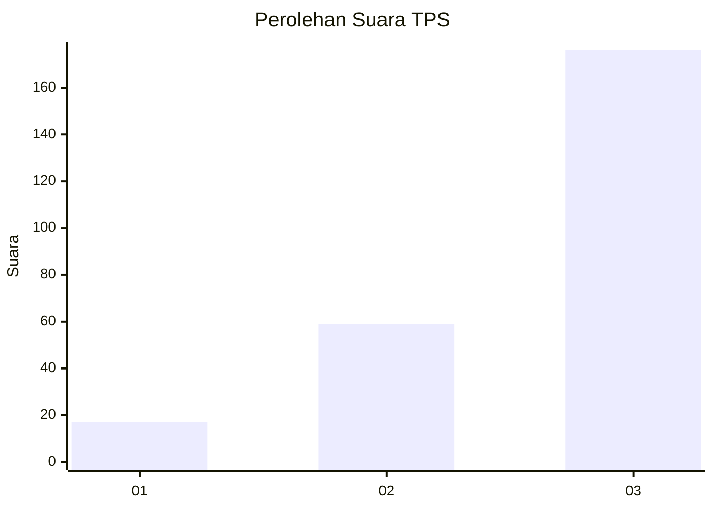
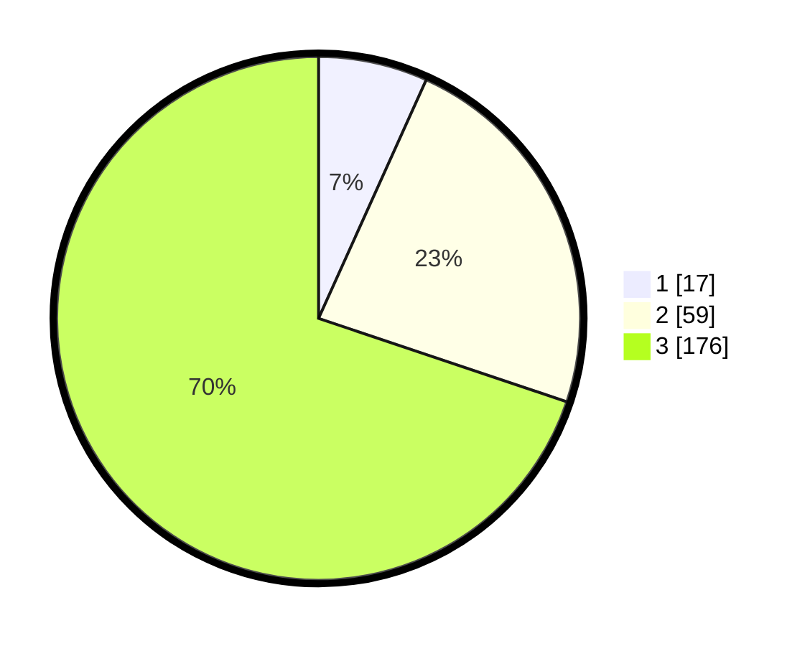

# Hasil

## Grafik

## Tabel

| No. | Nama Paslon    | Suara | Suara (raw) | Persentase |
|:--- |:-------------- | -----:| -----------:| ----------:|
| 1   | ANIES MUHAIMIN | 17    | [17][p-1]   | 6,75       |
| 2   | PRABOWO GIBRAN | 59    | [59][p-2]   | 23,41      |
| 3   | GANJAR MAHFUD  | 176   | [176][p-3]  | 69,84      |

[p-1]: https://github.com/gigit-pemilu/pemilu-2024-33-jawa-tengah/blob/main/pilpres/hitung-suara/sub/33-jawa-tengah/sub/09-boyolali/sub/09-banyudono/sub/2008-bendan/sub/009-tps/sub/paslon-1.txt
[p-2]: https://github.com/gigit-pemilu/pemilu-2024-33-jawa-tengah/blob/main/pilpres/hitung-suara/sub/33-jawa-tengah/sub/09-boyolali/sub/09-banyudono/sub/2008-bendan/sub/009-tps/sub/paslon-2.txt
[p-3]: https://github.com/gigit-pemilu/pemilu-2024-33-jawa-tengah/blob/main/pilpres/hitung-suara/sub/33-jawa-tengah/sub/09-boyolali/sub/09-banyudono/sub/2008-bendan/sub/009-tps/sub/paslon-3.txt

## Foto C Plano

https://sirekap-obj-formc.kpu.go.id/0e71/pemilu/ppwp/33/09/09/20/08/3309092008009-20240214-231717--360662d8-1971-4ba8-9882-26d87a657651.jpg

https://sirekap-obj-formc.kpu.go.id/0e71/pemilu/ppwp/33/09/09/20/08/3309092008009-20240214-231851--443b5b60-2ceb-4ff6-930b-a695962d0ee4.jpg

https://sirekap-obj-formc.kpu.go.id/0e71/pemilu/ppwp/33/09/09/20/08/3309092008009-20240214-232001--c4dfbca5-4de1-4a88-b542-0d21f952bd4b.jpg

## Metadata

| Key        | Value               |
| ---------- | ------------------- |
| Time Stamp | 2024-02-16 12:51:22 |

