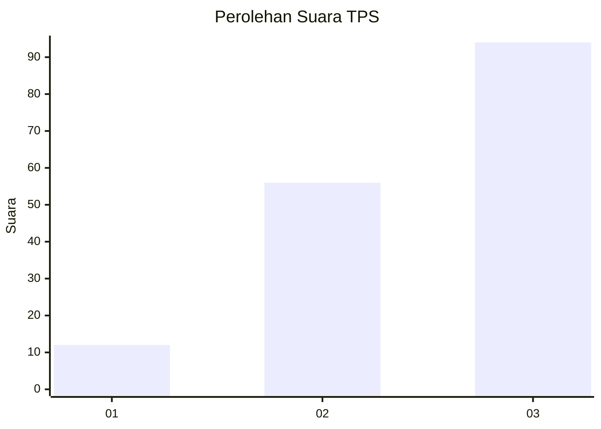
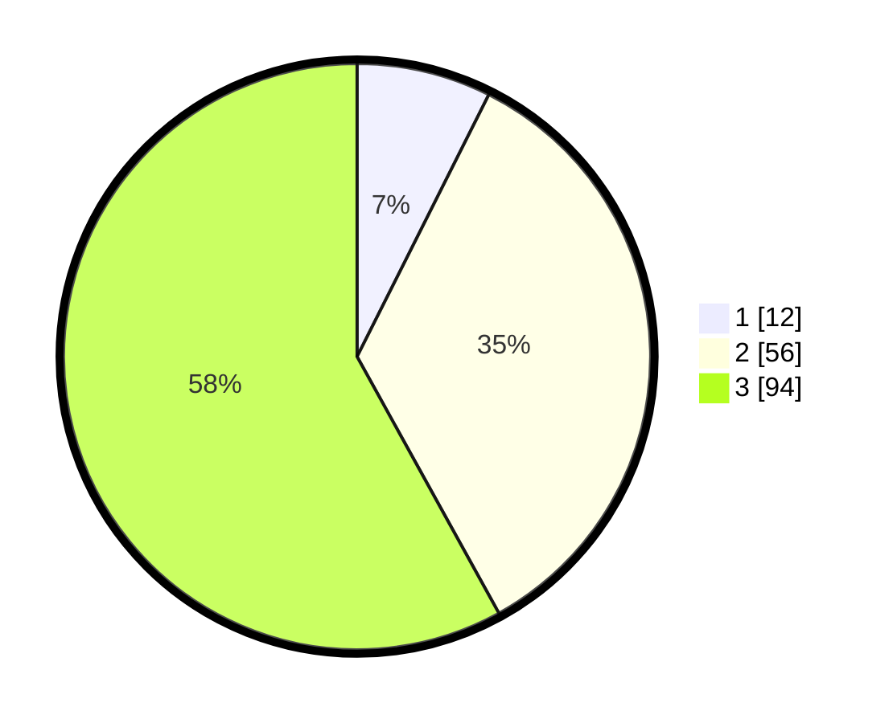

# Hasil

## Grafik

## Tabel

| No. | Nama Paslon    | Suara | Suara (raw) | Persentase |
|:--- |:-------------- | -----:| -----------:| ----------:|
| 1   | ANIES MUHAIMIN | 12    | [12][p-1]   | 7,41       |
| 2   | PRABOWO GIBRAN | 56    | [56][p-2]   | 34,57      |
| 3   | GANJAR MAHFUD  | 94    | [94][p-3]   | 58,02      |

[p-1]: https://github.com/gigit-pemilu/pemilu-2024-33-jawa-tengah/blob/main/pilpres/hitung-suara/sub/33-jawa-tengah/sub/09-boyolali/sub/09-banyudono/sub/2008-bendan/sub/015-tps/sub/paslon-1.txt
[p-2]: https://github.com/gigit-pemilu/pemilu-2024-33-jawa-tengah/blob/main/pilpres/hitung-suara/sub/33-jawa-tengah/sub/09-boyolali/sub/09-banyudono/sub/2008-bendan/sub/015-tps/sub/paslon-2.txt
[p-3]: https://github.com/gigit-pemilu/pemilu-2024-33-jawa-tengah/blob/main/pilpres/hitung-suara/sub/33-jawa-tengah/sub/09-boyolali/sub/09-banyudono/sub/2008-bendan/sub/015-tps/sub/paslon-3.txt

## Foto C Plano

https://sirekap-obj-formc.kpu.go.id/e0cb/pemilu/ppwp/33/09/09/20/08/3309092008015-20240215-023401--78576dc4-5338-4f23-8ede-70a28fd623ff.jpg

https://sirekap-obj-formc.kpu.go.id/e0cb/pemilu/ppwp/33/09/09/20/08/3309092008015-20240215-023526--42cfe1d9-9651-4414-94ad-d01e65a80a08.jpg

https://sirekap-obj-formc.kpu.go.id/e0cb/pemilu/ppwp/33/09/09/20/08/3309092008015-20240215-015852--d4253e29-1814-4b4f-b1e7-ea50182f7a99.jpg

## Metadata

| Key        | Value               |
| ---------- | ------------------- |
| Time Stamp | 2024-02-15 21:01:18 |

