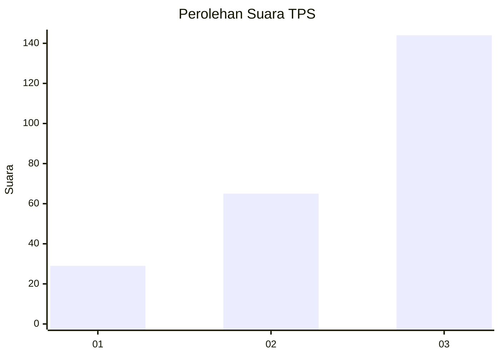
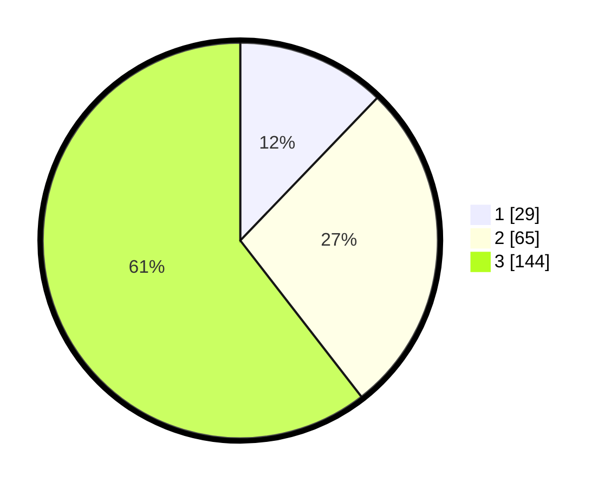

# Hasil

## Grafik

## Tabel

| No. | Nama Paslon    | Suara | Suara (raw) | Persentase |
|:--- |:-------------- | -----:| -----------:| ----------:|
| 1   | ANIES MUHAIMIN | 29    | [29][p-1]   | 12,18      |
| 2   | PRABOWO GIBRAN | 65    | [65][p-2]   | 27,31      |
| 3   | GANJAR MAHFUD  | 144   | [144][p-3]  | 60,50      |

[p-1]: https://github.com/gigit-pemilu/pemilu-2024-33-jawa-tengah/blob/main/pilpres/hitung-suara/sub/33-jawa-tengah/sub/09-boyolali/sub/09-banyudono/sub/2008-bendan/sub/016-tps/sub/paslon-1.txt
[p-2]: https://github.com/gigit-pemilu/pemilu-2024-33-jawa-tengah/blob/main/pilpres/hitung-suara/sub/33-jawa-tengah/sub/09-boyolali/sub/09-banyudono/sub/2008-bendan/sub/016-tps/sub/paslon-2.txt
[p-3]: https://github.com/gigit-pemilu/pemilu-2024-33-jawa-tengah/blob/main/pilpres/hitung-suara/sub/33-jawa-tengah/sub/09-boyolali/sub/09-banyudono/sub/2008-bendan/sub/016-tps/sub/paslon-3.txt

## Foto C Plano

https://sirekap-obj-formc.kpu.go.id/59be/pemilu/ppwp/33/09/09/20/08/3309092008016-20240214-195510--e67271ec-f3f1-48e3-bba5-e4b9995bca2c.jpg

https://sirekap-obj-formc.kpu.go.id/59be/pemilu/ppwp/33/09/09/20/08/3309092008016-20240215-021211--9d4e8fd0-e466-45c0-9e0e-967f715ca825.jpg

https://sirekap-obj-formc.kpu.go.id/59be/pemilu/ppwp/33/09/09/20/08/3309092008016-20240215-021236--6ccf6893-beb3-467d-8712-7c29aeac8d78.jpg

## Metadata

| Key        | Value               |
| ---------- | ------------------- |
| Time Stamp | 2024-02-16 16:25:10 |

