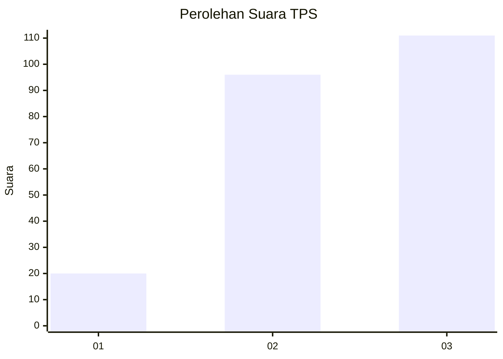
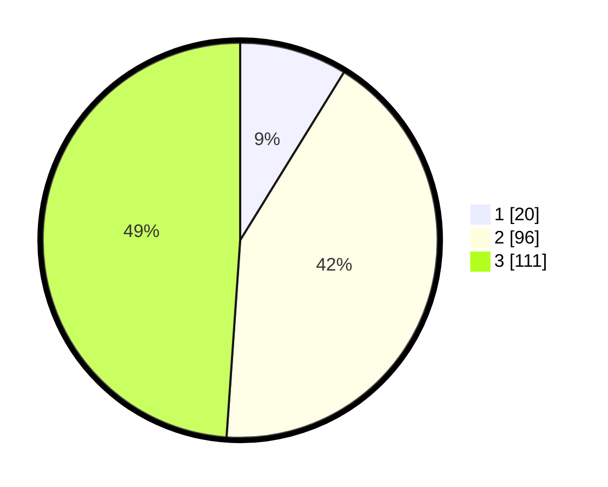

# Hasil

## Grafik

## Tabel

| No. | Nama Paslon    | Suara | Suara (raw) | Persentase |
|:--- |:-------------- | -----:| -----------:| ----------:|
| 1   | ANIES MUHAIMIN | 20    | [20][p-1]   | 8,81       |
| 2   | PRABOWO GIBRAN | 96    | [96][p-2]   | 42,29      |
| 3   | GANJAR MAHFUD  | 111   | [111][p-3]  | 48,90      |

[p-1]: https://github.com/gigit-pemilu/pemilu-2024-33-jawa-tengah/blob/main/pilpres/hitung-suara/sub/33-jawa-tengah/sub/09-boyolali/sub/09-banyudono/sub/2009-ketaon/sub/004-tps/sub/paslon-1.txt
[p-2]: https://github.com/gigit-pemilu/pemilu-2024-33-jawa-tengah/blob/main/pilpres/hitung-suara/sub/33-jawa-tengah/sub/09-boyolali/sub/09-banyudono/sub/2009-ketaon/sub/004-tps/sub/paslon-2.txt
[p-3]: https://github.com/gigit-pemilu/pemilu-2024-33-jawa-tengah/blob/main/pilpres/hitung-suara/sub/33-jawa-tengah/sub/09-boyolali/sub/09-banyudono/sub/2009-ketaon/sub/004-tps/sub/paslon-3.txt

## Foto C Plano

https://sirekap-obj-formc.kpu.go.id/1c9a/pemilu/ppwp/33/09/09/20/09/3309092009004-20240214-160141--cc554c83-657d-4f94-b7f7-ce73c2d4a7ef.jpg

https://sirekap-obj-formc.kpu.go.id/1c9a/pemilu/ppwp/33/09/09/20/09/3309092009004-20240214-155324--2de60d32-6f31-4375-87eb-1e6f4e25617c.jpg

https://sirekap-obj-formc.kpu.go.id/1c9a/pemilu/ppwp/33/09/09/20/09/3309092009004-20240215-002724--6d3751f6-2eda-4513-973f-072903787706.jpg

## Metadata

| Key        | Value               |
| ---------- | ------------------- |
| Time Stamp | 2024-02-16 12:51:22 |

