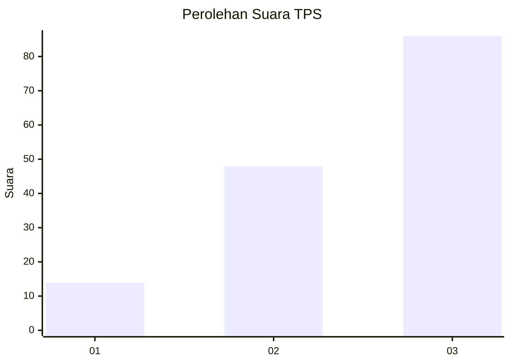
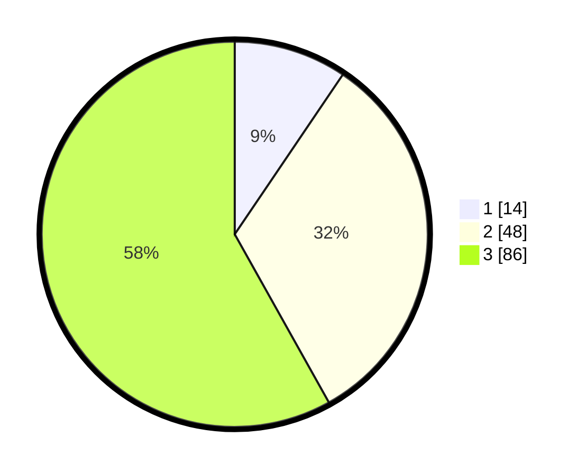

# Hasil

## Grafik

## Tabel

| No. | Nama Paslon    | Suara | Suara (raw) | Persentase |
|:--- |:-------------- | -----:| -----------:| ----------:|
| 1   | ANIES MUHAIMIN | 14    | [14][p-1]   | 9,46       |
| 2   | PRABOWO GIBRAN | 48    | [48][p-2]   | 32,43      |
| 3   | GANJAR MAHFUD  | 86    | [86][p-3]   | 58,11      |

[p-1]: https://github.com/gigit-pemilu/pemilu-2024-33-jawa-tengah/blob/main/pilpres/hitung-suara/sub/33-jawa-tengah/sub/09-boyolali/sub/09-banyudono/sub/2009-ketaon/sub/011-tps/sub/paslon-1.txt
[p-2]: https://github.com/gigit-pemilu/pemilu-2024-33-jawa-tengah/blob/main/pilpres/hitung-suara/sub/33-jawa-tengah/sub/09-boyolali/sub/09-banyudono/sub/2009-ketaon/sub/011-tps/sub/paslon-2.txt
[p-3]: https://github.com/gigit-pemilu/pemilu-2024-33-jawa-tengah/blob/main/pilpres/hitung-suara/sub/33-jawa-tengah/sub/09-boyolali/sub/09-banyudono/sub/2009-ketaon/sub/011-tps/sub/paslon-3.txt

## Foto C Plano

https://sirekap-obj-formc.kpu.go.id/5e3d/pemilu/ppwp/33/09/09/20/09/3309092009011-20240214-233453--9638b4b3-24a3-455d-a078-297b3534027d.jpg

https://sirekap-obj-formc.kpu.go.id/5e3d/pemilu/ppwp/33/09/09/20/09/3309092009011-20240214-221716--5df26b54-40b5-4ce1-8908-c008a4f26b89.jpg

https://sirekap-obj-formc.kpu.go.id/5e3d/pemilu/ppwp/33/09/09/20/09/3309092009011-20240214-233617--2dff33a4-30d9-4aba-9536-1eeb9cb2ed5c.jpg

## Metadata

| Key        | Value               |
| ---------- | ------------------- |
| Time Stamp | 2024-02-16 12:51:22 |

