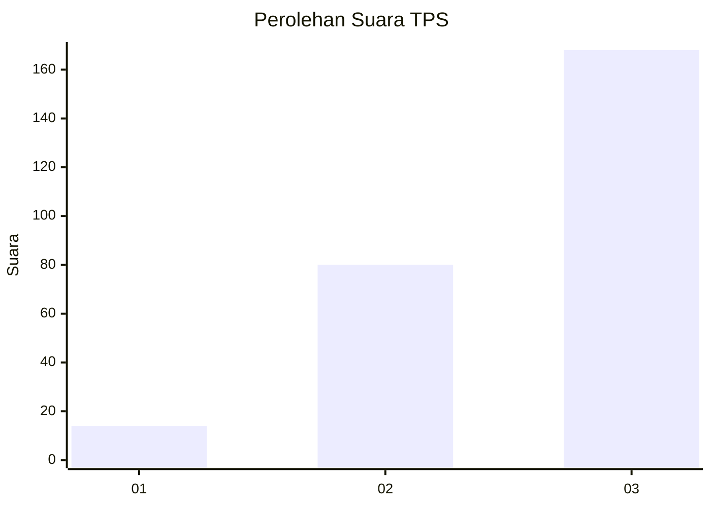
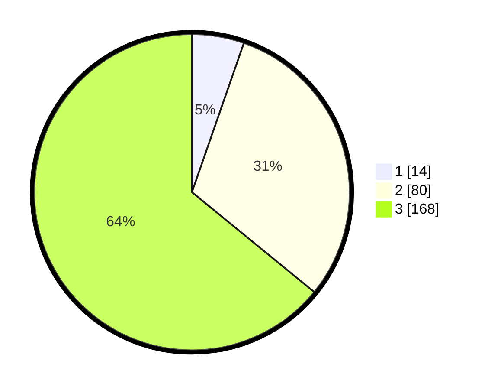

# Hasil

## Grafik

## Tabel

| No. | Nama Paslon    | Suara | Suara (raw) | Persentase |
|:--- |:-------------- | -----:| -----------:| ----------:|
| 1   | ANIES MUHAIMIN | 14    | [14][p-1]   | 5,34       |
| 2   | PRABOWO GIBRAN | 80    | [80][p-2]   | 30,53      |
| 3   | GANJAR MAHFUD  | 168   | [168][p-3]  | 64,12      |

[p-1]: https://github.com/gigit-pemilu/pemilu-2024/blob/main/pilpres/hitung-suara/sub/33-jawa-tengah/sub/09-boyolali/sub/09-banyudono/sub/2009-ketaon/sub/013-tps/sub/paslon-1.txt
[p-2]: https://github.com/gigit-pemilu/pemilu-2024/blob/main/pilpres/hitung-suara/sub/33-jawa-tengah/sub/09-boyolali/sub/09-banyudono/sub/2009-ketaon/sub/013-tps/sub/paslon-2.txt
[p-3]: https://github.com/gigit-pemilu/pemilu-2024/blob/main/pilpres/hitung-suara/sub/33-jawa-tengah/sub/09-boyolali/sub/09-banyudono/sub/2009-ketaon/sub/013-tps/sub/paslon-3.txt

## Foto C Plano

https://sirekap-obj-formc.kpu.go.id/c844/pemilu/ppwp/33/09/09/20/09/3309092009013-20240214-225652--0825966f-c8ac-4274-b267-f360b7f31185.jpg

https://sirekap-obj-formc.kpu.go.id/c844/pemilu/ppwp/33/09/09/20/09/3309092009013-20240214-225725--6a16739c-630f-4e5a-85e6-5cdbc0bfbe3d.jpg

https://sirekap-obj-formc.kpu.go.id/c844/pemilu/ppwp/33/09/09/20/09/3309092009013-20240214-225935--ad164f45-ea38-4b5c-b0da-ebdedfea582d.jpg

## Metadata

| Key        | Value               |
| ---------- | ------------------- |
| Time Stamp | 2024-02-16 12:51:22 |

