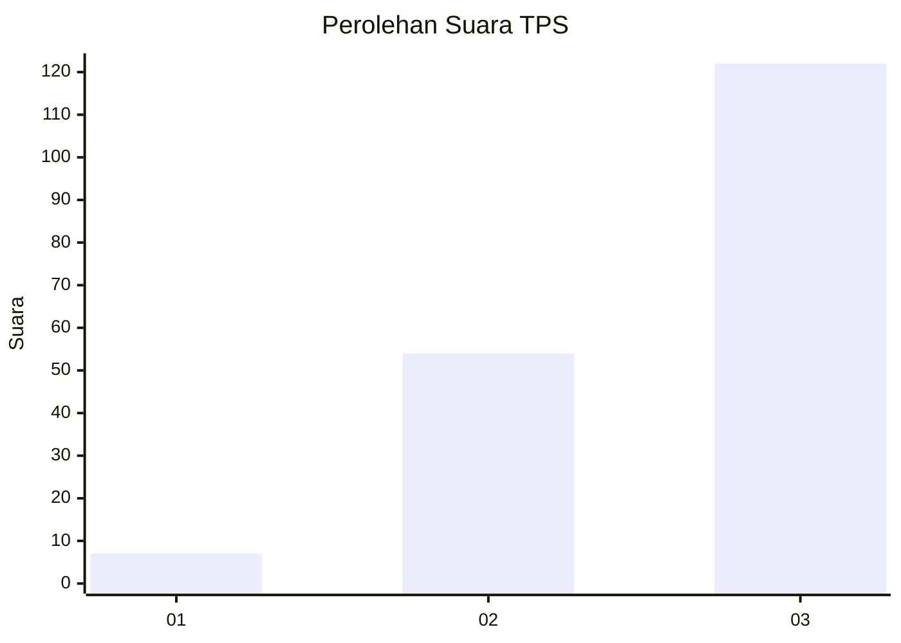
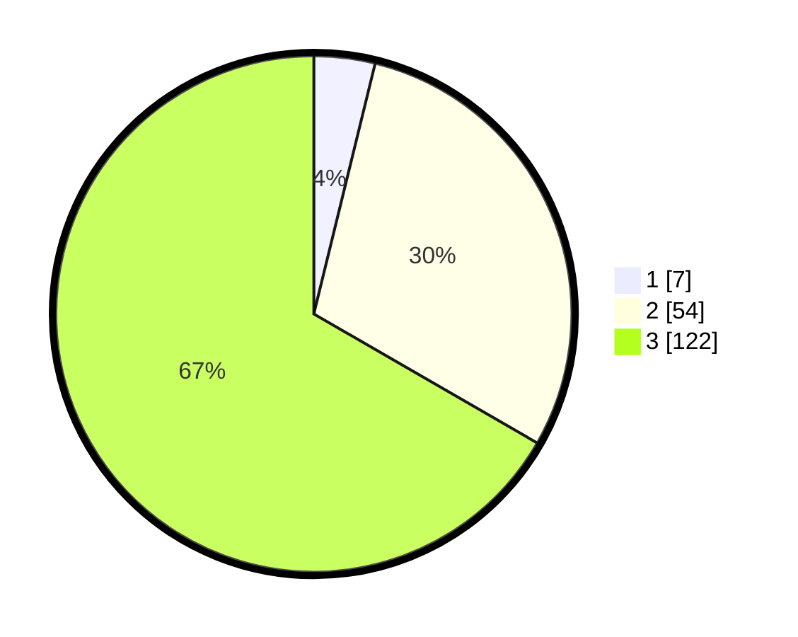

# Hasil

## Grafik

## Tabel

| No. | Nama Paslon    | Suara | Suara (raw) | Persentase |
|:--- |:-------------- | -----:| -----------:| ----------:|
| 1   | ANIES MUHAIMIN | 7     | [7][p-1]    | 3,83       |
| 2   | PRABOWO GIBRAN | 54    | [54][p-2]   | 29,51      |
| 3   | GANJAR MAHFUD  | 122   | [122][p-3]  | 66,67      |

[p-1]: https://github.com/gigit-pemilu/pemilu-2024-33-jawa-tengah/blob/main/pilpres/hitung-suara/sub/33-jawa-tengah/sub/09-boyolali/sub/09-banyudono/sub/2013-bangak/sub/005-tps/sub/paslon-1.txt
[p-2]: https://github.com/gigit-pemilu/pemilu-2024-33-jawa-tengah/blob/main/pilpres/hitung-suara/sub/33-jawa-tengah/sub/09-boyolali/sub/09-banyudono/sub/2013-bangak/sub/005-tps/sub/paslon-2.txt
[p-3]: https://github.com/gigit-pemilu/pemilu-2024-33-jawa-tengah/blob/main/pilpres/hitung-suara/sub/33-jawa-tengah/sub/09-boyolali/sub/09-banyudono/sub/2013-bangak/sub/005-tps/sub/paslon-3.txt

## Foto C Plano

https://sirekap-obj-formc.kpu.go.id/9a41/pemilu/ppwp/33/09/09/20/13/3309092013005-20240215-002509--b08793f9-879a-4070-a66b-df4d1a69884a.jpg

https://sirekap-obj-formc.kpu.go.id/9a41/pemilu/ppwp/33/09/09/20/13/3309092013005-20240214-224804--82f89ee7-6286-4f31-b33e-1444d1f539a2.jpg

https://sirekap-obj-formc.kpu.go.id/9a41/pemilu/ppwp/33/09/09/20/13/3309092013005-20240214-225103--2ae8f40e-82db-419b-bee9-99886df9a814.jpg

## Metadata

| Key        | Value               |
| ---------- | ------------------- |
| Time Stamp | 2024-02-16 12:51:22 |

