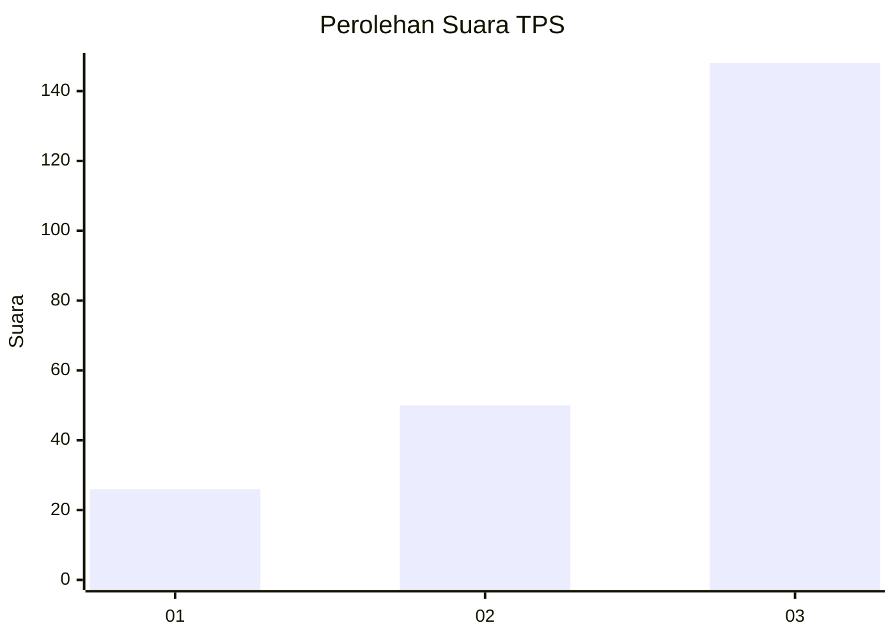
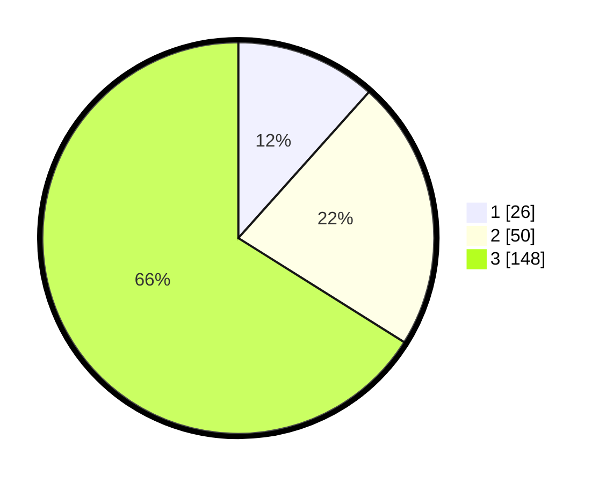

# Hasil

## Grafik

## Tabel

| No. | Nama Paslon    | Suara | Suara (raw) | Persentase |
|:--- |:-------------- | -----:| -----------:| ----------:|
| 1   | ANIES MUHAIMIN | 26    | [26][p-1]   | 11,61      |
| 2   | PRABOWO GIBRAN | 50    | [50][p-2]   | 22,32      |
| 3   | GANJAR MAHFUD  | 148   | [148][p-3]  | 66,07      |

[p-1]: https://github.com/gigit-pemilu/pemilu-2024/blob/main/pilpres/hitung-suara/sub/33-jawa-tengah/sub/09-boyolali/sub/09-banyudono/sub/2013-bangak/sub/008-tps/sub/paslon-1.txt
[p-2]: https://github.com/gigit-pemilu/pemilu-2024/blob/main/pilpres/hitung-suara/sub/33-jawa-tengah/sub/09-boyolali/sub/09-banyudono/sub/2013-bangak/sub/008-tps/sub/paslon-2.txt
[p-3]: https://github.com/gigit-pemilu/pemilu-2024/blob/main/pilpres/hitung-suara/sub/33-jawa-tengah/sub/09-boyolali/sub/09-banyudono/sub/2013-bangak/sub/008-tps/sub/paslon-3.txt

## Foto C Plano

https://sirekap-obj-formc.kpu.go.id/6cf7/pemilu/ppwp/33/09/09/20/13/3309092013008-20240214-220437--159cb834-87fe-4b33-92ca-4df0eed4abd6.jpg

https://sirekap-obj-formc.kpu.go.id/6cf7/pemilu/ppwp/33/09/09/20/13/3309092013008-20240214-221201--d28abbe9-9ce3-41f2-8a42-556d172d0c19.jpg

https://sirekap-obj-formc.kpu.go.id/6cf7/pemilu/ppwp/33/09/09/20/13/3309092013008-20240214-221814--90e70e04-d3b2-4d5b-a0fd-34437425c381.jpg

## Metadata

| Key        | Value               |
| ---------- | ------------------- |
| Time Stamp | 2024-02-16 12:51:22 |

