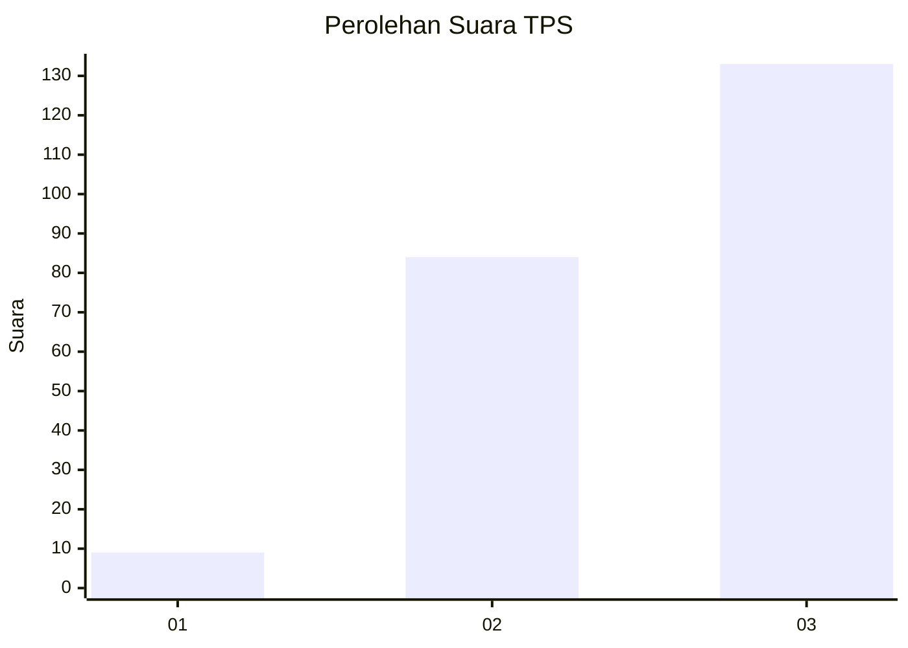
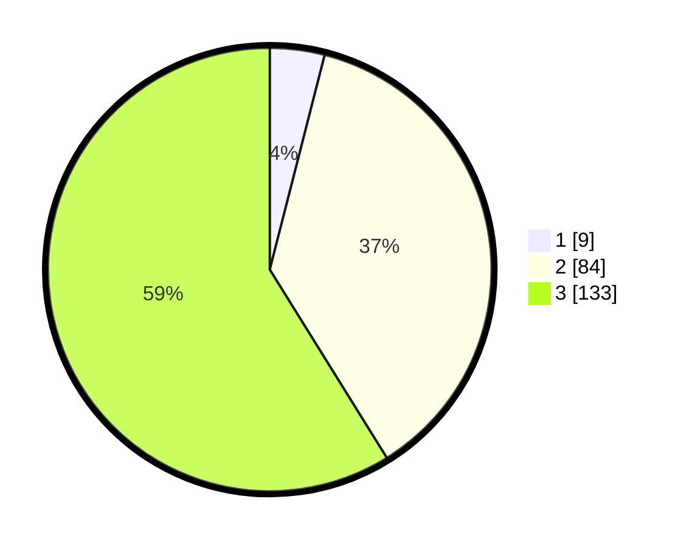

# Hasil

## Grafik

## Tabel

| No. | Nama Paslon    | Suara | Suara (raw) | Persentase |
|:--- |:-------------- | -----:| -----------:| ----------:|
| 1   | ANIES MUHAIMIN | 9     | [9][p-1]    | 3,98       |
| 2   | PRABOWO GIBRAN | 84    | [84][p-2]   | 37,17      |
| 3   | GANJAR MAHFUD  | 133   | [133][p-3]  | 58,85      |

[p-1]: https://github.com/gigit-pemilu/pemilu-2024/blob/main/pilpres/hitung-suara/sub/33-jawa-tengah/sub/09-boyolali/sub/09-banyudono/sub/2013-bangak/sub/011-tps/sub/paslon-1.txt
[p-2]: https://github.com/gigit-pemilu/pemilu-2024/blob/main/pilpres/hitung-suara/sub/33-jawa-tengah/sub/09-boyolali/sub/09-banyudono/sub/2013-bangak/sub/011-tps/sub/paslon-2.txt
[p-3]: https://github.com/gigit-pemilu/pemilu-2024/blob/main/pilpres/hitung-suara/sub/33-jawa-tengah/sub/09-boyolali/sub/09-banyudono/sub/2013-bangak/sub/011-tps/sub/paslon-3.txt

## Foto C Plano

https://sirekap-obj-formc.kpu.go.id/71c4/pemilu/ppwp/33/09/09/20/13/3309092013011-20240214-231829--a37eac2b-72cf-42cd-b9e9-abf0b8aa7514.jpg

https://sirekap-obj-formc.kpu.go.id/71c4/pemilu/ppwp/33/09/09/20/13/3309092013011-20240214-231909--87391c25-7d09-4c5f-a9e0-3931ff7b6991.jpg

https://sirekap-obj-formc.kpu.go.id/71c4/pemilu/ppwp/33/09/09/20/13/3309092013011-20240214-231934--7103549e-433e-4bf2-b7d2-0e64f23fc1d8.jpg

## Metadata

| Key        | Value               |
| ---------- | ------------------- |
| Time Stamp | 2024-02-16 12:51:22 |

