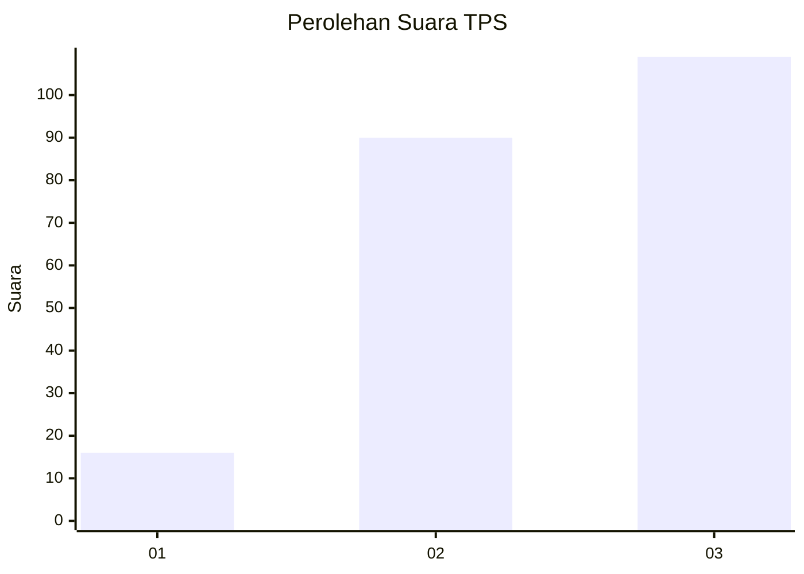
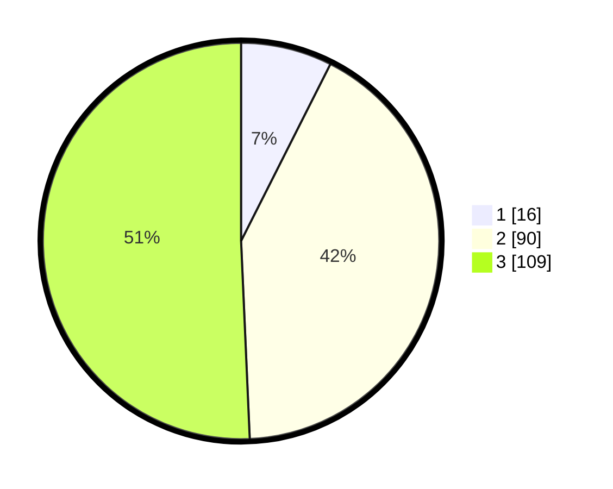

# Hasil

## Grafik

## Tabel

| No. | Nama Paslon    | Suara | Suara (raw) | Persentase |
|:--- |:-------------- | -----:| -----------:| ----------:|
| 1   | ANIES MUHAIMIN | 16    | [16][p-1]   | 7,44       |
| 2   | PRABOWO GIBRAN | 90    | [90][p-2]   | 41,86      |
| 3   | GANJAR MAHFUD  | 109   | [109][p-3]  | 50,70      |

[p-1]: https://github.com/gigit-pemilu/pemilu-2024/blob/main/pilpres/hitung-suara/sub/33-jawa-tengah/sub/09-boyolali/sub/09-banyudono/sub/2014-trayu/sub/003-tps/sub/paslon-1.txt
[p-2]: https://github.com/gigit-pemilu/pemilu-2024/blob/main/pilpres/hitung-suara/sub/33-jawa-tengah/sub/09-boyolali/sub/09-banyudono/sub/2014-trayu/sub/003-tps/sub/paslon-2.txt
[p-3]: https://github.com/gigit-pemilu/pemilu-2024/blob/main/pilpres/hitung-suara/sub/33-jawa-tengah/sub/09-boyolali/sub/09-banyudono/sub/2014-trayu/sub/003-tps/sub/paslon-3.txt

## Foto C Plano

https://sirekap-obj-formc.kpu.go.id/9132/pemilu/ppwp/33/09/09/20/14/3309092014003-20240214-221436--a10e82db-85ca-4d01-b659-c57a3ae7d9eb.jpg

https://sirekap-obj-formc.kpu.go.id/9132/pemilu/ppwp/33/09/09/20/14/3309092014003-20240214-222658--67fb25ac-cd5a-4c25-a030-20060ba3e832.jpg

https://sirekap-obj-formc.kpu.go.id/9132/pemilu/ppwp/33/09/09/20/14/3309092014003-20240214-222744--97fd2242-50bb-4edc-b2fe-9896b79053c7.jpg

## Metadata

| Key        | Value               |
| ---------- | ------------------- |
| Time Stamp | 2024-02-16 12:51:22 |

